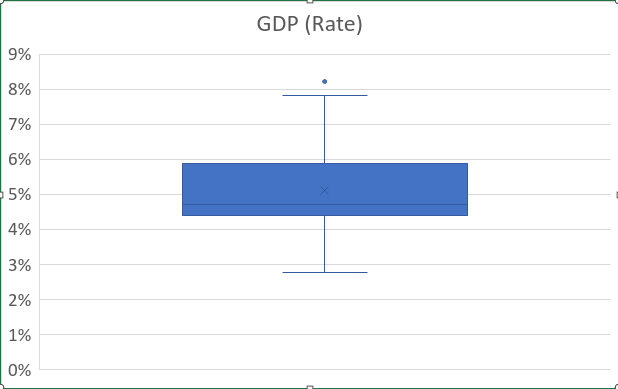
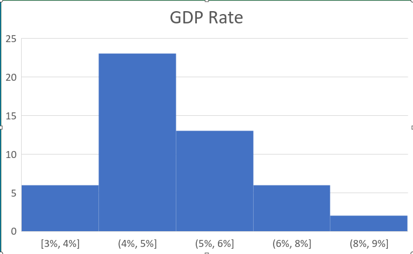
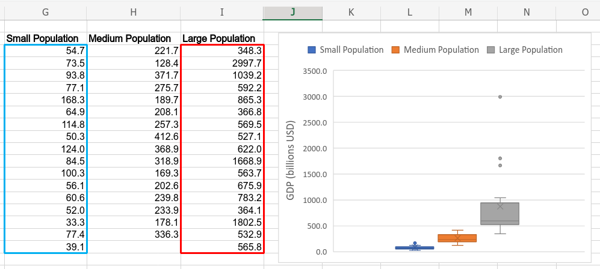
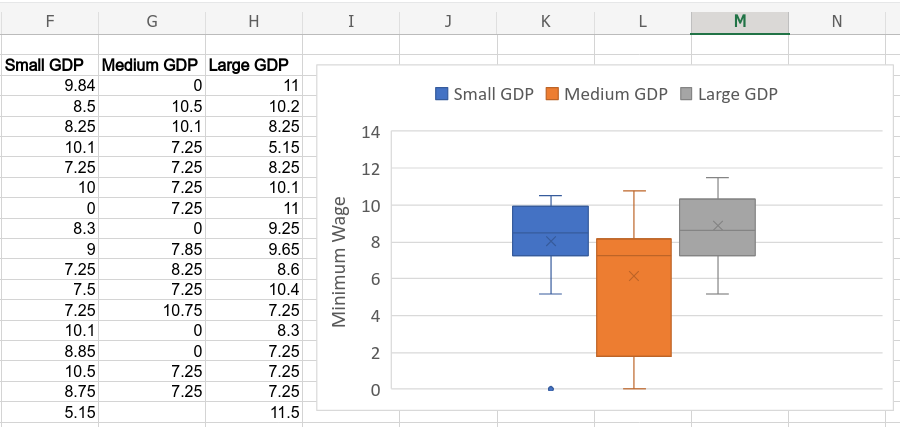
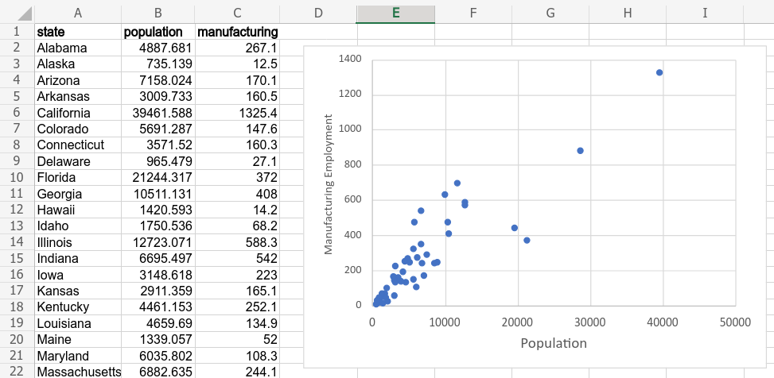

---
output:
  xaringan::moon_reader:
    css: ["default", "extra.css"]
    lib_dir: libs
    seal: false
    nature:
      highlightStyle: github
      highlightLines: true
      countIncrementalSlides: false
      ratio: '16:9'
---

```{r, echo = FALSE, warning = FALSE, message = FALSE}
##xaringan::inf_mr()
## For offline work: https://bookdown.org/yihui/rmarkdown/some-tips.html#working-offline
## Images not appearing? Put images folder inside the libs folder as that is the main data directory

library(tidyverse)
library(readxl)
library(stargazer)
library(kableExtra)
##library(modelr)

knitr::opts_chunk$set(echo = FALSE,
                      eval = TRUE,
                      error = FALSE,
                      message = FALSE,
                      warning = FALSE,
                      comment = NA)

d <- read_excel("../Data_for_Class/Session1/Financial_Data_US_States-2018.xlsx", na = "NA") |>
  mutate(
    gdp_category = factor(gdp_category, levels = c("Low", "Medium", "High")),
    pop_category = factor(pop_category, levels = c("Low", "Medium", "High")),
    manufacturing_category = factor(manufacturing_category, levels = c("Low", "Medium", "High")),
    #no_income_tax2 = if_else(no_income_tax == 0, "Income Tax", "No Income Tax"),
    gdp_billions = gdp_millions / 1e3
  )
```

background-image: url('libs/Images/01-statistics-background_v1.png')
background-size: 100%
background-position: center
class: middle

.size70[.content-box-white[**Today's Agenda**]]

<br>

.size50[
1. Organizing Data

2. Univariate Analyses

3. Bivariate Analyses
]

.center[.size40[
Justin Leinaweaver (Summer 2023)
]]

???

## Prep for Class
1. Upload data and variable description document for today

2. Bring graph paper and rulers

<br>

Welcome everybody!

- Course Description: This intensive course is designed to help students learn essential aspects of applied data analysis (e.g. visualization, descriptive statistics and modeling) using Excel. 

<br>

### What brought you to the MBA program? Backgrounds?

<br>

### What is your experience with Excel? How comfortable are you reviewing, analyzing and visualizing data in Excel?

<br>

### What is your experience with applied statistics?

- (**SLIDE**: What would you do to summarize a vector of data?) 


---

class: center, middle, slideblue

.code90[
```{r}
## Ross 1990 data adjusted to 2022
d_ross <- read_excel("../Data_for_Class/Session2/MBA_Session2-Data.xlsx", guess_max = 10000) |>
  mutate(
    earnk2021 = earnk*2.0266
  )

# Increase columns for output on this slide
options(width = 100)

d_ross$earnk2021[1:176]
```
]

**And 1,639 more responses...**

???

Here we see the results of a 1990 survey of Americans that asked them to report their yearly earnings 
- Survey was a nationally representative sample of 1,800 people,
- Incomes adjusted for inflation to 2021 dollars and shown in thousands of dollars

Let's say you work for me and I gave you this list of data points to analyze.

### What could you do to "analyze" this data for me? What could you tell me about incomes in the USA?

<br>

### The Middle: How do we identify the "middle" of the data and when is that summary useful?

<br>

### The Range: How do we identify the "range" of the data and when is that summary useful?

<br>

### The Variation: How do we identify the "variation" of the data and when is that summary useful?


---

class: middle, slideblue

.pull-left[
.size35[

<br>

```{r}
## Random data
tibble(
  Mean = mean(d_ross$earnk2021),
  Median = median(d_ross$earnk2021),
  Minimum = min(d_ross$earnk2021),
  Maximum = max(d_ross$earnk2021),
  Range = Maximum - Minimum,
  #Variance = var(weights),
  'Standard Deviation' = sd(d_ross$earnk2021)
) |>
  mutate_if(.predicate = is.numeric, .funs = round, 0) |>
  t() |>
  kbl() |>
  pack_rows("The Middle", 1, 2) |>
  pack_rows("The Range", 3, 5) |>
  pack_rows("The Variation", 6, 6)
```
]]

.pull-right[
.code60[
```{r}
# Reduce columns for output on this slide
options(width = 80)

d_ross$earnk2021[1:204]
```
]]


???

### So, for what specific situations could you use the summary data?

### And, in what situations would you prefer having all 1,815 responses?

*Force this discussion*


---

class: middle, center, slideblue

.size65[.content-box-white[**Defining Statistics: Level 1**]]

<br>

.size50[
Statistics is a set of tools we use to summarize data
 
Summarize: "give a brief statement of the main points of (something)" (Oxford Dictionary).
]

???

Leads us to our first definition of statistics

- In our example we used descriptive statistics like the mean, median and standard deviation to summarize our data.

<br>

For many purposes the summaries of the data are far more useful than the list of data points.

- How are incomes distributed in the US?

- What proportion of Americans live in poverty?

- etc.


---

class: middle, center, slideblue

.size65[.content-box-white[**Defining Statistics: Level 2**]]

<br>

.size50[
"The practice or science of collecting and analyzing numerical data in large quantities, **especially for the purpose of inferring proportions in a whole from those in a representative sample**" (Oxford Dictionary).
]

???

Defining statistics (level 2) is using summaries of samples to learn about the wider population. Small data to tell us about the whole world.

<br>

The survey data we were discussing was designed to be "nationally representative."

- This means the researchers tried to pick a sample whose descriptive statistics would come close, or match, the wider population.

<br>

My aim for this week is to get you doing applied statistical analyses both to learn how to:

- Extract useful analyses from large datasets, and

- Use sample statistics to learn about a wider population.


---

class: top, center, slideblue

.size55[.content-box-white[**Economic Data on the US States**]]

<br>

```{r, results='asis'}
d |>
  select(state:unemployment) |>
  mutate_if(is.numeric, round, digits = 2) |>
  slice(1:11) |>
  kbl(format = "html", digits = 2, align = 'c') |>
  row_spec(row = 0, background = "#ece9e8")
```

???

Introducing today's dataset

- Purpose: Exploring the economic characteristics of the American states

- Sourcing: Primarily from the Federal Reserve Bank in St Louis and a few other sources


---

background-image: url('libs/Images/Session1-Tidy_Data.png')
background-size: 100%
background-position: center

???

Organizing Data 

- Before you begin any analysis you need to clean and organize the data. 

- Three rules of tidy data.


---

class: top, center, slideblue

.size55[.content-box-white[**Economic Data on the US States**]]

<br>

```{r, results='asis'}
d |>
  select(state:unemployment) |>
  mutate_if(is.numeric, round, digits = 2) |>
  slice(1:11) |>
  kbl(format = "html", digits = 2, align = 'c') |>
  row_spec(row = 0, background = "#ece9e8")
```

???

### Why specifically is this a "tidy" dataset?

<br>

Time to explore.

Open up the codebook document on Canvas and use it to make sure you understand what each variable represents.

- What is it? Where did it come from? What units are they measured in?

<br>

Now take a few minutes to explore the data itself

### Which states are doing the "best" and which the "worst"? Why?
- How did you decide which variables were most important?

<br>

### Any data challenge your preconceived notions about the economics of the states?


---

background-image: url('libs/Images/background-columns.png')
background-size: 100%
background-position: center

.left-column[

.center[
.textblack[
.size35[
**Univariate Analyses**

<br>

<br>

Variable type determines analysis tool
]]]]

.right-column[

<br>

.size55[
- Categorical Variables
    - Nominal
    - Ordinal
]

.size55[
- Numerical Variables
    - Interval
    - Ratio
]
]

???

Univariate Analyses 
- Describing / summarizing individual variables

- Important Lesson: Variable Types Determine the Tools we Need

<br>

### Questions on these four types of variable? Everybody clear on what each represents?
- (**SLIDE**)


---

background-image: url('libs/Images/background-columns.png')
background-size: 100%
background-position: center

.left-column[

.center[
.textblack[
.size35[
**Univariate Analyses**

<br>

<br>

Variable type determines analysis tool
]]]]

.right-column[

<br>

.size50[
- Categorical Variables
    - Nominal (named items)
    - Ordinal (items in order)

]

.size50[
- Numerical Variables
    - Interval (Differences matter)
    - Ratio (Zero matters)
]]

???

### Questions on this?

<br>

**SLIDE**: Let's start our work on univariate analyses focusing on categorical variables.


---

background-image: url('libs/Images/Session1-univariate3.png')
background-size: 100%
background-position: center

???

### Make sense?


---

background-image: url('libs/Images/Session1-univariate4.png')
background-size: 100%
background-position: center

???

Let's practice these techniques using GDP category.

Everybody create a new sheet and copy over state, year and gdp_category variables.

<br>

### Has anybody used pivot tables before?

- A very handy tool but can be a little clunky to learn the ins and outs of using them.


---

background-image: url('libs/Images/Session1-univariate5.png')
background-size: 100%
background-position: center


---

background-image: url('libs/Images/Session1-univariate6.png')
background-size: 100%
background-position: center


---

background-image: url('libs/Images/Session1-univariate7.png')
background-size: 100%
background-position: center


---

background-image: url('libs/Images/Session1-univariate8.png')
background-size: 100%
background-position: center


---

background-image: url('libs/Images/Session1-univariate9.png')
background-size: 100%
background-position: center


---

background-image: url('libs/Images/Session1-univariate10.png')
background-size: 100%
background-position: center


---

background-image: url('libs/Images/Session1-univariate11.png')
background-size: 100%
background-position: center


---

background-image: url('libs/Images/Session1-univariate12.png')
background-size: 100%
background-position: center

???

So, this is the table version of our summary.

- Always make sure to polish your table for presentation (e.g. remove blanks and put the categories in a logical order)

<br>

### How could we visualize the results of this table? What kind of chart would we need?
- (Bar plot!)

<br>

I know this might seem silly, but I'm going to ask each of you to take a piece of paper and draw this bar plot by hand.

- There is really no better way that I've found for helping you develop an intuitive understanding of each visualization than by making a couple by hand.

- Letting Excel do it just doesn't accomplish the same learning ends.

Ok, Draw it!

<br>

**SLIDE**: Now, let's check this in Excel


---

background-image: url('libs/Images/Session1-univariate13.png')
background-size: 100%
background-position: center

???

*Steps on slide*

<br>

Let's talk bar chart design.

- x-axis should increase left-to-right (if a logical order exists)

- Excel y-axis defaults can be TERRIBLE.

<br>

**SLIDE**: Let's talk the y-axis


---

background-image: url('libs/Images/Session1-univariate14a.png')
background-size: 100%
background-position: center

???

### What is wrong with this bar chart? 


---

background-image: url('libs/Images/Session1-univariate15.png')
background-size: 100%
background-position: center

???

### Why is it important to start all bar charts at zero?
- The meaning of each bar is represented by its height and height begins at zero (ratio variable)
- Any value to start other than zero produces bars that do not correspond to the value.

### Make sense?

<br>

### Does this rule hold for all charts?
- (Nope!)
    - Only for those that are ratio variables, AND
    - Where the visual representation depends on seeing the entirety of the data to carry the right meaning
    
- In other words, feel free to zoom in your line plots (within reason)!


---

background-image: url('libs/Images/Session1-univariate16.png')
background-size: 100%
background-position: center

???

It BLOWS my damn mind that Excel zooms in its bar charts.

- This is bafflingly bad practice.


---

background-image: url('libs/Images/Session1-univariate17.png')
background-size: 100%
background-position: center

???

Good opportunity to talk "best practices"!

<br>

### Questions?


---

class: middle, slideblue

.center[
.size55[.content-box-white[**Practice Univariate Analysis of**]]

.size55[.content-box-white[**a Categorical Variable**]]
]

<br>

.size50[
1. Pivot table: Count the levels of income_tax

2. Insert a horizontal bar plot and polish the visualization
]


---

background-image: url('libs/Images/Session1-univariate18.png')
background-size: 100%
background-position: center

???

### Everybody get these results?

<br>

### Conclusions we can draw from this?


---

background-image: url('libs/Images/Session1-univariate3.png')
background-size: 100%
background-position: center

???

### Questions on visualizing categorical variables?


---

background-image: url('libs/Images/Session1-univariate19.png')
background-size: 100%
background-position: center

???

Let's switch to working with our numerical variables.


---

class: middle, slideblue

.center[
.size35[.content-box-white[**Analyzing Numerical Variables (Johnson 2012)**]]
]

.size40[
- Measures of Central Tendency
    - Mean
    - Median
]

.size40[
- Deviations from Central Tendency
    - Standard deviation
]

.size40[
- Measures of Variability
    - Range = Maximum - Minimum
    - IQR = 75th - 25th percentile
]

???

### Questions on these summary statistics?
- Measures of central tendency: Mean, Median, IQR (25th and 75th percentile)
- Measures of spread: SD, Range (minimum, maximum)

<br>

**SLIDE**: Demonstrate average function


---

background-image: url('libs/Images/Session1-univariate20.png')
background-size: 100%
background-position: center

???

Let's practice the average function.

Everybody do two things:
1. Rescale GDP into billions, and

2. calculate the mean value of the new column

<br>

(**SLIDE**: Results)


---

background-image: url('libs/Images/Session1-univariate21.png')
background-size: 100%
background-position: center


---

class: middle, size40

Statistic|Function
------|-------
Mean|= AVERAGE
Median|= MEDIAN
Standard Deviation|= STDEV.S
Minimum|= MIN
Maximum|= MAX
25th Percentile|= QUARTILE.EXC(, 1)
75th Percentile|= QUARTILE.EXC(, 3)

???

Let's summarize GDP billions using all of these descriptive statistics.

- (**SLIDE**: Results)


---

class: middle, slideblue

.center[
.size45[.content-box-white[**Practice: Descriptive stats for GDP (billions)**]]
]

.size45[
```{r, results='asis', cache=TRUE}
d %>%
  pivot_longer(cols = gdp_billions, names_to = "Variable", values_to = "Value") %>%
  group_by(Variable) %>%
  summarize(
    Mean = round(mean(Value, na.rm = TRUE), 1),
    Median = round(median(Value, na.rm = TRUE), 1),
    StdDev = round(sd(Value, na.rm = TRUE), 1),
    Minimum = round(min(Value), 1),
    Maximum = round(max(Value), 1),
    "25th Percentile" = as.numeric(round(quantile(Value, na.rm = TRUE, probs = .25)), 1),
    "75th Percentile" = as.numeric(round(quantile(Value, na.rm = TRUE, probs = .75), 1))
  ) |>
  t() |>
  kbl(format = "html", digits = 2, align = 'c') |>
  row_spec(row = 1, bold = TRUE, background = "#ece9e8")
```
]

???

### Everybody get these?

<br>

### What do we learn from this analysis of state GDP? 

### - Key takeaways about the wealth of states in the US?


---

class: slideblue

.center[
.size35[.content-box-white[**Univariate Analyses: Numerical Variables**]]
]

.pull-left[
.size40[
- min_wage

- unemployment

- population

- bachelors

- homeowner_rate

- manufacturing
]]

.pull-right[

<br>

<br>

.size25[

Statistic|Function
------|-------
Mean|= AVERAGE
Median|= MEDIAN
Standard Deviation|= STDEV.S
Minimum|= MIN
Maximum|= MAX
25th Percentile|= QUARTILE.EXC(, 1)
75th Percentile|= QUARTILE.EXC(, 3)

]]

???

Let's practice!

*Split up the variables for the class to calculate and present*

- Everybody calculate these so we can think through what these represent.

<br>

**SLIDE**: Results


---

class: middle, center, slideblue

.size45[.content-box-white[**Practice: Descriptive Statistics**]]

<br>

.size35[
```{r, results='asis'}
d |>
  pivot_longer(cols = c(min_wage, unemployment, population, bachelors, homeowner_rate, manufacturing), names_to = "Variable", values_to = "Value") |>
  group_by(Variable) |>
  summarize(
    Mean = round(mean(Value, na.rm = TRUE), 1),
    StdDev = round(sd(Value, na.rm = TRUE), 1),
    Min = round(min(Value), 1),
    pct25 = as.numeric(round(quantile(Value, na.rm = TRUE, probs = .25)), 1),
    Median = round(median(Value, na.rm = TRUE), 1),
    pct75 = as.numeric(round(quantile(Value, na.rm = TRUE, probs = .75), 1)),
    Max = round(max(Value), 1)
  ) |>
  kbl(format = "html", digits = 2, align = c('l', rep('c', 7))) |>
  row_spec(row = 0, background = "#ece9e8")
```
]

???

### Everybody get these?


---

class: middle, slideblue

.size35[
```{r, results='asis'}
d |>
  pivot_longer(cols = c(min_wage, unemployment, population, bachelors, homeowner_rate, manufacturing), names_to = "Variable", values_to = "Value") |>
  group_by(Variable) |>
  summarize(
    Mean = round(mean(Value, na.rm = TRUE), 1),
    StdDev = round(sd(Value, na.rm = TRUE), 1),
    Min = round(min(Value), 1),
    pct25 = as.numeric(round(quantile(Value, na.rm = TRUE, probs = .25)), 1),
    Median = round(median(Value, na.rm = TRUE), 1),
    pct75 = as.numeric(round(quantile(Value, na.rm = TRUE, probs = .75), 1)),
    Max = round(max(Value), 1)
  ) |>
  kbl(format = "html", digits = 2, align = c('l', rep('c', 7))) |>
  row_spec(row = 0, background = "#ece9e8")
```
]

.center[
.size35[
Identify the **TWO** variables with the **LEAST** variation across the states.

Identify the **TWO** variables with the **MOST** variation across the states.
]]

???

### Ok, two questions, what do you think?
- *DISCUSS*

<br>

**SLIDE**: Let's now connect our descriptive stats to visualizing the distribution


---

background-image: url('libs/Images/Session1-univariate24.png')
background-size: 100%
background-position: center

???

Two primary visualization options for numerical variables.

- Both are linked and both have different benefits.

<br>

I think it is a super useful exercise to make these two things by hand.

- Everybody grab some paper and a ruler.


---

background-image: url('libs/Images/Session1-univariate25.png')
background-size: 100%
background-position: center

???

Let's start with the box plot.

- Use the descriptive stats to draw the distribution of GDP by hand

<br>

**SLIDE** x 9: Results


---

```{r, fig.align='center', fig.retina=3, out.width='95%', fig.asp=0.618, cache=TRUE}
# Build box plot in steps
p1 <- d %>%
  ggplot(aes(y = gdp_billions)) +
  theme_bw() +
  labs(y = "GDP (billions USD)", x = "") +
  coord_flip(ylim = c(0, 3e3), xlim = c(-1,1)) +
  scale_y_continuous(breaks = seq(0,3e3,5e2)) +
  scale_x_continuous(breaks =  NULL)

# Set range
p1 +
  ggtitle("Set the X-Axis Range")
```


---

```{r, fig.align='center', fig.retina=3, out.width='95%', fig.asp=0.618, cache=TRUE}
# Draw in median 
p1 +
  ggtitle("Mark the median (50th percentile)") +
  annotate("segment", y = median(d$gdp_billions), yend = median(d$gdp_billions), x = -1.2, xend = .5, size = 1.2, color = "red")
```


---

```{r, fig.align='center', fig.retina=3, out.width='95%', fig.asp=0.618, cache=TRUE}
# Add the minimum and maximum
p1 +
  ggtitle("Add the minimum and maximum values") +
  annotate("segment", y = median(d$gdp_billions), yend = median(d$gdp_billions), x = -1.2, xend = .5, size = 1) +
  annotate("segment", y = min(d$gdp_billions), yend = min(d$gdp_billions), x = -1.2, xend = .5, size = 1, color = "red") +
  annotate("segment", y = max(d$gdp_billions), yend = max(d$gdp_billions), x = -1.2, xend = .5, size = 1, color = "red")
```


---

```{r, fig.align='center', fig.retina=3, out.width='95%', fig.asp=0.618, cache=TRUE}
# Add 25th and 75th percentiles
p1 +
  ggtitle("Add the 25th and 75th percentiles") +
  annotate("segment", y = median(d$gdp_billions), yend = median(d$gdp_billions), x = -1.2, xend = .5, size = 1) +
  annotate("segment", y = min(d$gdp_billions), yend = min(d$gdp_billions), x = -1.2, xend = .5, size = 1) +
  annotate("segment", y = max(d$gdp_billions), yend = max(d$gdp_billions), x = -1.2, xend = .5, size = 1) +
  annotate("segment", y = quantile(d$gdp_billions, probs = .25), yend = quantile(d$gdp_billions, probs = .25), x = -1.2, xend = .5, size = 1, color = "red") +
  annotate("segment", y = quantile(d$gdp_billions, probs = .75), yend = quantile(d$gdp_billions, probs = .75), x = -1.2, xend = .5, size = 1, color = "red") 
```


---

```{r, fig.align='center', fig.retina=3, out.width='95%', fig.asp=0.618, cache=TRUE}
# Highlight the lines
p1 +
  ggtitle("Quartiles: One quarter of the data lies between each line (percentiles)") +
  annotate("segment", y = median(d$gdp_billions), yend = median(d$gdp_billions), x = -1.2, xend = .5, size = 1) +
  annotate("segment", y = min(d$gdp_billions), yend = min(d$gdp_billions), x = -1.2, xend = .5, size = 1) +
  annotate("segment", y = max(d$gdp_billions), yend = max(d$gdp_billions), x = -1.2, xend = .5, size = 1) +
  annotate("segment", y = quantile(d$gdp_billions, probs = .25), yend = quantile(d$gdp_billions, probs = .25), x = -1.2, xend = .5, size = 1) +
  annotate("segment", y = quantile(d$gdp_billions, probs = .75), yend = quantile(d$gdp_billions, probs = .75), x = -1.2, xend = .5, size = 1) +
  annotate("text", y = max(d$gdp_billions), x = .75, label = "100th", angle = 90) +
  annotate("text", y = quantile(d$gdp_billions, probs = .75), x = .75, label = "75th", angle = 90) +
  annotate("text", y = quantile(d$gdp_billions, probs = .5), x = .75, label = "50th", angle = 90) +
  annotate("text", y = quantile(d$gdp_billions, probs = .25), x = .75, label = "25th", angle = 90) +
  annotate("text", y = min(d$gdp_billions)-10000, x = .75, label = "0th", angle = 90)
```


---

```{r, fig.align='center', fig.retina=3, out.width='95%', fig.asp=0.618, cache=TRUE}
# Add boxes
p1 +
  ggtitle("Replace IQR with a box") +
  annotate("segment", y = min(d$gdp_billions), yend = min(d$gdp_billions), x = -1.2, xend = .5, size = 1) +
  annotate("segment", y = max(d$gdp_billions), yend = max(d$gdp_billions), x = -1.2, xend = .5, size = 1) +
  annotate("segment", y = quantile(d$gdp_billions, probs = .25), yend = quantile(d$gdp_billions, probs = .25), x = -.6, xend = .5, size = .5) +
  annotate("segment", y = quantile(d$gdp_billions, probs = .75), yend = quantile(d$gdp_billions, probs = .75), x = -.6, xend = .5, size = .5) +
  annotate("segment", y = quantile(d$gdp_billions, probs = .25), yend = quantile(d$gdp_billions, probs = .75), x = -.6, xend = -.6, size = .5) +
  annotate("segment", y = quantile(d$gdp_billions, probs = .25), yend = quantile(d$gdp_billions, probs = .75), x = .5, xend = .5, size = .5) +
  annotate("segment", y = quantile(d$gdp_billions, probs = .5), yend = quantile(d$gdp_billions, probs = .5), x = -.6, xend = .5, size = 1)
```


---

```{r, fig.align='center', fig.retina=3, out.width='95%', fig.asp=0.618, cache=TRUE}
# Replace min/max with whiskers
p1 +
  ggtitle("Replace min and max with 'whiskers'") +
  annotate("segment", y = quantile(d$gdp_billions, probs = .25), yend = quantile(d$gdp_billions, probs = .25), x = -.6, xend = .5, size = .5) +
  annotate("segment", y = quantile(d$gdp_billions, probs = .75), yend = quantile(d$gdp_billions, probs = .75), x = -.6, xend = .5, size = .5) +
  annotate("segment", y = quantile(d$gdp_billions, probs = .25), yend = quantile(d$gdp_billions, probs = .75), x = -.6, xend = -.6, size = .5) +
  annotate("segment", y = quantile(d$gdp_billions, probs = .25), yend = quantile(d$gdp_billions, probs = .75), x = .5, xend = .5, size = .5) +
  annotate("segment", y = quantile(d$gdp_billions, probs = .5), yend = quantile(d$gdp_billions, probs = .5), x = -.6, xend = .5, size = 1) +
  annotate("segment", y = min(d$gdp_billions), yend = quantile(d$gdp_billions, probs = .25), x = 0, xend = 0, size = .5) +
  annotate("segment", y = max(d$gdp_billions), yend = quantile(d$gdp_billions, probs = .75), x = 0, xend = 0, size = .5)
```


---

```{r, fig.align='center', fig.retina=3, out.width='95%', fig.asp=0.618, cache=TRUE}
d %>%
  ggplot(aes(y = gdp_billions)) +
  geom_boxplot(fill = "peachpuff") +
  theme_bw() +
  labs(y = "GDP (billions USD)", x = "", title = "Technically the whiskers should only extend 1.5x the IQR",
       subtitle = "(With outliers represented as points)") +
  coord_flip(ylim = c(0, 3e3), xlim = c(-1,1)) +
  scale_x_continuous(breaks =  NULL) +
  scale_y_continuous(breaks = seq(0,3e3,5e2))
```

???

### What is the takeaway of this plot?

### - What do we learn about the distribution of states by the size of their ecocomies?

### - What do we learn from these outliers?

- (Most US states have similarly sized economies with three extreme outliers)


---

background-image: url('libs/Images/Session1-Excel_boxplot1.png')
background-size: 100%
background-position: center

???

Excel makes it easy to make a basic box plot, but tweaks are pretty tough.

- Highlight the variable column, insert, box plot (under summaries plots)

<br>

**SLIDE**: Result


---

background-image: url('libs/Images/Session1-Excel_boxplot2.png')
background-size: 100%
background-position: center

???

I've tweaked a few aspects just to polish the plot a bit.

### Questions on using Excel to make a box plot?


---

background-image: url('libs/Images/Session1-Excel_boxplot3.png')
background-size: 100%
background-position: center

???

Now we need to make a histogram.

- The histogram allows us to visualize an approximation of the whole distribution rather than just the middle 50%.

<br>

The technique for building a histogram looks a lot like making a bar plot.

### Remind me, how do we make a bar chart by hand?
- Count the categories in the variable, e.g. make a table
- Draw bars the height of each value

<br>

Let's try this process using GDP in billions of dollars.

Everybody start by making a pivot table to count the values of GDP Billions.

(**SLIDE**)


---

class: middle, center, slideblue

.size40[.content-box-white[**Building a Histogram**]]

<br>

.size21[
```{r}
#table(d$gdp_billions)
d |> 
  count(gdp_billions) |>
  slice(1:19) |>
  rename("GDP" = gdp_billions) |>
  t() |>
  kbl(digits = 1, align = 'c')
```

<br>

```{r}
d |> 
  count(gdp_billions) |>
  slice(20:35) |>
  rename("GDP" = gdp_billions) |>
  t() |>
  kbl(digits = 1, align = 'c')
```

<br>

```{r}
d |> 
  count(gdp_billions) |>
  slice(36:50) |>
  rename("GDP" = gdp_billions) |>
  t() |>
  kbl(digits = 1, align = 'c')
```
]

???

Here's my results of making a table of GDP.

### What would we get if we tried to draw this as a bar plot?

(**SLIDE**)


---

```{r, fig.align='center', fig.width=8, fig.retina=3, fig.asp=.618, out.width='95%', cache=TRUE}
d |>
  ggplot(aes(x = gdp_billions)) +
  geom_bar() +
  theme_bw() +
  scale_y_continuous(limits = c(0, 1.5), breaks = c(0,1)) +
  labs(x = "GDP (billions USD)")
```

???

50 bars of height 1

- Not really a distribution, but a series of 50 lines

More like a method for showing the numbers on a number line but not a good summary of the data.

<br>

**SLIDE**: Let's try the histogram approach to summarizing this numerical variable.


---

class: middle, slideblue

.center[.size40[.content-box-white[**Building a Histogram**]]]

<br>

.size21[
```{r}
#table(d$gdp_billions)
d |> 
  count(gdp_billions) |>
  slice(1:19) |>
  rename("GDP" = gdp_billions) |>
  t() |>
  kbl(digits = 1, align = 'c')
```

```{r}
d |> 
  count(gdp_billions) |>
  slice(20:35) |>
  rename("GDP" = gdp_billions) |>
  t() |>
  kbl(digits = 1, align = 'c')
```

```{r}
d |> 
  count(gdp_billions) |>
  slice(36:50) |>
  rename("GDP" = gdp_billions) |>
  t() |>
  kbl(digits = 1, align = 'c')
```
]

<br>

.center[
.size40[**Create "bins" of $500 (e.g. 0-500, 501-1,000, etc.), remake the table and make a new bar chart by hand.**]
]

???

So, let's try this table approach again but instead of individual values let's create bins!

- Create bins of $500 billion, remake the table and make a new bar chart by hand.

<br>

**SLIDE**: result


---

```{r, fig.retina=3, fig.align='center', fig.asp=0.618, out.width='95%', fig.width=6, cache=TRUE}
d |>
  mutate(
    gdp_cat2 = case_when(
      gdp_billions < 500 ~ 1,
      gdp_billions < 1000 ~ 2,
      gdp_billions < 1500 ~ 3,
      gdp_billions < 2000 ~ 4,
      gdp_billions < 2500 ~ 5,
      gdp_billions < 3000 ~ 6,
      gdp_billions < 3500 ~ 7,
      gdp_billions < 4000 ~ 8
    )
  ) |>
  ggplot(aes(x = as.character(gdp_cat2))) +
  geom_bar() +
  theme_bw() +
  labs(x = "", y = "", title = "GDP in 500 billion 'bins'") +
  scale_x_discrete(limits = c("1", "2", "3", "4", "5", "6", "7", "8"), labels = c("0-$500", "$501-\n$1,000", "$1,001-\n$1,500", "$1,501-\n$2,000", "$2,001-\n$2,500", "$2,501-\n$3,000", "$3,501-\n$4,000", "$4,501-\n$5,000"))
```

???

### Everybody make something that looks like this?

<br>

This is the concept of a histogram.

- It is a bar plot of a numeric variable that first groups the numeric variable into bins.

<br>

Everybody now try making the histogram (not using the grouped data) in Excel.

- Highlight the gdp_billions column and insert a histogram

<br>

**SLIDE**: Let's now compare and contrast approaches


---

class: slideblue

.pull-left[

<br>

<br>

.size30[
```{r, results='asis', cache=TRUE}
d %>%
  pivot_longer(cols = gdp_billions, names_to = "Variable", values_to = "Value") %>%
  group_by(Variable) %>%
  summarize(
    Mean = round(mean(Value, na.rm = TRUE), 1),
    StdDev = round(sd(Value, na.rm = TRUE), 1),
    Minimum = round(min(Value), 1),
    "25th Percentile" = as.numeric(round(quantile(Value, na.rm = TRUE, probs = .25)), 1),
    Median = round(median(Value, na.rm = TRUE), 1),
    "75th Percentile" = as.numeric(round(quantile(Value, na.rm = TRUE, probs = .75), 1)),
    Maximum = round(max(Value), 1)
  ) |>
  t() |>
  kbl(format = "html", digits = 2, align = 'c') |>
  row_spec(row = 1, bold = TRUE, background = "#ece9e8")
```
]
]

.pull-right[
```{r, fig.align='center', fig.retina=3, out.width='95%', fig.asp=0.618, fig.width = 5, cache=TRUE}
d |>
  ggplot(aes(x = gdp_billions)) +
  geom_boxplot(fill = "lightblue") +
  theme_bw() +
  labs(x = "GDP (billions USD)", y = "") +
  scale_y_continuous(limits = c(-.6, .6), breaks = 1, labels = "")
```

```{r, fig.align='center', fig.retina=3, out.width='95%', fig.asp=0.618, fig.width = 5, cache=TRUE}
d %>%
  ggplot(aes(x = gdp_billions)) +
  geom_histogram(fill = "darkblue", color = "white", bins = 15) +
  theme_bw() +
  labs(x = "GDP (billions USD)", y = "") +
  scale_x_continuous(breaks = seq(0,3e3,5e2))
```
]

???

### Is everybody clear on how to make everything on this slide?

<br>

Ok, each of these summary approaches offer different costs and benefits.

### In what situations should we prefer each of these over the other two?

### - Give me case examples, e.g. writing a report for a specific audience, where each approach would be "best."

<br>

Ok, let's practice all of these again.


---

class: middle, slideblue

.center[.size55[**Univariate Analyses: GDP (rate)**]]

.size45[
1. Use Excel to calculate the descriptive stats
    - Mean, StdDev, Minimum, 25th pct, Median, 75th pct, Maximum

2. Use Excel to make a box plot

3. Use Excel to make a histogram
]

???

Using Excel calculate the descriptive stats, make a box plot and a histogram of GDP rate.


---

class: slideblue

.pull-left[

<br>

<br>

.size40[
```{r, results='asis', cache=TRUE}
d %>%
  pivot_longer(cols = gdp_rate, names_to = "Variable", values_to = "Value") %>%
  group_by(Variable) %>%
  summarize(
    Mean = round(mean(Value, na.rm = TRUE), 3),
    StdDev = round(sd(Value, na.rm = TRUE), 3),
    Minimum = round(min(Value), 3),
    "25th Percentile" = as.numeric(round(quantile(Value, na.rm = TRUE, probs = .25)), 3),
    Median = round(median(Value, na.rm = TRUE), 3),
    "75th Percentile" = as.numeric(round(quantile(Value, na.rm = TRUE, probs = .75), 3)),
    Maximum = round(max(Value), 3)
  ) |>
  t() |>
  kbl(format = "html", digits = 2, align = 'c') |>
  row_spec(row = 1, bold = TRUE, background = "#ece9e8")
```
]
]

.pull-right[
```{r, echo = FALSE, fig.align = 'center', out.width = '100%'}

```

```{r, echo = FALSE, fig.align = 'center', out.width = '100%'}

```

]

???

### Everybody get these results?

### Lessons on GDP rate?

<br>

#### NOTES
- I used Excel web version to make the plots
- Right-click on chart and select 'format'
- Changed y-axis "Number Format"
    - Category = percentage
    - Change format code to 0%
- Removed x-axis label
- Increased font size of title


---

class: middle, slideblue

.center[.size65[.content-box-white[**Univariate Analyses**]]]

<br>

.size50[
1. Descriptive Statistics

2. Bar plots (categorical variables)

3. Box plots (numeric variables)

4. Histograms (numeric variables)
]

???

### Any questions on our univariate approaches either interpreting them or making them in Excel?


---

class: middle, center, slideblue

.size65[.content-box-white[**Bivariate Analyses**]]

<br>

<br>

.size65[Analyzing pairs of variables for associations / relationships]

<br>

<br>

<br>

.size40[.content-box-white[Remember: Variable type dictates tool selection]]

???


---

class: middle, slideblue

.center[.size40[.content-box-white[**Bivariate Visualizations: Categorical x Categorical**]]]

<br>

???

Let's start our bivariate work in the same way we started the univariate.

- Focusing on categorical variables only

- Making a table

- Then converting the table to a bar chart.

<br>

**SLIDE**: Steps to perform

--

.size45[
1. Pivot table: Count gdp_category levels (rows) by the levels of income_tax (columns)

2. Plot 1: Insert a clustered column bar chart

3. Plot 2: Insert a stacked column bar chart
]

???

<br>

Ok, let's try this!

- Give it a shot in Excel.


---

background-image: url('libs/Images/Session1-Excel_stacked_bars.png')
background-size: 100%
background-position: center

???

### Everybody get these?

<br>

We typically refer to tables that present a relationship between multiple variables a cross-tab (e.g. cross-tabulation).

<br>

### Do these visualizations suggest a relationship between income taxes and state wealth? e.g. do states without an income tax have bigger economies?


---

class: middle, slideblue

.center[.size40[.content-box-white[**Bivariate Visualizations: Categorical x Categorical**]]]

<br>

.size45[
1. Pivot table: Count pop_category (rows) levels by the manufacturing_category (columns)

2. Plot 1: Insert a clustered column bar chart

3. Plot 2: Insert a stacked column bar chart
]

???

Try it again.

- Practice by looking for a relationship between population and manufacturing employment.


---

background-image: url('libs/Images/Session1-Excel_stacked_bars2.png')
background-size: 100%
background-position: center

???

### Everybody get these?

<br>

### What do we learn about this possible relationship?

<br>

So, the relationship between two categorical variables can be analyzed using a cross-tab or various two variable bar charts.

- Stacked, clustered, proportional, etc.


---

class: middle, center, slideblue

.size45[.content-box-white[**Bivariate Analyses: Numerical x Categorical**]]

???

In our second set of bivariate analyses we move to situations where you'd like to investigate the relationship between a numeric and a categorical variable.

--

<br>

.size60[
Example:

Analyze the size of state economies by the size of their populations
]

???

Let's first try to answer this question using descriptive statistics for different subsets of the data.

- In other words, what is the average GDP size in states with small populations vs those with large populations.

### Make sense?


---

class: middle, slideblue

.center[.size35[.content-box-white[**Bivariate Analyses: Numerical x Categorical**]]]

.size45[
1. Convert GDP into billions of USD

2. Pivot table: Calculate values for GDP (billions) by the levels of pop_category
    - Minimum
    - Maximum
    - Mean
    - Std Deviation
]

???

Everybody try to do this.


---

background-image: url('libs/Images/Session1-crosstab2.png')
background-size: 100%
background-position: center

???

### Ok, what do we learn from this cross-tab?

### - Notable conclusions we can draw?

<br>

**SLIDE**: Let's now visualize these results with three box plots


---


class: middle, slideblue

.center[.size45[.content-box-white[**Bivariate Analyses: Numerical x Categorical**]]]

<br>

.size45[
**Box Plots**
1. Sort the data by the categorical variable

2. Make new columns for each level of the categories

3. Highlight new columns and insert box plot
]

???

In the univariate section we made box plots by highlighting a single column.

For box plots with multiple boxes we have to make a new column for each box we want on the plot

- This is the process for making a single plot with multiple boxes on it in the order you want.

- The Excel defaults are all messed up and hard to rearrange.

<br>

Everybody make sure to write these steps down so you have them in your notes.

<br>

**SLIDE**: Example


---

background-image: url('libs/Images/Session1-box_plots2_v2023.png')
background-size: 100%
background-position: center

???

Once you have separate columns for each box you want to make, highlight the columns and insert a box chart.

- Note: it will put the boxes in this order (the order of the columns).

- The labels go into the legend names

<br>

Everybody do this and insert the box plot.


---

class: middle, slideblue

```{r, echo = FALSE, fig.align = 'center', out.width = '100%'}

```

???

### Everybody get this?

In the format options
- Turn on the legend
- Add a y-axis label

<br>

### What do we learn about this possible relationship?

### - Is this more useful than the cross-tabs? Why or why not?

<br>

**SLIDE**: Let's practice


---

class: middle, center, slideblue

.size45[.content-box-white[**Bivariate Analyses: Numerical x Categorical**]]

<br>

.size60[
Do states with bigger economies (gdp_category) pay higher minimum wages?
]

???

Everybody make a box plot to help us answer this question.

(**SLIDE**)


---

class: middle, slideblue

```{r, echo = FALSE, fig.align = 'center', out.width = '100%'}


# d %>%
#   ggplot(aes(y = min_wage, x = gdp_category)) +
#   geom_boxplot(fill = "lightblue") +
#   theme_bw() +
#   labs(y = "Minimum Wage", x = "GDP (categories)", 
#        caption = "Source: U.S. Bureau of Labor Statistics. (2020, Jan 8); U.S. Census Bureau. (2020, Jan 8)")
```

???

### Everybody get this?

<br>

### What do we learn about this possible relationship? How does this help us answer our question?

<br>

### Any questions on our techniques for performing a bivariate analysis on one numeric and one categorical variable?


---

class: middle, center, slideblue

.size50[.content-box-white[**Bivariate Analyses: Numerical x Numerical**]]

<br>

.size60[
Do states with bigger populations have higher levels of employment in manufacturing?
]

???

Now we move to our final set of bivariate analyses.

- Approaches for studying the relationship between two numerical variables.


---

background-image: url('libs/Images/Session1-scatter1.png')
background-size: 100%
background-position: center

???

The process to make a scatterplot is mercifully easy!


---

class: middle, slideblue

```{r, echo = FALSE, fig.align = 'center', out.width = '100%'}


# d %>%
#   ggplot(aes(x = population, y = manufacturing)) +
#   geom_point(color = "darkblue", size = 2) +
#   theme_bw() +
#   labs(x = "Population (Thousands)", y = "Manufacturing Employment (Thousands)", caption = "Source: U.S. Bureau of Economic Analysis. (2020, Jan 8); U.S. Census Bureau. (2020, Jan 8)")
```

???

### Everybody get this?

<br>

### How does this answer our question?
- Employment in manufacturing correlates with the size of the population

<br>

**SLIDE**: Let's practice!


---

class: middle, slideblue

.center[.size35[.content-box-white[**Bivariate Analyses: Numerical x Numerical**]]]

<br>

.size50[
Make and analyze the following four scatter plots:
- GDP (billions) x Unemployment
- GDP (billions) x Bachelors' Degrees
- GDP (rate) x Unemployment
- GDP (rate) x Bachelors' Degrees
]

???

### Any evidence of relationships here?


---

class: slideblue, middle

.center[.size35[.content-box-white[**Explaining GDP (Billions USD)**]]]

.pull-left[
```{r, fig.align='center', fig.retina=3, out.width='98%', fig.asp=.87, fig.width = 4, cache=TRUE}
d |>
  ggplot(aes(x = unemployment, y = gdp_billions)) +
  geom_point() +
  theme_bw() +
  labs(x = "Unemployment Rate (%)", y = "GDP (Billions USD)")
```
]

.pull-right[
```{r, fig.align='center', fig.retina=3, out.width='98%', fig.asp=.87, fig.width = 4, cache=TRUE}
d %>%
  ggplot(aes(x = bachelors, y = gdp_billions)) +
  geom_point() +
  theme_bw() +
  labs(x = "Bachelors' Degrees Earned (%)", y = "GDP (Billions USD)")
```
]

???


---

class: slideblue, middle

.center[.size35[.content-box-white[**Explaining GDP (Rate)**]]]

.pull-left[
```{r, fig.align='center', fig.retina=3, out.width='98%', fig.asp=.87, fig.width = 4, cache=TRUE}
d |>
  ggplot(aes(x = unemployment, y = gdp_rate)) +
  geom_point() +
  theme_bw() +
  labs(x = "Unemployment Rate (%)", y = "GDP Growth Rate (%)")
```
]

.pull-right[
```{r, fig.align='center', fig.retina=3, out.width='98%', fig.asp=.87, fig.width = 4, cache=TRUE}
d %>%
  ggplot(aes(x = bachelors, y = gdp_rate)) +
  geom_point() +
  theme_bw() +
  labs(x = "Bachelors' Degrees Earned (%)", y = "GDP Growth Rate (%)")
```
]

???


---

class: middle, slideblue

.size35[.content-box-white[**Session 1: Descriptive Statistics and Visualizations**]]

.size35[
3) Matching our Tools to the Type of Variable

- **Categorical**: Tables of counts and bar plots

- **Numerical**: Descriptive stats, box plots and histograms

- **Cat x Cat**: Pivot tables, side-by-side and stacked bar plots

- **Cat x Num**: Pivot tables and box plots

- **Num x Num**: Scatter plots
]

???

### Any questions on the meaning of these tools?

### Or how to make them in Excel?


---

class: slideblue, middle

.center[.size55[.content-box-white[**For Tomorrow**]]]

.size40[
1. Read Wilson, Keating and Beal-Hodges ch 2-5

2. For any statistical concepts from today that remain unclear, re-read the relevant sections of Johnson (2012) and be ready to ask about it tomorrow.

3. Make sure you are comfortable using Excel to perform the analyses we explored today.
]

???

**SLIDE**: Assignment for tomorrow:
- Read Wilson, Keating and Beal-Hodges ch 2-5
- For any statistical concepts from today that remain unclear, re-read the relevant sections of Johnson (2012) and be ready to ask about it tomorrow.
- Make sure you are comfortable using Excel to perform the analyses we explored today.


