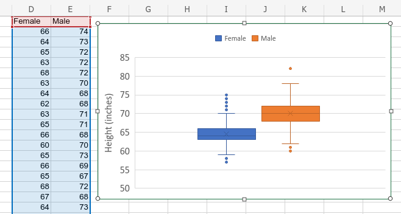
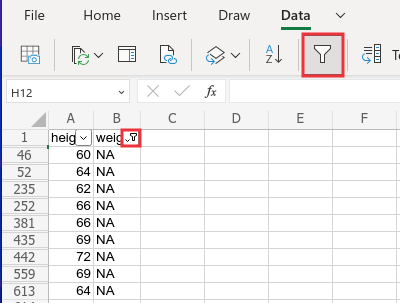
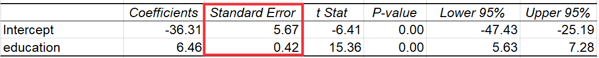
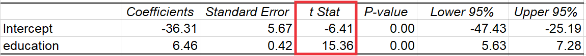
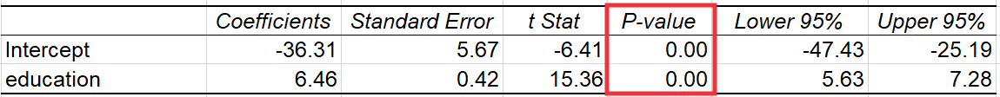
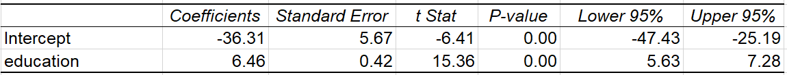
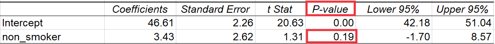

---
output:
  xaringan::moon_reader:
    css: ["default", "extra.css"]
    lib_dir: libs
    seal: false
    nature:
      highlightStyle: github
      highlightLines: true
      countIncrementalSlides: false
      ratio: '16:9'
---

```{r, echo = FALSE, warning = FALSE, message = FALSE}
##xaringan::inf_mr()
## For offline work: https://bookdown.org/yihui/rmarkdown/some-tips.html#working-offline
## Images not appearing? Put images folder inside the libs folder as that is the main data directory

library(tidyverse)
library(readxl)
library(stargazer)
library(modelr)
library(purrr)
library(kableExtra)

knitr::opts_chunk$set(echo = FALSE,
                      eval = TRUE,
                      error = FALSE,
                      message = FALSE,
                      warning = FALSE,
                      comment = NA)

# Data found in "Regression and Other Stories: Earnings" by "Andrew Gelman, Jennifer Hill, Aki Vehtari"
# https://github.com/avehtari/ROS-Examples/tree/master/Earnings

# Codebook: wfwcodebook.txt

# NOTE FOR YOU: Removed one huge outlier respondent who reported 400k in salary

## Just for fun, adjust income for inflation
## 1990 to 2021: 102.66% increase (ballpark estimate)
d <- read_excel("../Data_for_Class/Session2/Ross1990-Data.xlsx", na = c("NA"), guess_max = 10000) |>
    mutate(
        earnk_adj = earnk*2.3483,
        male = if_else(gender == "Male", 1, 0)
        )
```

background-image: url('libs/Images/01-statistics-background_v1.png')
background-size: 100%
background-position: center
class: middle

.size60[.content-box-white[**Today's Agenda**]]

<br>

.size45[
Simple OLS Regression Modeling
1. Fitting the models
2. Interpreting the models
3. Evaluating the models
]

.center[.size40[
  Justin Leinaweaver (Summer 2023)
]]

???

## Prep for Class
1. Upload data and variable description document for today

<br>

Welcome back! 

- Let's review our material from Session 1 and make sure we're all ready to move forward.


---

class: middle, slideblue

.size35[.content-box-white[**Session 1: Descriptive Statistics and Visualizations**]]

<br>

.size50[
1. The purpose of statistics (our aims)
    - Summarizing data
    
    - Answering questions about the world
]

???

### Any questions on the broad purposes of applied statistics?


---

class: middle, slideblue

.size35[.content-box-white[**Session 1: Descriptive Statistics and Visualizations**]]

<br>

.size50[
2) Pre-Analysis Work
- Cleaning data
    
- Organizing data to make it "tidy"
    
- Sorting and filtering data with the filter
]

???

### Any questions on the organizational and cleaning work that comes before analyses?


---

class: middle, slideblue

.size35[.content-box-white[**Session 1: Descriptive Statistics and Visualizations**]]

.size35[
3) Matching our Tools to the Type of Variable

- **Categorical**: Tables of counts and bar plots

- **Numerical**: Descriptive stats, box plots and histograms

- **Cat x Cat**: Pivot tables, side-by-side and stacked bar plots

- **Cat x Num**: Pivot tables and box plots

- **Num x Num**: Scatter plots
]

???

### Any questions on the meaning of these tools?

### Or how to make them in Excel?


---

class: middle, center, slideblue

```{r, fig.align='center'}

```

```{r, results='asis'}
d |>
  select(height:gender, earnk, ethnicity, education, age, walk, exercise) |>
  slice(1:9) |>
  kbl(format = "html", align = 'c') |>
  row_spec(row = 0, background = "#eedc82")
```

???

Introduce today's dataset

- Purpose: "This  study  measures  the  effects  of  various social conditions  on  individuals'  physical  and  mental health."

- Sourcing: Ross (1990) with funding from the Inter-university Consortium for Political and Social Research


---

background-image: url('libs/Images/Session2-Inflation-2023-06.png')
background-size: 85%
background-position: top left
class: slideblue

.right[.size55[.content-box-blue[**+134.83% (est)**]]]

.size65[

<br>

<br>

<br>

.center[.content-box-white[earn_adj = earnk * (1 + 1.3483)]]
]
???

[BLS CPI Calculator](https://www.bls.gov/data/inflation_calculator.htm)
- Jan 1990 to Jan 2023: $100 is $234.83

[St Louis FRED Inflation](https://fred.stlouisfed.org/series/FPCPITOTLZGUSA#)

<br>

First, let's adjust the earnings for inflation since 1990. 

- Per the BLS CPI calculator we can estimate the cumulative increase as 134.83%

<br>

To keep things more interesting for us today let's update the earnings in the survey for inflation.

- Make a new column, earnk_adj

- Multiply the amount by 1 +the rate of inflation

- The value of that column is the current earnk * 2.3483

- Note: Each time you copy this new variable to a new working sheet you have to paste special as a number.

<br>

### Everybody got that?


---

class: middle, center, slideblue

```{r, fig.align='center'}

```

```{r, results='asis'}
d |>
  select(earnk_adj, height:gender, education, age, walk, exercise) |>
  slice(1:10) |>
  kbl(format = "html", align = 'c', digits = 1) |>
  row_spec(row = 0, background = "#eedc82")
```

???

Explore the data using the filter and the codebook! 

- Anything stand out as interesting? 

- Any variables need explanation?

- Are we confident in the reliability and validity of these measures?

<br>

**SLIDE**: Let's take some time to practice our skills from Session 1 and learn something about the US in 1990. 


---

class: middle, slideblue

.size40[
1. What is the most common level of education in the sample?

2. What is the distribution of income? What are the maximum and minimum earnings reported?

3. Is there a gender difference in height? How big is the difference on average?

4. Do reported earnings increase with the level of education?
]

???

**Let's Practice!**

<br>

### What tools from last class could we use to answer each of these questions?

- (**SLIDE**)


---

class: middle, slideblue

.size40[
1. What is the most common level of education in the sample? .textred[**(Pivot table & bar plot)**]

2. What is the distribution of income? What are the maximum and minimum earnings reported? .textred[**(Histogram & descriptive stats)**]

3. Is there a gender difference in height? How big is the difference on average? .textred[**(Pivot table & box plot)**]

4. Do reported earnings increase with the level of education? .textred[**(Scatter plot)**]
]

???

Ok, 10 mins, get to it!


---

background-image: url('libs/Images/Session2-Ross_Pivot_Education.png')
background-size: 100%
background-position: center

???

Don't forget to filter out the NA and blank rows BEFORE you insert the bar plot.

- Use the drop-down arrow beside the column label for "education"
    - Choose "filter" and uncheck NA and blank


---

class: middle, slideblue

```{r, results='asis'}
d |>
  count(education) |>
  t() |>
  kbl(format = "html", align = 'c') |>
  row_spec(row = 1, bold = TRUE, background = "#ece9e8")
```

<br>

```{r, fig.align='center', fig.retina=3, out.width='75%', fig.width=6, fig.asp=0.618, cache=TRUE}
d |>
  ggplot(aes(x = education)) +
  geom_bar() +
  theme_bw() +
  labs(x = "Education (Years)", y = "",
       title = "What is the most commonly reported education level?") +
  scale_x_discrete(limits = 2:18)
```

???

## 1. What is the most common level of education in the sample?

<br>

### What is the answer to our question?

<br>

### What do we learn about the sample from this?


---

class: middle, slideblue

```{r, results='asis'}
d |>
  summarize(
    "Minimum Reported Earnings" = min(earnk_adj),
    "Maximum Reported Earnings" = max(earnk_adj)
  ) |>
  kbl(format = "html", digits = 2, align = 'c') |>
  row_spec(row = 0, bold = TRUE, background = "#ece9e8")
```

<br>

```{r, fig.align='center', fig.retina=3, out.width='70%', fig.width=6, fig.asp=0.618, cache=TRUE}
d |>
  ggplot(aes(x = earnk_adj)) +
  geom_histogram(color = "white", bins = 20) +
  theme_bw() +
  labs(x = "Yearly Earnings (2021k)", y = "", title = "Reported Sample Incomes (20 bins)")
```

???

## 2. What is the distribution of income? What are the maximum and minimum earnings reported?

<br>

### What is the answer to our question?

<br>

### What do we learn about the sample from this?


---

class: middle, slideblue

```{r, results='asis'}
d |>
  group_by(gender) |>
  summarize(
    "Minimum Height" = min(height),
    "Mean Height" = round(mean(height), 2),
    "Maximum Height" = round(max(height), 2)
  ) |>
  kbl(format = "html", digits = 2, align = 'c') |>
  row_spec(row = 0, bold = TRUE, background = "#ece9e8")
```

<br>

```{r, echo = FALSE, fig.align = 'center', out.width = '80%'}


# d |>
#   ggplot(aes(x = gender, y = height)) +
#   geom_boxplot() +
#   theme_bw() +
#   labs(y = "Height (inches)", x = "", title = "Is there a gender difference in height?")
```

???

## 3. Is there a gender difference in height? How big is the difference on average?

<br>

### What is the answer to our question?

<br>

### What do we learn about the sample from this?

<br>

### Is the average the "best" descriptive statistic for describing this difference? Why or why not?


---

class: middle, slideblue


```{r, fig.align='center', fig.retina=3, out.width='97%', fig.width=7, fig.asp=0.618, cache=TRUE}
d |>
  ggplot(aes(x = education, y = earnk_adj)) +
  geom_point() +
  theme_bw() +
  labs(y = "Yearly Earnings (2021k)", x = "Education (Years)", title = "Is there a relationship between education and reported earnings?")
```

???

## 4. Do reported earnings increase with the level of education?

<br>

### What is the answer to our question?

<br>

### What do we learn about the sample from this?

<br>

Let's use the scatter plot to jump to our next set of tools: Ordinary Least Squares

- Clearly we need a tool for summarizing a relationship between variables and evaluating the strength of those relationships.

- How do we identify the pattern in this cloud of data points? 

- How do we make precise estimates about the change in earnings for each year of education?


---

background-image: url('libs/Images/Session2-Fig2_4_1.png')
background-size: 100%
background-position: center

???

Everybody take a minute to review the example on p19 in the book. 

- Help me understand what I'm looking at here. 

<br>

### What does each axis represent? 
- (**SLIDE**)


---

background-image: url('libs/Images/Session2-Fig2_4_2.png')
background-size: 100%
background-position: center

???

### Does it matter what goes on the y vs the x axis? 
- (Y is always outcome)

### What are the dots? 
- (Basketball teams coded by their winning percentage and their shots made percentage)

### What is the line? 
- (An OLS "line of best fit" e.g. the model)

### So, what is the question this scatter plot is trying to answer? 
- (**SLIDE**)


---

background-image: url('libs/Images/Session2-Fig2_4_3.png')
background-size: 100%
background-position: center

???

- What explains why some college basketball teams win more games than others? 
- Do college basketball teams that score a higher percentage of their baskets win more games? 
- Do more efficient college basketball teams win more games?

<br>

### And what appears to be the answer? 
- (**SLIDE**)


---

background-image: url('libs/Images/Session2-Fig2_4_4.png')
background-size: 100%
background-position: center

???

(OLS attempts to draw a line through data points that represents the relationship.)
- So, yes, this line shows a positive slope.

<br>

### By how much? What does improving my team's shooting translate directly into wins? 


---

class: middle, slideblue

.center[
.size60[.content-box-white[**The Formula for a Line**]]

.size65[
Y = &#945; + &#946; X
]]

.size40[
- Y is the outcome

- &#945; is the constant (the intercept)

- &#946; is the coefficient estimate (the slope)

- X is the predictor
]

???

OLS results as the formula for a line. 

- Note: equivalent to y=mx+b, but this is the customary form in stats.

<br>

### Questions on this?


---

background-image: url('libs/Images/Session2-Fig2_4_5.png')
background-size: 100%
background-position: center

???

Here's the formula for the basketball example in the book. 

### What does this formula tell me about the relationship between shooting % and winning %?

<br>

### So, according to this model what is the average winning percentage for a team that makes 40% of its shots? 
- (29.4%)

### And according to this model what is the average winning percentage for a team that makes 50% of its shots? 
- (86.5%)

<br>

### Is everybody clear on how the OLS creates a line and we can use the formula for a line to make predictions with the model?

<br>

### How does OLS draw this line through the data points?
- (**SLIDE**)


---

background-image: url('libs/Images/Session2-Fig2_4_6.png')
background-size: 100%
background-position: center

???

Ordinary least squares minimizes the squared residuals.

Think of it like an iterative process.

1. Draw a line through the data points.

2. Calculate the residual for every data point 
    - The residual is the distance between the model line and the actual values in the data.

3. Square the residuals and add them together

4. Record the result and start over with a new line.

5. Finally, you keep the line with the smallest sum of squared residuals.

<br>

### Why square the residuals before adding them together?
- (Don't want the positive and negative errors to cancel each other out!)

<br>

In reality, the software uses matrix algebra to solve for the line which is much faster.


---

background-image: url('libs/Images/Session2-Fig2_4_7.png')
background-size: 100%
background-position: center

???

### Questions on the logic of OLS and how to interpret the results using the formula for a line? 

<br>

For the rest of today we practice!

**SLIDE**: Let's walk through the process of fitting and interpreting a regression model in Excel


---

class: middle, center, slideblue

.size60[.content-box-white[**Summarizing a Relationship with OLS**]]

<br>

<br>

.size70[**Is height a useful model of weight in the Ross (1990) sample?**]

???

**SLIDE**: Before we fit our OLS model, let's visualize the data!


---

class: middle, slideblue

.center[.size50[**Is height a useful model of weight in the Ross (1990) sample?**]]

.size50[
1. Make a scatterplot of height and weight

2. Add linear trend line

2. Make the line red and solid

3. Zoom the x axis in on the data
]

???

(**SLIDE**: Results)


---

```{r, fig.align='center', fig.retina=3, out.width='95%', fig.width=6, fig.asp=0.618, cache=TRUE}
d %>%
  ggplot(aes(x = height, y = weight)) +
  geom_point() +
  geom_smooth(method = "lm", se = FALSE, color = "red") +
  theme_bw() +
  labs(x = "Height (in)", y = "Weight (lb)", caption = "Source: Ross (1990)",
       title = "Bivariate Analysis: Scatter Plot")
```

???

### Everybody get this?

<br>

### What's our early takeaway?

<br>

The basic trend line added by Excel is an approximation of the OLS line.

- So, let's use OLS to get the details about this line.


---

class: middle, slideblue

.center[.size50[.content-box-white[**OLS Step 1: Remove Missing Data**]]]

.pull-left[
.size35[
1. Copy data to new sheet

2. **Filter** each variable to find missing data

3. **Delete complete rows** if missing data in any **relevant** column
]]

.pull-right[
```{r, echo = FALSE, fig.align = 'center', out.width = '100%'}

```
]

???

First step, copy data to working page and remove missing data. 

- Use filter to identify NA / missing data values.

<br>

### Why do we have to do this? 
- (You can't measure a relationship between two variables if values for one of them are missing.)

<br>

### Is removing 27 respondents a problem for our conclusions? Why or why not?


---

background-image: url('libs/Images/Session2-Fig-1_6.png')
background-size: 100%
background-position: center

???

In order to fit a regression in Excel we need the Data Analysis toolpak.

Everybody go through and make sure the toolpak is enabled.


---

background-image: url('libs/Images/Session2-Fig1_6_2.png')
background-size: 100%
background-position: center

???

Ok, let's step through the process of fitting an OLS regression of weight on height.

This slide is just to make sure you have the needed data on a new sheet, missing data removed and the analysis toolpak installed.

Go ahead and open the toolpak and select the regression


---

background-image: url('libs/Images/Session2-Simple_OLS1.png')
background-size: 100%
background-position: center

???

### Everybody have the regression window open?


---

background-image: url('libs/Images/Session2-Simple_OLS2.png')
background-size: 100%
background-position: center

???

Remember, 'Y' is the outcome or the thing we're trying to explain.


---

background-image: url('libs/Images/Session2-Simple_OLS3.png')
background-size: 100%
background-position: center

???

We'll discuss most of the output here, but keep yourself rooted in our work so far on the formula for a line.

All of this detail is provided to allow us to estimate the formula for the OLS line and to evaluate how well the line fits the actual data.

- The intercept "coefficient" is the alpha (e.g. the constant)

- The height "coefficient" is the beta coefficient in the formula for a line

<br>

Quick tangent: The Excel regression output is... let's just identify it as non-standard.

- Never provide someone with the raw Excel output if they ask you for a regression analysis. It looks terrible and is rather hard to disentangle.


---

class: middle

.size30[
```{r, results='asis'}
res1 <- d %>% lm(data = ., weight ~ height)

stargazer(res1, type = "html", omit.stat = "rsq", star.cutoffs = .05, notes = "*p < 0.05", notes.append = FALSE, digits = 2, covariate.labels = c("Height", "Constant"), dep.var.labels = "Weight", dep.var.caption = "")
```
]

???

In most published work with regression results you'll see a table that looks something like this.

- The first section, with the variable names, lists the elements you need to draw the OLS line (e.g. use the formula of a line)
    - Each coefficient is the number we plug into the formula for this line
    - The standard errors below each coefficient are a measure of how "good" your estimate is.
    - The stars represent a shorthand way of saying the fit is "good" or not
    
So, this OLS table describes a line where yearly earnings = -31

- The bottom section provides the info we need to evaluate the fit of the model as a whole
    - The number of observations, R^2, residual error and various tests of model fit like the F statistic.

<br>

We'll talk through each of these in a moment.


---

background-image: url('libs/Images/Session2-Simple_OLS4.png')
background-size: 100%
background-position: center

???

First, let's make sure everyone writes this down in their notes.

- This is how you take the Excel output and format it into a more standard table.

<br>

**SLIDE**: The height OLS regression in a report ready table


---

background-image: url('libs/Images/Session2-Simple_OLS5.png')
background-size: 100%
background-position: center

???

And here's what the completed table looks like.

### Questions on formatting a regression table?


---

class: middle

.pull-left[
```{r, fig.align='center', fig.retina=3, out.width='100%', fig.width=4.5, fig.asp=1, cache=TRUE}
d %>%
  ggplot(aes(x = height, y = weight)) +
  geom_point(alpha = .2) +
  geom_smooth(method = "lm", se = FALSE, color = "red") +
  theme_bw() +
  labs(x = "Height (in)", y = "Weight (lb)")
```
]

.pull-right[
```{r, results='asis'}
res1 <- d %>% lm(data = ., weight ~ height)

stargazer(res1, type = "html", omit.stat = "rsq", star.cutoffs = .05, notes = "*p < 0.05", notes.append = FALSE, digits = 2, covariate.labels = c("Height", "Constant"), dep.var.labels = "Weight", dep.var.caption = "")
```
]

<br>

.center[.size40[**Outcome = Constant + Beta Coefficient * Predictor**]]

???

Now remember, the OLS results are the numbers you need in the formula for a line.

### What values from the table do we plug into this formula for a line?
- (**SLIDE**)


---

class: middle

.pull-left[
```{r, fig.align='center', fig.retina=3, out.width='100%', fig.width=4.5, fig.asp=1, cache=TRUE}
d %>%
  ggplot(aes(x = height, y = weight)) +
  geom_point(alpha = .2) +
  geom_smooth(method = "lm", se = FALSE, color = "red") +
  theme_bw() +
  labs(x = "Height (in)", y = "Weight (lb)")
```
]

.pull-right[
```{r, results='asis'}
stargazer(res1, type = "html", omit.stat = "rsq", star.cutoffs = .05, notes = "*p < 0.05", notes.append = FALSE, digits = 2, covariate.labels = c("Height", "Constant"), dep.var.labels = "Weight", dep.var.caption = "")
```
]

<br>

.center[.size45[**Weight = -173.26 + 4.95 * Height**]]

???

Remember, you can use this formula, and simple algebra, to make a prediction of weight for ANY value of height. 

- We call these point estimates.

However, the model is really only useful for values inside the data.

<br>

Let's practice.

### First, what is the average height in the sample data?
- (**SLIDE**: `r mean(d$height)`)


---

class: middle

.pull-left[
```{r, fig.align='center', fig.retina=3, out.width='100%', fig.width=4.5, fig.asp=1, cache=TRUE}
d %>%
  ggplot(aes(x = height, y = weight)) +
  geom_point(alpha = .02) +
  geom_smooth(method = "lm", se = FALSE, color = "red") +
  annotate("segment", x = mean(d$height), xend = mean(d$height), y = 75, yend = 156, color = "blue") +
  annotate("text", x = 68, y = 80, label = "66.6", color = "blue") +
  annotate("point", x = 66.6, y = 156.2, color = "blue", size = 2) +
  theme_bw() +
  labs(x = "Height (in)", y = "Weight (lb)")
```
]

.pull-right[
```{r, results='asis'}
stargazer(res1, type = "html", omit.stat = "rsq", star.cutoffs = .05, notes = "*p < 0.05", notes.append = FALSE, digits = 2, covariate.labels = c("Height", "Constant"), dep.var.labels = "Weight", dep.var.caption = "")
```
]

<br>

.center[.size45[**Weight = -173.26 + 4.95 * (Height = 66.6)**]]

???

### Now, plug in this value for 'height' and tell me what your model predicts for the average weight of a person in this sample of average height?
- (**SLIDE**)


---

class: middle

.pull-left[
```{r, fig.align='center', fig.retina=3, out.width='100%', fig.width=4.5, fig.asp=1, cache=TRUE}
d %>%
  ggplot(aes(x = height, y = weight)) +
  geom_point(alpha = .02) +
  geom_smooth(method = "lm", se = FALSE, color = "red") +
  annotate("segment", x = mean(d$height), xend = mean(d$height), y = 75, yend = 156, color = "blue") +
  annotate("text", x = 68, y = 80, label = "66.6", color = "blue") +
  annotate("segment", x = 57, xend = mean(d$height), y = 156, yend = 156, color = "blue") +
  annotate("point", x = 66.6, y = 156.2, color = "blue", size = 2) +
  annotate("text", x = 68, y = 80, label = "66.6", color = "blue") +
  annotate("text", x = 58, y = 165, label = "156.2", color = "blue") +
  theme_bw() +
  labs(x = "Height (in)", y = "Weight (lb)")
```
]

.pull-right[
```{r, results='asis'}
stargazer(res1, type = "html", omit.stat = "rsq", star.cutoffs = .05, notes = "*p < 0.03", notes.append = FALSE, digits = 2, covariate.labels = c("Height", "Constant"), dep.var.labels = "Weight", dep.var.caption = "")
```
]

<br>

.center[.size45[**156.2 = -173.26 + 4.95 * (66.6)**]]

???

Prediction: `r predict.lm(res1, newdata = data.frame(height = mean(d$height)))`

<br>

### Does everybody understand how the OLS line attempts to summarize the relationship between these two variables?

We can plug any height value in and the line gives us a prediction of weight based on the data we have.

### Any questions on how to extract the formula for a line from the OLS regression and then to use it to make predictions?

<br>

Let's practice making predictions using our OLS regression.

- **SLIDE**


---

class: middle, slideblue

.center[.size40[.content-box-white[**Point Estimates to Evaluate Changes in the Predictor**]]]

<br>

```{r, fig.retina=3, fig.align='center', fig.asp=.618, out.width='75%'}
d |>
  ggplot(aes(x = height)) +
  geom_histogram(color = "white", bins = 12) +
  theme_bw() +
  labs(x = "Height (inches)", y = "Count") +
  geom_vline(xintercept = 66.6, color = "red", linewidth = 2)
```

???

Here is the histogram of heights in the dataset.

We just made a point estimate (prediction) based on the mean value (66.6).
- That's typically the first place everybody begins making predictions.

- Pretty clearly here that represents the most common height value in the data so seeing what our model predicts for it makes sense

<br>

Our next task is to use our model to evaluate how changes in the predictor translate to changes in the outcome.

- **SLIDE**: Common options...


---

class: middle, slideblue

.center[.size40[.content-box-white[**Point Estimates to Evaluate Changes in the Predictor**]]]

<br>

```{r, fig.retina=3, fig.align='center', fig.asp=.618, out.width='75%'}
d |>
  ggplot(aes(x = height)) +
  geom_histogram(color = "white", bins = 12) +
  theme_bw() +
  labs(x = "Height (inches)", y = "Count",
       title = "The Range of the Data") +
  geom_vline(xintercept = 57, color = "red", linewidth = 2) +
  annotate("text", x = 59, y = 450, label = "57", color = "red", size = 5) +
  geom_vline(xintercept = 82, color = "red", linewidth = 2) +
  annotate("text", x = 80, y = 450, label = "82", color = "red", size = 5)
```

???

One option is to make two point predictions, one for the minimum and one for the maximum heights in the dataset.

<br>

### Under what circumstances would this be useful information?

- Model testing: What are the limits of my model? Do the extreme predictions sound plausible?

- Product design: What are the absolute largest and smallest sizes we need to make sure our product can accommodate?

<br>

Ok, use our model to make these two predictions.

- What is the predicted weight for the shortest and tallest observations in the dataset?

- (**SLIDE**)


---

class: middle

.center[.size40[.content-box-blue[**Point Estimates to Evaluate Changes in the Predictor**]]]

.pull-left[
```{r, fig.align='center', fig.retina=3, out.width='100%', fig.width=4.5, fig.asp=1, cache=TRUE}
preds1 <- predict(res1, newdata = data.frame(height = c(57,82)))

d %>%
  ggplot(aes(x = height, y = weight)) +
  geom_point(alpha = .02) +
  geom_smooth(method = "lm", se = FALSE, color = "red") +
  annotate("segment", x = min(d$height), xend = min(d$height), y = 75, yend = preds1[1], color = "blue") +
  annotate("point", x = min(d$height), y = preds1[1], color = "blue", size = 2) +
  annotate("segment", x = max(d$height), xend = max(d$height), y = 75, yend = preds1[2], color = "blue") +
  annotate("point", x = max(d$height), y = preds1[2], color = "blue", size = 2) +
  annotate("text", x = min(d$height) + .5, y = preds1[1]+15, label = round(preds1[1],1), color = "blue") +
  annotate("text", x = max(d$height)-.5, y = preds1[2]+15, label = round(preds1[2],1), color = "blue") +
  theme_bw() +
  labs(x = "Height (in)", y = "Weight (lb)")
```
]

.pull-right[
```{r, results='asis'}
stargazer(res1, type = "html", omit.stat = "rsq", star.cutoffs = .05, notes = "*p < 0.03", notes.append = FALSE, digits = 2, covariate.labels = c("Height", "Constant"), dep.var.labels = "Weight", dep.var.caption = "")
```
]

???

### Everybody get these results?

<br>

Assuming our sample is representative of all Americans today then this would give us our range of possible weights!

- I'm guessing this data is pretty outdated 33 years later.


---

class: middle, slideblue

.center[.size40[.content-box-white[**Point Estimates to Evaluate Changes in the Predictor**]]]

<br>

```{r, fig.retina=3, fig.align='center', fig.asp=.618, out.width='75%'}
d |>
  ggplot(aes(x = height)) +
  geom_histogram(color = "white", bins = 12) +
  theme_bw() +
  labs(x = "Height (inches)", y = "Count",
       title = "The Interquartile Range of the Data") +
  geom_vline(xintercept = 64, color = "red", linewidth = 2) +
  geom_vline(xintercept = 69, color = "red", linewidth = 2) +
  annotate("text", x = 62, y = 450, label = "64", color = "red", size = 5) +
  annotate("text", x = 71, y = 450, label = "69", color = "red", size = 5)
```

???

A second option is to make two point predictions on a narrower slice of the data.
- We don't meet a lot of extremes day to day, so let's go with a narrower slice of the data: 25th to 75th percentile

<br>

### Under what circumstances would this be useful information?

- 50% of the population between these two values so much more likely to encounter these weights.

<br>

Go for it!


---

class: middle

.center[.size40[.content-box-blue[**Point Estimates to Evaluate Changes in the Predictor**]]]

.pull-left[
```{r, fig.align='center', fig.retina=3, out.width='100%', fig.width=4.5, fig.asp=1, cache=TRUE}
preds2 <- predict(res1, newdata = data.frame(height = c(64,69)))

d %>%
  ggplot(aes(x = height, y = weight)) +
  geom_point(alpha = .02) +
  geom_smooth(method = "lm", se = FALSE, color = "red") +
  annotate("segment", x = 64, xend = 64, y = 75, yend = preds2[1], color = "blue") +
  annotate("point", x = 64, y = preds2[1], color = "blue", size = 2) +
  annotate("segment", x = 69, xend = 69, y = 75, yend = preds2[2], color = "blue") +
  annotate("point", x = 69, y = preds2[2], color = "blue", size = 2) +
  annotate("text", x = 64, y = preds2[1]+15, label = round(preds2[1],1), color = "blue") +
  annotate("text", x = 69, y = preds2[2]+15, label = round(preds2[2],1), color = "blue") +
  theme_bw() +
  labs(x = "Height (in)", y = "Weight (lb)")
```
]

.pull-right[
```{r, results='asis'}
stargazer(res1, type = "html", omit.stat = "rsq", star.cutoffs = .05, notes = "*p < 0.03", notes.append = FALSE, digits = 2, covariate.labels = c("Height", "Constant"), dep.var.labels = "Weight", dep.var.caption = "")
```
]

???

### Everybody get these results?

<br>

These point estimates give us a sense of how the model fits the relationship between X and Y (height and weight).

- This shows us the general relationship in the middle of the distribution.

### Make sense?


---

class: middle

.center[.size35[.content-box-blue[**Bivariate Analyses with OLS**]]]

<br>

.pull-left[
```{r, fig.align='center', fig.retina=3, out.width='100%', fig.width=4.5, fig.asp=1, cache=TRUE}
d %>%
  ggplot(aes(x = height, y = weight)) +
  geom_point(alpha = .2) +
  geom_smooth(method = "lm", se = FALSE, color = "red") +
  theme_bw() +
  labs(x = "Height (in)", y = "Weight (lb)")
```
]

.pull-right[
```{r, results='asis'}
stargazer(res1, type = "html", omit.stat = "rsq", star.cutoffs = .05, notes = "*p < 0.05", notes.append = FALSE, digits = 2, covariate.labels = c("Height", "Constant"), dep.var.labels = "Weight", dep.var.caption = "")
```
]

???

### Any questions on the basics of fitting an OLS regression in Excel?

### How to translate Excel output into this style of professional table?

### Or how to make point estimates using the OLS results?

<br>

**SLIDE**: Let's practice!


---

class: middle, slideblue

.center[.size55[.content-box-white[**Let's Practice!**]]]

<br>

.size45[
Make a scatterplot and write the formula for a line:

- Model 1: Regress earnk_adj on height

- Model 2: Regress earnk_adj on age

- Model 3: Regress earnk_adj on education
]

???

Class Practice: 

- Three models of earnings with scatter plots and regressions (on height; on age; on education)

### Questions?

<br>

Get to it!


---

class: middle, slideblue

```{r, fig.align='center', fig.retina=3, out.width='95%', fig.width=9, fig.asp=0.4, cache=TRUE}
d %>%
  select(earnk, height, age, education) %>%
  pivot_longer(cols = height:education, names_to = "Predictor", values_to = "Values") %>%
  mutate(
    Predictor = case_when(
      Predictor == "age" ~ "Age (years)",
      Predictor == "height" ~ "Height (in)",
      Predictor == "education" ~ "Education (years)"
    )
  ) %>%
  ggplot(aes(x = Values, y = earnk)) +
  geom_point(alpha = .1) +
  geom_smooth(method = "lm", se = FALSE) +
  facet_wrap(~ Predictor, scales = "free") +
  theme_bw() +
    labs(x = "", y = "Yearly Income (Thousands 2021 USD)", caption = "Source: Ross (1990)")

res1 <- lm(data = d, earnk_adj ~ age)
res2 <- lm(data = d, earnk_adj ~ education)
res3 <- lm(data = d, earnk_adj ~ height)
```

.size45[
- Income = `r as.numeric(round(coef(res1)[1], 2))` + `r as.numeric(round(coef(res1)[2], 2))` * Age
- Income = `r as.numeric(round(coef(res2)[1], 2))` + `r as.numeric(round(coef(res2)[2], 2))` * Education
- Income = `r as.numeric(round(coef(res3)[1], 2))` + `r as.numeric(round(coef(res3)[2], 2))` * Height
]

???

### Everybody get these results?
- NOTE: I've made the points slightly translucent to help us deal with overplotting

<br>

### Which predictor has the "strongest" effect on income? Why?

- Age has a small slope, but a huge range of input values and kind of makes sense...

- Education has the steepest slope, but there's a problem on the left side (predictions below zero) and a bunch of outliers on the right...

- Height splits the difference well BUT I'm not clear on the logic of this connection...

<br>

### So, bottom line, which is the most "useful" model of earnings? Why?

<br>

**SLIDE**: Let's explore what the other statistics in our regression tables tell us about how well these models fit the data.


---

class: middle, slideblue

.center[.size55[.content-box-white[**Evaluating an OLS Regression**]]]

<br>

.size50[
1. Logic

2. Significance

3. Coefficient of Determination (R&sup2;)

4. Non-linearity and heteroskedasticity
]

???

Four evaluation steps per the textbook

<br>

Let's apply each of these and see what they show us.


---

class: middle, slideblue

.center[.size55[.content-box-white[**Evaluation Step 1: Logic**]]]

<br>

```{r, fig.align='center', fig.retina=3, out.width='100%', fig.width=9, fig.asp=0.35, cache=TRUE}
d %>%
  select(earnk, height, age, education) %>%
  pivot_longer(cols = height:education, names_to = "Predictor", values_to = "Values") %>%
  mutate(
    Predictor = case_when(
      Predictor == "age" ~ "Age (years)",
      Predictor == "height" ~ "Height (in)",
      Predictor == "education" ~ "Education (years)"
    )
  ) %>%
  ggplot(aes(x = Values, y = earnk)) +
  geom_point() +
  geom_smooth(method = "lm", se = FALSE) +
  facet_wrap(~ Predictor, scales = "free") +
  theme_bw() +
    labs(x = "", y = "Yearly Income (Thousands 2021 USD)", caption = "Source: Ross (1990)")
```

???

This is very much the conversation we have been having as we tried to interpret the scatter plots with model line.

- Is the causal mechanism here logical?

- Does the size of the effect make sense?

- Does the direction of the effect make sense?

<br>

### What do we learn about these models using Step 1?


---

class: middle

.pull-left[

<br>

<br>

<br>

.center[.size45[**Evaluation Step 2: Statistical Significance**]]
]

.pull-right[
```{r, results='asis'}
# Simple Regression Options
res1 <- d %>% lm(data = ., earnk_adj ~ height)
res2 <- d %>% lm(data = ., earnk_adj ~ age)
res3 <- d %>% lm(data = ., earnk_adj ~ education)

stargazer(res1, res2, res3, omit.stat = c("rsq", "f", "ser"), star.cutoffs = .05, notes = "*p < 0.05", notes.append = FALSE, digits = 2, covariate.labels = c("Height", "Age", "Education", "Constant"), dep.var.labels = "Earnings (Thousands)", dep.var.caption = "", type = "html")
```
]

???

Let's talk about the second step in our evaluation process: statistical significance.

- e.g. the little stars on the coefficients in the regression results table

<br>

This is a deeply problematic and much misunderstood topic.

- Let's try to clarify the intuitions here so we can work with them AND understand their considerable limitations.


---

class: middle

.center[.size40[.content-box-blue[**What is statistical significance?**]]]

<br>

.pull-left[
.size25[
```{r, results='asis'}
stargazer(res3, omit.stat = c("rsq", "f", "ser"), star.cutoffs = .05, notes = "*p < 0.05", notes.append = FALSE, digits = 2, covariate.labels = c("Education", "Constant"), dep.var.labels = "Earnings (2021)", dep.var.caption = "", type = "html")
```
]]

.pull-right[
.center[
.size50[
Alternative Hypothesis (H<sub>A</sub>)

VS

Null Hypothesis (H<sub>0</sub>)
]]]

???

Conventional statistical significance testing is based on the idea that we can present our model in two ways:

- As an alternative hypothesis and a null hypothesis.

<br>

The 'alternative' refers to a hypothesis that the predictor and the outcome are related.

### So, what is the alternative hypothesis for this education model? What do we think is the relationship?
- (Higher levels of education are associated with larger incomes)

<br>

**SLIDE**: The 'null' refers to a hypothesis that the two things are not related at all.


---

class: middle

.center[.size40[.content-box-blue[**What is statistical significance?**]]]

<br>

.pull-left[
.size25[
```{r, results='asis'}
stargazer(res3, omit.stat = c("rsq", "f", "ser"), star.cutoffs = .05, notes = "*p < 0.05", notes.append = FALSE, digits = 2, covariate.labels = c("Education", "Constant"), dep.var.labels = "Earnings (2021)", dep.var.caption = "", type = "html")
```
]]

.pull-right[
.size30[
Alternative Hypothesis (H<sub>A</sub>)
- Higher levels of education are associated with larger incomes

<br>

Null Hypothesis (H<sub>0</sub>)
- Level of education is not associated with income
]]

???

### Everybody understand how you can think about any hypothesis in these terms?

<br>

Let's look at the data and see if we can tell which hypothesis is more consistent with the data.

### How do we visualize the alternative hypothesis?

### - How have you visualized the data thus far?

- (**SLIDE**)


---

```{r, fig.align='center', fig.retina=3, out.width='95%', fig.width=7, fig.asp=0.618, cache=TRUE}
# Significant example
d %>%
  ggplot(aes(x = education, y = earnk_adj)) +
  geom_jitter(width = 0, height = 0, alpha = .25) +
  geom_smooth(method = "lm", se = FALSE) +
  theme_bw() +
  #coord_cartesian(ylim = c(-10, 100)) +
  labs(x = "Education (years)", y = "Earnings (2021 USD)", title = "Alternative Hypothesis")
```

???

### Does everybody understand how this represents a model in which increasing education leads to higher yearly earnings?

<br>

### Ok, how do we visualize the null hypothesis?

### - What kind of line do we draw to show an expectation that there is no relationship between education and earnings?

- (**SLIDE**)


---

class: middle

.center[.size45[.content-box-blue[**What is statistical significance?**]]]

<br>

.pull-left[
```{r, fig.align='center', fig.retina=3, out.width='95%', fig.width=5, fig.asp=0.8, cache=TRUE}
# Significant example
d %>%
  ggplot(aes(x = education, y = earnk_adj)) +
  geom_jitter(width = 0, height = 0, alpha = .25) +
  geom_smooth(method = "lm", se = FALSE) +
  theme_bw() +
  #coord_cartesian(ylim = c(-10, 100)) +
  labs(x = "Education (years)", y = "Earnings (2021 USD)", title = "Alternative Hypothesis")
```
]

.pull-right[
```{r, fig.align='center', fig.retina=3, out.width='95%', fig.width=5, fig.asp=0.8, cache=TRUE}
d %>%
  ggplot(aes(x = education, y = earnk_adj)) +
  geom_jitter(width = 0, height = 0, alpha = .25) +
  geom_hline(yintercept = mean(d$earnk_adj), color = "red") +
  theme_bw() +
  #coord_cartesian(ylim = c(-10, 100)) +
  labs(x = "Education (years)", y = "Earnings (2021 USD)", title = "Null Hypothesis")
```
]

???

### Why is the null a horizontal line?

<br>

In short, the test of statistical significance asks which of these two lines better fit the data.

### Simply eye-balling this, which would you say better "fits"? Why?

<br>

The good news is, we don't have to eye-ball it.

**SLIDE**: The bad news is that the test itself isn't quite this intuitive...


---

class: middle, slideblue

.center[.size40[.content-box-white[**What is statistical significance?**]]]

<br>

```{r, fig.align='center', out.width='93%'}
knitr::include_graphics('libs/Images/Session2-OLS-Full-Education1_red_outline.png')
```

???

Let's root ourselves here back in the Excel regression output and focus on the coefficient estimates.

- Each coefficient is provided along with a series of statistical measures

<br>

### Remind me, what does the coefficient on education represent? How do we interpret it?

### And what about the coefficient on the intercept?

<br>

So, remember the coefficients are the estimated values in our formula for a line and our job in evaluation step 2 is to ask if these estimates are "statistically significant."


---

class: middle, slideblue

.size65[.center[.content-box-white[**The Standard Error**]]]

<br>

```{r, fig.align='center'}

```

<br>

.size65[.center[**How uncertain is each estimated coefficient?**]]

???

The standard error is an attempt to represent the uncertainty in our coefficient estimates.

- **SLIDE**: Think of this like the standard deviation we calculate for any list of numbers.


---

class: slideblue, middle, full

```{r, fig.retina=3, fig.align='center', fig.asp=0.45, fig.width=9, out.width='100%', cache=TRUE}
tibble(
  x1 = rnorm(n = 5000, mean = 0, sd = 2),
  x2 = rnorm(n = 5000, mean = 0, sd = 6)
) |>
  pivot_longer(cols = x1:x2, names_to = "Vars", values_to = "Values") |>
  mutate(
    Vars = if_else(Vars == "x1", "Small Standard Deviation", "Large Standard Deviation")
  ) |>
  ggplot(aes(x = Values)) +
  geom_histogram(bins = 15, color = "white") +
  facet_wrap(~Vars, scales = "free_y") +
  geom_vline(xintercept = 0, color = "red", lwd = 1.25) +
  theme_bw() +
  labs(x = "", y = "") +
  scale_x_continuous(breaks = seq(-20, 20, 10), labels = c("-20", "-10", "Mean", "+10", "+20"))
```

???

The standard deviation tells you how far from the mean the values in any list of numbers are on average.

- If the mean is the "correct" answer, the sd tells you how far off these numbers tend to be.

<br>

Here we see two histograms of different lists of numbers.

- In both lists, the mean is the most common value but the rest of the numbers are spread around it.

- On the left we see a distribution with a large standard deviation
    - A big sd means the numbers are very spread out and any single number you select from the list may be very far from the mean

- On the right we see a distribution with a small standard deviation
    - A small sd means any single number in the list is likely close to the mean.

<br>

### Make sense?


---

class: middle, slideblue, size35

```{r, fig.align='center'}

```

```{r, fig.retina=3, fig.align='center', fig.asp=0.45, fig.width=8, out.width='100%', cache=TRUE}
tibble(
  x1 = rnorm(n = 5000, mean = 5.57, sd = 2),
  x2 = rnorm(n = 5000, mean = 5.57, sd = 6)
) |>
  pivot_longer(cols = x1:x2, names_to = "Vars", values_to = "Values") |>
  mutate(
    Vars = if_else(Vars == "x1", "1. Small Standard Error (2)", "2. Large Standard Error (6)")
  ) |>
  ggplot(aes(x = Values)) +
  geom_histogram(bins = 15, color = "white") +
  facet_wrap(~Vars, scales = "free_y") +
  geom_vline(xintercept = 5.57, color = "red", lwd = 1.25) +
  theme_bw() +
  labs(x = "", y = "") +
  scale_x_continuous(breaks = c(-10, 0, 5.57, 10, 20), labels = c("-10", "0", "\u03B2", "10", "20"))
```

???

The standard error works like this for the regression estimates.

- Here we see the education beta estimate at 5.57 with a large and a small standard error.

- Technically, the standard error is an estimate of the standard deviation of the coefficient.

- In other words, the SE describes how much we'd expect the coefficient estimate to change if we re-ran our analysis on new data for our sample using this same model.
    - e.g. ran a new nationally representative survey of Americans and asked them about their earnings and education. 

- Just as before, large SEs mean we should not be confident because any new replication of this model and analysis will produce estimates that may be very far away from our current one.

- Small SEs mean we are confident that our estimated coefficient is closer to the 'true' parameter value and that new replications will reinforce our confidence.

### Does this make sense?

### Out of curiosity, which plot better represents our actual regression results?

(**SLIDE**)


---

class: middle, slideblue, size35

```{r, fig.align='center'}

```

```{r, fig.retina=3, fig.align='center', fig.asp=0.45, fig.width=8, out.width='100%', cache=TRUE}
tibble(
  x1 = rnorm(n = 5000, mean = 5.57, sd = 0.362),
  x2 = rnorm(n = 5000, mean = 5.57, sd = 6)
) |>
  pivot_longer(cols = x1:x2, names_to = "Vars", values_to = "Values") |>
  mutate(
    Vars = if_else(Vars == "x1", "1. Estimated Standard Error (0.36)", "2. Large Standard Error (6)")
  ) |>
  ggplot(aes(x = Values)) +
  geom_histogram(bins = 15, color = "white") +
  facet_wrap(~Vars, scales = "free") +
  geom_vline(xintercept = 5.57, color = "red", lwd = 1.25) +
  theme_bw() +
  labs(x = "", y = "")
  #scale_x_continuous(breaks = c(-10, 0, 5.57, 10, 20), labels = c("-10", "0", "\u03B2", "10", "20"))
```

???

Our actual estimated SE is tiny!
- These histograms use the SE to simulate our whole analysis 5,000 times.

### What do we notice when comparing these two histograms? Perhaps something related to the null hypothesis?

### Focusing just on the histogram that uses our actual SE, what can we say about the education coefficient across all 5,000 simulations?
- (Basically every single simulation produced an estimate of the coefficient between 4.5 and 6.5!)
    - We should feel super confident about our estimate!
    
### And what do we learn from the 5,000 simulations with the large SE?
- (Results show a HUGE range; estimates vary from -10 to above 20!)
- (AND a bunch of the estimates are 0, e.g. the null hypothesis!)
- (AND a bunch of results are NEGATIVE meaning more education lowers your earnings!)

### Does this make sense? Any questions on how to interpret the SE?

**SLIDE:** Now, with an estimate of the coefficient and a measure of the error we can try to measure the probability that our alternative hypothesis beats the null hypothesis.


---

class: middle, slideblue

.size65[.center[.content-box-white[**Calculating the T-Statistic**]]]

<br>

```{r, fig.align='center'}

```

<br>

.center[

.size45[**Rescaling our coefficient into SE-units**

T-statistic = $\frac{\text{coefficient}}{\text{standard error}}$

]]


???

The t-statistic gives us a statistical method for determining if our model estimates are likely to be significant, rather than having to visualize thousands of simulations.

- Calculated by dividing the estimated coefficient by the standard error

<br>

This converts our estimates into a new number, called a t-statistic, which represents the number of error units between zero (the null hypothesis) and our estimate (the alternative hypothesis).


---

```{r, fig.retina=3, fig.align='center', fig.width=9, out.width='95%', fig.asp=0.618}
## Visualize the t-distribution
distdata <- tibble(
  x = seq(qt(p = c(0.0001), df = 1800), qt(p = c(0.9999), df = 1800), 0.0001),
  y = dt(x = x, df = 1800)
)

distdata |>
  ggplot(aes(x = x, y = y)) +
  geom_line() +
  theme_bw() +
  labs(x = "Estimated t-Score", y = "",
       title = "Student's t-Distribution (df = 1,800)") 
```

???

It turns out that t-scores can be evaluated using the Student's t-distribution which is approximately normal in shape and can be estimated using degrees of freedom when you don't know the actual underlying standard deviation.

- Here we see a density curve of the Student's t with 1800 degrees of freedom (approximately the size of our survey sample).

- Think of this like a histogram but instead of counting bins it represents probabilities.

- The entire area under the curve equals 100% of all possible coefficient estimates.

<br>

We can use this distribution to evaluate our model's t-statistic and it will tell us how likely we are to get our results IF THE NULL HYPOTHESIS IS TRUE.


---

```{r, fig.retina=3, fig.align='center', fig.width=9, out.width='95%', fig.asp=0.618}
## Visualize the t-distribution

## 50% interval
dist50 <- distdata |>
  filter(x >= qt(p = .25, df = 1800) & x <= qt(p = .75, df = 1800))

distdata |>
  ggplot(aes(x = x, y = y)) +
  geom_line() +
  
  theme_bw() +
  labs(x = "Estimated t-Score", y = "",
       title = "Student's t-Distribution: 50% of Outcomes") +
  geom_ribbon(data = dist50, aes(ymin = 0, ymax = y), fill = "blue", alpha = .3) +
  geom_vline(xintercept = 0, color = "red", lwd = 1.2) +
  annotate("text", x = 1, y = .025, label = "+0.67") +
  annotate("text", x = -1, y = .025, label = "-0.67")
```

???

The Student's t allows us to make projections based on a world where the null hypothesis is true.

<br>

For example, let's say we could re-run our survey 1000 times with 1000 different samples.

- The t distribution tells us that in half of the new surveys the coefficient on education would have a t-statistic between -.67 and +.67.

- In other words, assuming the null is true and education has ZERO effect on earnings we would expect to find half of our surveys give results in this blue area.
    - This blue area, therefore, represents results mostly indistinguishable from zero.


---

```{r, fig.retina=3, fig.align='center', fig.width=9, out.width='95%', fig.asp=0.618}
## Visualize the t-distribution

## 75% interval
dist75 <- distdata |>
  filter(x >= qt(p = .125, df = 1800) & x <= qt(p = .875, df = 1800))

distdata |>
  ggplot(aes(x = x, y = y)) +
  geom_line() +
  
  theme_bw() +
  labs(x = "Estimated t-Score", y = "",
       title = "Student's t-Distribution: 75% of Outcomes") +
  geom_ribbon(data = dist75, aes(ymin = 0, ymax = y), fill = "blue", alpha = .3) +
  geom_vline(xintercept = 0, color = "red", lwd = 1.2) +
  annotate("text", x = 1.5, y = .025, label = "+1.15") +
  annotate("text", x = -1.5, y = .025, label = "-1.15")
```

???

Let's say we want to be more careful than that, so we bump it to 75%

- Here we see that 75% of the new surveys would produce education t-stats between -1.15 and 1.15.

- So, a result above or below those numbers would be different than 75% of the null results.

### Making some sense?

<br>

### Does anybody know what we conventionally use as our threshold of significance in statistics?
- (**SLIDE**: 95%)


---

```{r, fig.retina=3, fig.align='center', fig.width=9, out.width='95%', fig.asp=0.618}
## Visualize the t-distribution

## 95% interval
dist95 <- distdata |>
  filter(x >= qt(p = .025, df = 1800) & x <= qt(p = .975, df = 1800))

distdata |>
  ggplot(aes(x = x, y = y)) +
  geom_line() +
  
  theme_bw() +
  labs(x = "Estimated t-Score", y = "",
       title = "Student's t-Distribution: 95% of Outcomes") +
  geom_ribbon(data = dist95, aes(ymin = 0, ymax = y), fill = "blue", alpha = .3) +
  geom_vline(xintercept = 0, color = "red", lwd = 1.2) +
  annotate("text", x = 2.2, y = .1, label = "+1.96") +
  annotate("text", x = -2.2, y = .1, label = "-1.96")
```

???

So, we run 1,000 new analyses using our current research plan and we would expect 95% of the education t-stats to be between -2 and 2 ASSUMING THE NULL HYPOTHESIS IS TRUE.

- In other words, assuming a null hypothesis world you should almost never see a t-score on education above 2!

### And what is the t-stat we estimated in our regression?
- (SLIDE)


---

```{r, fig.retina=3, fig.align='center', fig.width=9, out.width='95%', fig.asp=0.618}
## Visualize the t-distribution

## 95% interval
dist95 <- distdata |>
  filter(x >= qt(p = .025, df = 1800) & x <= qt(p = .975, df = 1800))

distdata |>
  ggplot(aes(x = x, y = y)) +
  geom_line() +
  
  theme_bw() +
  labs(x = "Estimated t-Score", y = "",
       title = "Student's t-Distribution: 95% of Outcomes") +
  geom_ribbon(data = dist95, aes(ymin = 0, ymax = y), fill = "blue", alpha = .3) +
  geom_vline(xintercept = 0, color = "red", lwd = 1.2) +
  annotate("text", x = 2.2, y = .1, label = "+1.96") +
  annotate("text", x = -2.2, y = .1, label = "-1.96") +
  geom_vline(xintercept = 15.4, color = "blue", lwd = 1.25)
```

???

And this is the intuition behind the check for statistical significance.

<br>

Typically we assume that t-statistics above 2 or below -2 are far enough away from zero to be meaningful (e.g. "statistically significant").

- In other words, estimates that are at least two error units away from zero are probably pretty good.

<br>

In our education example we see our coefficient estimate is 15 SE units away from zero.

- That's a long, long way out there!

**SLIDE**: Of course, nobody really communicates in SE units, so let's convert those into probabilities!


---

class: middle, slideblue

.size65[.center[.content-box-white[**The P-Value**]]]

<br>

```{r, fig.align='center'}


res3 <- lm(data = d, earnk_adj ~ education)
# summary(res3)
```

<br>

.center[

.size55[**Converts the t-stat into a probability**]]

???

In our visualizations we kept increasing the spread of our experiment from 50% to 75% to 95%.

The p-value in an OLS regression table is presented in the other direction, e.g. 1 - this %.
- In other words, the smaller the p-value the better

- So, giving the null hypothesis a 95% chance of winning is 1 - .95 = 0.05, e.g. a 5% test.

- Excel here is rounding to 2 digits. I have an estimate of something like 2e-16

### Make sense?

<br>

Key takeaway: Researchers have come to accept that any p-value smaller than 5% (0.05) is "statistically significant."

- p-values smaller than 0.05 means your alternative hypothesis "wins" (e.g. fits the data better than the null). 

- p-values larger than 0.05 means the null "wins"  (e.g. fits the data better than the alternative).

### So, which wins for our education coefficient?
- (Here we see a p-value on education of 4x10-50. That's an **incredibly** tiny number.)
    - In other words, if reality is that education has ZERO effect on earnings we would ALMOST NEVER expect to find an effect as large as 5.57

### What questions do you have about this chain of steps that start with a coefficient and end with a probability?


---

class: middle, slideblue

```{r, fig.align='center', out.width='93%'}

```

.pull-left[
.size25[
```{r, results='asis'}
stargazer(res3, omit.stat = c("rsq", "f", "ser"), star.cutoffs = .05, notes = "*p < 0.05", notes.append = FALSE, digits = 2, covariate.labels = c("Education", "Constant"), dep.var.labels = "Earnings (2021)", dep.var.caption = "", type = "html")
```
]]

.pull-right[
```{r, fig.retina=3, fig.align='center', out.width='100%', fig.asp=.8, fig.width=5}
ggplot(data = d, aes(x = education, y = earnk_adj)) +
  geom_point() +
  geom_smooth(method = "lm", se = FALSE) +
  geom_hline(yintercept = mean(d$earnk_adj), color = "red") +
  theme_bw() +
  labs(x = "Education", y = "Yearly Earnings (Adjusted)")
```
]

???

Let's put it all together.

Here are the Excel and the scatter plot.

- These p-values are both below 0.05 so we say that the blue line fits the data better than the red line.

- The star indicates a p-value smaller than some threshold. 

- In this table the note identifies 0.05.

<br>

So, when formatting a regression table the expectation is that you will include stars next to "significant" coefficients

- You should also include a note at the bottom as to what your chosen level of significance is.

### Questions on this?

<br>

**SLIDE**: Let me show you a not significant result as a comparison.


---

class: middle, slideblue

```{r, fig.align='center', fig.retina=3, out.width='95%', fig.width=7, fig.asp=0.618, cache=TRUE}
d %>%
  ggplot(aes(x = smokenow, y = earnk_adj)) +
  geom_jitter(width = .1, height = 0, alpha = .35) +
  geom_smooth(method = "lm", se = FALSE, size = 1.1) +
  geom_segment(x = 1, xend = 2, y = mean(d$earnk_adj), yend = mean(d$earnk_adj), color = "red") +
  theme_bw() +
  labs(x = "", y = "Yearly Income (Thousands USD)", title = "Alternative vs the Null Hypothesis") +
  scale_x_continuous(breaks = c(1,2), labels = c("Smoker", "Non-Smoker"), limits = c(0.75,2.25))
```

???

Here we see data from Ross (1990) on smoking behavior and earnings.

It should be clear to see from the lines that the red and blue lines overlap considerably.


---

class: middle, slideblue

```{r, fig.align='center', out.width='93%'}

```

```{r, fig.align='center', fig.retina=3, out.width='80%', fig.width=6, fig.asp=0.618, cache=TRUE}
d %>%
  ggplot(aes(x = smokenow, y = earnk_adj)) +
  geom_jitter(width = .1, height = 0, alpha = .35) +
  geom_smooth(method = "lm", se = FALSE, size = 1.1) +
  geom_segment(x = 1, xend = 2, y = mean(d$earnk_adj), yend = mean(d$earnk_adj), color = "red") +
  theme_bw() +
  labs(x = "", y = "Yearly Income (Thousands USD)", title = "Alternative vs the Null Hypothesis") +
  scale_x_continuous(breaks = c(1,2), labels = c("Smoker", "Non-Smoker"), limits = c(0.75,2.25))
```

???

In terms of the regression output you can see that the p-value on smoking is .19 which is bigger than 0.05.

- So, even though the coefficient is almost 3, meaning non-smokers earn 3k more on average, we are not confident the model is an improvement on the null hypothesis.

### Questions on this example?


---

class: middle

.pull-left[

<br>

<br>

<br>

.center[.size45[**Evaluation Step 2: Statistical Significance**]]
]

.pull-right[
```{r, results='asis'}
stargazer(res1, res2, res3, omit.stat = c("rsq", "f", "ser"), star.cutoffs = .05, notes = "*p < 0.05", notes.append = FALSE, digits = 2, covariate.labels = c("Height", "Age", "Education", "Constant"), dep.var.labels = "Earnings (Thousands)", dep.var.caption = "", type = "html")
```
]

???

### So, what do we learn about these models using Step 2?


---

class: middle

.pull-left[

<br>

<br>

<br>

.center[.size45[**Evaluation Step 3: Coefficient of Determination**]]
]

.pull-right[
```{r, results='asis'}
stargazer(res1, res2, res3, omit.stat = c("rsq", "f", "ser"), star.cutoffs = .05, notes = "*p < 0.05", notes.append = FALSE, digits = 2, covariate.labels = c("Height", "Age", "Education", "Constant"), dep.var.labels = "Earnings (Thousands)", dep.var.caption = "", type = "html")
```
]

???

Evaluation Step 3: Coefficient of Determination

### What do we learn about these models using Step 3?

<br>

- **SLIDE**: Example of high R2

- **SLIDE**: Example of low R2


---

background-image: url('libs/Images/Session2-R2_1.png')
background-size: 100%
background-position: center

???

A "high" R2, meaning values closer to 1, implies a close association between the data and the line estimated by the OLS method.

- In high R2 situations any prediction made by your model is likely to come very close to the actual data.


---

background-image: url('libs/Images/Session2-R2_2.png')
background-size: 100%
background-position: center

???

A "low" R2, meaning values closer to 0, implies big differences between the model line and the actual data.

- In low R2 situations any prediction made by your model is likely to be pretty far away from the actual data.

<br>

### Questions on the intuition of an R-squared value?


---

class: middle

.pull-left[

<br>

<br>

<br>

.center[.size45[**Evaluation Step 3: Coefficient of Determination**]]
]

.pull-right[
```{r, results='asis'}
stargazer(res1, res2, res3, omit.stat = c("rsq", "f", "ser"), star.cutoffs = .05, notes = "*p < 0.05", notes.append = FALSE, digits = 2, covariate.labels = c("Height", "Age", "Education", "Constant"), dep.var.labels = "Earnings (Thousands)", dep.var.caption = "", type = "html")
```
]

???

Evaluation Step 3: Coefficient of Determination

### So, what do we learn about these models from their R2 values?

<br>

Super important note: Small R squared values do not mean bad models!

- It does mean overall predictions are likely to be off, but the slope of the line might still be highly precise!

<br>

In other words, I am confident that people with more education will earn more on average, BUT I'm not super confident that this model will accurately pinpoint the exact right salary.

### Make sense?


---

class: middle

.center[.size30[.content-box-white[**Evaluation Step 4: Visualize the Residuals**]]]

```{r, fig.align='center', fig.retina=3, out.width='85%', fig.width=7, fig.asp=0.618, cache=TRUE}
# Show a fake data result with heterogeneous data
new1 <-
  tibble(
    x = rnorm(350),
    y = (x * 3) + rnorm(350)
  )

res100 <- lm(y ~ x, data = new1)

new1 %>%
  add_residuals(res100) %>%
  add_predictions(res100) %>%
  ggplot(aes(x = pred, y = resid)) +
  geom_point() +
  theme_bw() +
  labs(x = "Model Predictions", y = "Residuals") +
  geom_smooth(method = "lm", se = FALSE)
```

???

Step 4 is where I ask you to do something different than the textbook's approach.

- The book's authors are focused on a very narrow type of error that is likely when you have time series data.

<br>

I prefer that we develop and apply a different tool, a residuals plot, that is helpful regardless of the kind of data you are working with.

In this plot the y-axis represents the residuals of the model and the x-axis the predicted values of the model.

- By residuals, we mean the difference between the actual data and the model.

- By predicted values, we mean the points along the model line.

<br>

This will be clearer when we make them in a moment, but first let's talk about the goal.

- This example is what we're hoping to see.

- The points are scattered above and below the horizontal line at zero in a seemingly random pattern.

- This is what we call homoscedastic errors.


---

background-image: url('libs/Images/Session2-Bad_Residuals1.png')
background-size: 100%
background-position: center

???

The first type of problem a residual plot can identify for you is evidence of heteroskedasticity.

<br>

This slide shows two models fit to data.

On the left, the model shows homoscedastic errors, meaning it is about equally accurate anywhere along the line.
- That's the goal!

- This model makes predictions all along the line with about the same level of error at each point.
    
<br>
    
On the right, the model shows heteroskedastic errors and they indicate something is wrong with our model.

- In our example on the right, our model makes much more accurate predictions at the low end and MUCH more inaccurate predictions at the high end.

- This is evidence that our model is missing something at the high end and may be over-fitting to the data on the low end.

<br>

The goal is a model line that goes through the conditional means of the data so a good fitting model should have similar levels of error all the way along it.

- Otherwise, our assumption that the model is a straight line may be wrong.

### Make sense? Questions on this?


---

background-image: url('libs/Images/Session2-Bad_Residuals2.png')
background-size: 100%
background-position: center

???

A second type of problem a residual plot can identify for you is evidence of clear non-linearities in the data.

In these examples the errors in our model clearly reveal the relationship we are studying is not actually a straight line.

### Make sense? Questions on this?


---

background-image: url('libs/Images/Session2-Bad_Residuals3.png')
background-size: 100%
background-position: center

???

Making a residuals plot in Excel is super easy.

- Check the residuals box in the regression window then highlight the two columns it produces and insert a scatterplot.

<br>

NOTE: DO NOT check the residuals plot box.
- It does NOT make the right thing in multiple OLS regressions.

- I have no idea why.

<br>

Let's practice.

- Everybody make the residual plot for our first model: Height


---

class: middle

.center[.size30[.content-box-white[**Evaluation Step 4: Visualize the Residuals**]]]

```{r, fig.align='center', fig.retina=3, out.width='85%', fig.width=7, fig.asp=0.618, cache=TRUE}
d %>%
  add_residuals(res1) %>%
  add_predictions(res1) %>%
  ggplot(aes(x = pred, y = resid)) +
  geom_point(alpha = .25) +
  theme_bw() +
  labs(x = "Predicted Earnings (2021 USD)", y = "Residuals", title = "Model 1: Height") +
  geom_smooth(se = FALSE)
```

???

### Everybody get this?

<br>

### Interpret it for me!

<br>

Ok, now do model 2: Age


---

class: middle

.center[.size30[.content-box-white[**Evaluation Step 4: Visualize the Residuals**]]]

```{r, fig.align='center', fig.retina=3, out.width='85%', fig.width=7, fig.asp=0.618, cache=TRUE}
d %>%
  add_residuals(res2) %>%
  add_predictions(res2) %>%
  ggplot(aes(x = pred, y = resid)) +
  geom_point(alpha = .25) +
  theme_bw() +
  labs(x = "Predicted Earnings (2021 USD)", y = "Residuals", title = "Model 2: Age") +
    geom_smooth(se = FALSE)
```

???

### Everybody get this?

<br>

### Interpret it for me!

<br>

Ok, now do model 3: Education


---

class: middle

.center[.size30[.content-box-white[**Evaluation Step 4: Visualize the Residuals**]]]

```{r, fig.align='center', fig.retina=3, out.width='85%', fig.width=7, fig.asp=0.618, cache=TRUE}
d %>%
  add_residuals(res3) %>%
  add_predictions(res3) %>%
  ggplot(aes(x = pred, y = resid)) +
  geom_point(alpha = .25) +
  theme_bw() +
  labs(x = "Predicted Earnings (2021 USD)", y = "Residuals", title = "Model 3: Education") +
  geom_smooth(se = FALSE)
```
???

### Everybody get this?

<br>

### Interpret it for me!


---

class: middle

.pull-left[
.size50[
1. Logic

2. Significance

3. Coefficient of Determination (R&sup2;)

4. Non-linearity and heteroskedasticity
]]

.pull-right[
```{r, results='asis'}
stargazer(res1, res2, res3, omit.stat = c("rsq", "ser", "f"), star.cutoffs = .05, notes = "*p < 0.05", notes.append = FALSE, digits = 2, covariate.labels = c("Height", "Age", "Education", "Constant"), dep.var.labels = "Earnings (Thousands)", dep.var.caption = "", type = "html")
```
]

???

### Ok, given the four steps, which is the most useful model of yearly earnings? Why?


---

class: middle, slideblue

.size60[
.center[**Which is a better model of personal income (earnk_adj)**:]

1. Mother's education level, or

2. Personal exercise
]

???

Class Practice: Which is a better model of personal income (earnk): Mother's education level, or Personal exercise

- **SLIDE**: first step...


---

class: middle, slideblue

.size45[
.center[**Which is a better model of personal income (earnk_adj)**:]

1. Mother's education level, or
2. Personal exercise
]

.size45[
- Step 1: Fit and evaluate both models
    - Scatterplots, regression table & residuals plots
]

???

- **SLIDE**: Scatter plots and table


---

.pull-left[
```{r, fig.align='center', fig.retina=3, out.width='90%', fig.width=5, fig.asp=1.4, cache=TRUE}
# Which is a better model of earnings: Mother's education or Father's education
res1 <- d %>% lm(data = ., earnk_adj ~ mother_education)
res2 <- d %>% lm(data = ., earnk_adj ~ exercise)

d %>%
  select(earnk_adj, mother_education, exercise) %>%
  pivot_longer(cols = mother_education:exercise, names_to = "Predictor", values_to = "Values") %>%
  mutate(
    Predictor = if_else(Predictor == "mother_education", "Mother's Education", "Strenuous Exercise")
  ) %>%
  ggplot(aes(x = Values, y = earnk_adj)) +
  geom_point() +
  geom_smooth(method = "lm", se = FALSE) +
  facet_wrap(~ Predictor, scales = "free", ncol = 1) +
  theme_bw() +
  labs(x = "", y = "Earnings (2021 USD)")
```
]

.pull-right[

<br>

```{r, results='asis'}
stargazer(res1, res2, type = "html", omit.stat = c("rsq", "ser", "f"), star.cutoffs = .05, notes = "*p < 0.05", notes.append = FALSE, digits = 2, covariate.labels = c("Mother's Education", "Exercise", "Constant"), dep.var.labels = "Earnings (2021 USD)", dep.var.caption = "")
```
]

???

### Everybody get these results?

<br>

### Any concerns raised by the four evaluation steps?

- **SLIDE**: Residual plots


---

class: middle, slideblue

.center[.size30[.content-box-white[**Evaluation Step 4: Visualize the Residuals**]]]

.pull-left[
```{r, fig.align='center', fig.retina=3, out.width='97%', fig.width=5, fig.asp=.85, cache=TRUE}
d %>%
  add_residuals(res1) %>%
  add_predictions(res1) %>%
  ggplot(aes(x = pred, y = resid)) +
  geom_point() +
  geom_smooth(method = "lm", se = FALSE) +
  theme_bw() +
  labs(x = "Model Predictions", y = "Residuals", title = "Residuals: Predicting Earnings with Mother's Education")
```
]

.pull-right[
```{r, fig.align='center', fig.retina=3, out.width='97%', fig.width=5, fig.asp=.85, cache=TRUE}
d %>%
  add_residuals(res2) %>%
  add_predictions(res2) %>%
  ggplot(aes(x = pred, y = resid)) +
  geom_point() +
  theme_bw() +
  labs(x = "Model Predictions", y = "Residuals", title = "Residuals: Predicting Earnings with Exercise") +
  geom_smooth(se = FALSE, method = "lm")
```
]

???

### Residual plots look ok?


---

class: middle, slideblue

.size45[
.center[**Which is a better model of personal income (earnk_adj)**:]

1. Mother's education level, or
2. Personal exercise
]

.size40[
- Step 2: Make four predictions
    - Mother completed high school (12) vs college (16)
    - No strenuous exercise (1) vs > 3x per week (7)
]

???

Step 2: Make four predictions


---

class: middle, slideblue

.center[.size50[.content-box-white[**What are the predicted earnings...**]]]

<br>

.size40[
```{r, results='asis'}
preds1 <- round(c(as.numeric(predict.lm(res1, newdata = data.frame(mother_education = c(12, 16)))), as.numeric(predict.lm(res2, newdata = data.frame(exercise = c(1, 7))))), 2)

tibble(
  Prediction = c("Mother completed high school (12)",
                 "Mother completed college (16)",
                 "Never does strenuous exercise (1)",
                 "Works out > 3 times per week (7)"),
  Estimate = preds1
) |>
  kbl(format = "html", digits = 2, align = 'c') |>
  row_spec(row = 0, bold = TRUE, background = "#ece9e8")
```
]

???

### Everybody get these?

<br>

### Do these change your sense of which model is more useful? Why or why not?


---

class: middle, slideblue

.center[.size50[.content-box-white[**For Next Class**]]]

.size40[
1. Read Wilson, Keating and Beal-Hodges ch 6-8

2. For any statistical concepts from today that remain unclear, re-read the relevant sections of ch1-5 in the book

3. Make sure you are comfortable using Excel to perform the analyses we explored today.
]


