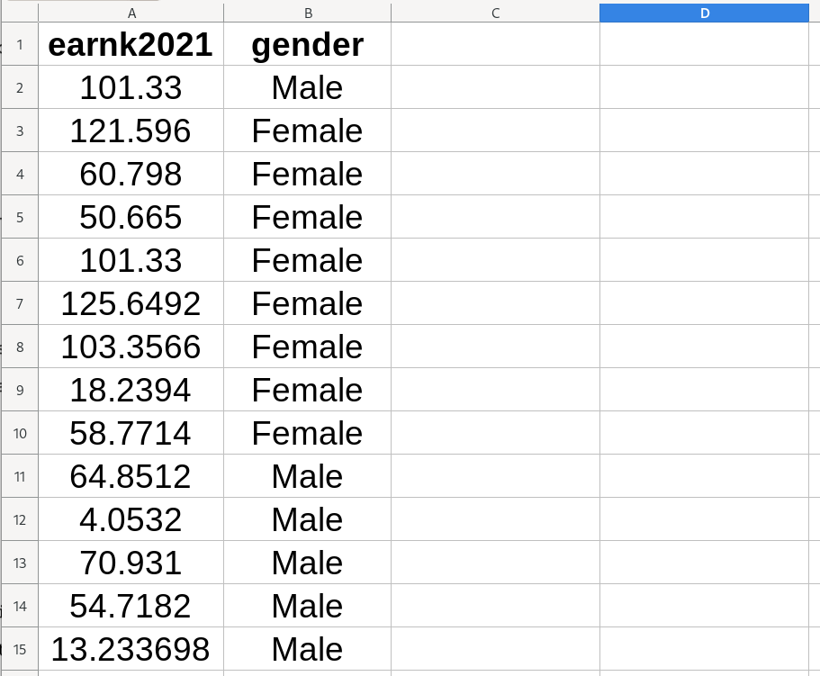
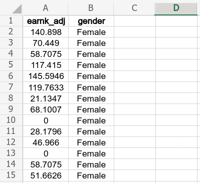
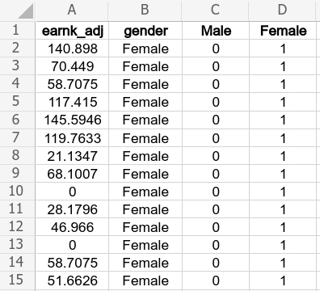
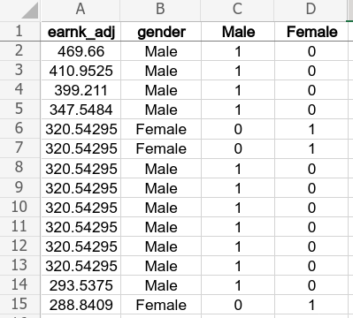
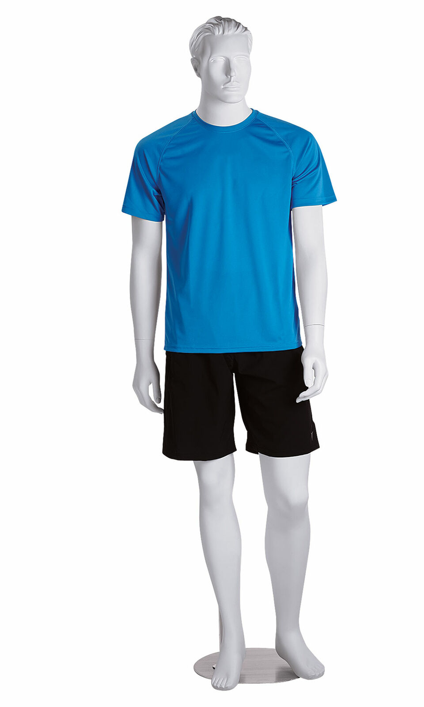
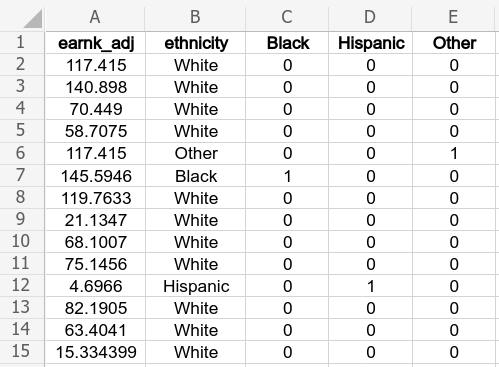
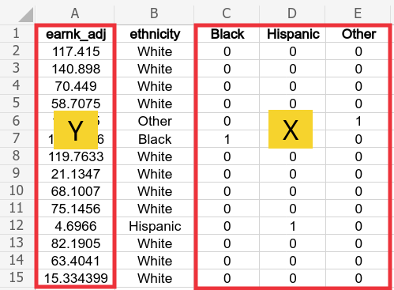

---
output:
  xaringan::moon_reader:
    css: ["default", "extra.css"]
    lib_dir: libs
    seal: false
    nature:
      highlightStyle: github
      highlightLines: true
      countIncrementalSlides: false
      ratio: '16:9'
---

```{r, echo = FALSE, warning = FALSE, message = FALSE}
##xaringan::inf_mr()
## For offline work: https://bookdown.org/yihui/rmarkdown/some-tips.html#working-offline
## Images not appearing? Put images folder inside the libs folder as that is the main data directory

library(tidyverse)
library(readxl)
library(stargazer)
library(modelr)
library(kableExtra)
library(modelsummary)

knitr::opts_chunk$set(echo = FALSE,
                      eval = TRUE,
                      error = FALSE,
                      message = FALSE,
                      warning = FALSE,
                      comment = NA)

```

background-image: url('libs/Images/01-statistics-background_v1.png')
background-size: 100%
background-position: center
class: middle

.size65[.content-box-white[**Today's Agenda**]]

<br>

.size50[
Multiple OLS Regression Modeling
1. Fitting the models
2. Interpreting the models
3. Evaluating the models
]

.center[.size40[
  Justin Leinaweaver (Summer 2023)
]]

???

**NOTE: You removed the box plots from these slides because students struggling to keep up. Consider putting back next year.**

<br>

## Prep for Class
1. Upload data and variable description document for today

<br>

Welcome back! 

- Let's review our material from Session 2 and make sure we're all ready to move forward.


---

class: middle, slideblue

.center[.size45[.content-box-white[**Session 2: Simple OLS Regression**]]]

<br>

.size40[
.center[Estimating a linear relationship between two variables]

1. Fitting in Excel

2. Interpreting the results

3. Evaluating the fit (4 steps)

4. Making point estimates
]

???

### Touching base, questions on what we've done so far? Clarifications needed?


---

class: middle, slideblue

.center[.size40[.content-box-white[**Do states that pay a higher minimum**]]]

.center[.size40[.content-box-white[**wage see more people finish college?**]]]

<br>

.size35[
1. Visualize the relationship (scatter plot)

2. Regress bachelors on min_wage

3. Evaluate the fit (four steps)

4. Make three predictions
    - Minimum wage at the minimum, median, and the maximum
]

???

Use the data from Session 1 to practice all our skills so far!


---

class: slideblue

.pull-left[
```{r, fig.align='center', fig.retina=3, out.width='95%', fig.width=5, fig.asp=0.618, cache=TRUE}
d <- read_excel("../Data_for_Class/Session1/Financial_Data_US_States-2018.xlsx", na = "NA") |>
  mutate(
    gdp_billions = gdp_millions / 1000,
    pop_millions = population / 1000,
    manufacture_millions = manufacturing / 1000,
  )

d |>
  ggplot(aes(x = min_wage, y = bachelors)) +
  geom_point() +
  theme_bw() + 
  labs(x = "Minimum Wage", y = "Bachelors (%)") +
  geom_smooth(method = "lm", se = FALSE)
```

```{r, fig.align='center', fig.retina=3, out.width='95%', fig.width=5, fig.asp=0.618, cache=TRUE}
res1 <- lm(data = d, bachelors ~ min_wage)

d |>
  add_residuals(res1) |>
  add_predictions(res1) |>
  ggplot(aes(x = pred, y = resid)) +
  geom_point() +
  theme_bw() + 
  labs(x = "Predicted Values", y = "Residuals") +
  geom_smooth(method = "lm", se = FALSE)
```
]

.pull-right[

<br>

.size24[
```{r, results='asis'}
stargazer(res1, type = "html", digits = 2, omit.stat = "rsq", dep.var.caption = "", dep.var.labels = "Bachelors (%)", covariate.labels = "Minimum Wage", notes = "*p<0.05", notes.append = FALSE, star.cutoffs = .05)
```
]]

???

### Everybody get these results?

<br>

### Walk me through the four steps of the evaluation. Does the regression fit the data "well"?

<br>

### How does this regression answer our question: Do states that pay a higher minimum wage see more people finish college?

<br>

**SLIDE**: Making predictions


---

class: slideblue

.pull-left[

<br>

.size24[
```{r, results='asis'}
stargazer(res1, type = "html", digits = 2, omit.stat = "rsq", dep.var.caption = "", dep.var.labels = "Bachelors (%)", covariate.labels = "Minimum Wage", notes = "*p<0.05", notes.append = FALSE, star.cutoffs = .05)
```
]]

.pull-right[
.size50[

<br>
]

.size30[
```{r, results='asis'}
tibble(
  "Minimum Wage" = c("Minimum = 0", "Median = 8.25", "Maximum = 11.50"),
  "Predicted Bachelors" = round(as.numeric(predict(res1, newdata = data.frame(min_wage = c(0, 8.25, 11.5)))), 2)
) |>
  kbl(format = "html", digits = 2, align = c('l', 'c')) |>
  row_spec(row = 0, bold = TRUE, background = "lightgrey") |>
  column_spec(column = 1, width = "15em", background = "#ece9e8") |>
  column_spec(column = 2, width = "8em", background = "#ece9e8")
```
]]

???

### Everybody get these results?

<br>

### How does this deepen our understanding of the results of the model? 
### - In what specific ways is this a useful addition to our regression table?

<br>

**SLIDE**: This table also represents a useful process for visualizing much more complicated models (e.g. the multiple regression models from today)


---

class: middle, slideblue

.center[.size55[.content-box-white[**A Marginal Effects Plot**]]]

<br>

.pull-left[

<br>

.size30[
```{r, results='asis'}
tibble(
  "Minimum Wage" = c(0, 8.25, 11.50),
  "Predicted Bachelors" = round(as.numeric(predict(res1, newdata = data.frame(min_wage = c(0, 8.25, 11.5)))), 2)
) |>
  kbl(format = "html", digits = 2, align = 'c') |>
  row_spec(row = 0, bold = TRUE, background = "lightgrey") |>
  column_spec(column = 1, width = "8em", background = "#ece9e8") |>
  column_spec(column = 2, width = "8em", background = "#ece9e8")
```
]]

.pull-right[
```{r, fig.align='center', fig.retina=3, out.width='95%', fig.width=4.5, fig.asp=0.85, cache=TRUE}
tibble(
  wage = c(0, 8.25, 11.50),
  pred = round(as.numeric(predict(res1, newdata = data.frame(min_wage = c(0, 8.25, 11.50)))), 2)
) |>
  ggplot(aes(x = wage, y = pred)) +
  geom_line() +
  geom_point() +
  theme_bw() +
  labs(x = "Minimum Wage", y = "Predicted Bachelor's Degrees (%)")
```
]

???

Everybody create two new columns on their spreadsheet and then use those new columns to insert a scatter plot with connecting lines.

<br>

This is a marginal effects plot

- e.g. It shows the estimated relationship between one of our predictors and the outcome controlling for all the other parts of the model.

- As your models get more complicated, e.g. more variables and more complex transformations, this can become the only way to easily communicate to other people what you've found.

- A scatter plot is typically limited to only two variables so you cannot just add a trendline on top if your regression includes more than one predictor (as it will today!).

<br>

### Any questions on making or interpreting a marginal effects plot?


---

class: middle, slideblue

.center[.size40[.content-box-white[**Presenting OLS Regression Results**]]]

.pull-left[

<br>

```{r, fig.align='center', fig.retina=3, out.width='95%', fig.width=4.5, fig.asp=0.85, cache=TRUE}
tibble(
  wage = c(0, 8.25, 11.50),
  pred = round(as.numeric(predict(res1, newdata = data.frame(min_wage = c(0, 8.25, 11.50)))), 2)
) |>
  ggplot(aes(x = wage, y = pred)) +
  geom_line() +
  geom_point() +
  theme_bw() +
  labs(x = "Minimum Wage", y = "Predicted Bachelor's Degrees (%)")
```
]

.pull-right[
.size24[
```{r, results='asis'}
stargazer(res1, type = "html", digits = 2, omit.stat = "rsq", dep.var.caption = "", dep.var.labels = "Bachelors (%)", covariate.labels = "Minimum Wage", notes = "*p<0.05", notes.append = FALSE, star.cutoffs = .05)
```
]
]

???

This is what I consider to be "best practice" for reporting an OLS regression.

- You give people the table which includes the key details on the coefficients and model fit, PLUS

- You give them an easy to digest version that shows what your model predicts for various levels of the predictor (marginal effects plot).

<br>

**SLIDE**: Before we move to new material, and now that you've had a day to digest it, I want to go through the significance testing criteria a second time.

- Let's see if it makes a tiny bit more sense after sleeping on it!


---

class: middle, slideblue

.center[.size35[.content-box-white[**Statistical Significance: Take Two!**]]]

.pull-left[
```{r, fig.align='center', fig.retina=3, out.width='80%', fig.width=6, fig.asp=0.618, cache=TRUE}
# Alternative
d |>
  ggplot(aes(x = min_wage, y = bachelors)) +
  geom_point() +
  theme_bw() + 
  labs(x = "Minimum Wage", y = "Bachelors (%)",
       title = "Alternative Hypothesis") +
  geom_smooth(method = "lm", se = FALSE)
```

```{r, fig.align='center', fig.retina=3, out.width='80%', fig.width=6, fig.asp=0.618, cache=TRUE}
# Null
d |>
  ggplot(aes(x = min_wage, y = bachelors)) +
  geom_point() +
  geom_hline(yintercept = mean(d$bachelors), color = "red") +
  theme_bw() + 
  labs(x = "Minimum Wage", y = "Bachelors (%)",
       title = "Null Hypothesis")
```
]

.pull-right[
.size24[
```{r, results='asis'}
stargazer(res1, type = "html", digits = 2, omit.stat = "rsq", dep.var.caption = "", dep.var.labels = "Bachelors (%)", covariate.labels = "Minimum Wage", notes = "*p<0.05", notes.append = FALSE, star.cutoffs = .05)
```
]
]

???

Now, remember that significance testing sets up a comparison between the alternative and the null hypothesis.

- The statistical significance question is, in essence, which line fits the data better?

<br>

To answer this question the OLS results include the standard error, a t-score and a p-value.

- Let me approach each of those concepts in a new way.

<br>

**SLIDE**: Let's start with the standard error.


---

class: middle, slideblue

.center[.size30[.content-box-white[**Statistical Significance:  What is the Standard Error?**]]]

<br>

```{r, fig.retina=3, fig.align='center', fig.asp=0.618, out.width='80%', cache=TRUE}
# Histogram bachelors to illustrate SD
d |>
  ggplot(aes(x = bachelors)) +
  geom_histogram(bins = 10, color = "white", fill = "blue1") +
  theme_bw() +
  labs(x = "Bachelors Degrees (%)", y = "",
       title = "Our Outcome to Explain: Bachelors Degrees") 
```

???

Here we see the distribution of the outcome we're trying to explain.

- Why do some states have lots of college completions and others not so much?


---

class: middle, slideblue

.center[.size30[.content-box-white[**Statistical Significance:  What is the Standard Error?**]]]

<br>

```{r, fig.retina=3, fig.align='center', fig.asp=0.618, out.width='80%', cache=TRUE}
# Histogram bachelors to illustrate SD
d |>
  ggplot(aes(x = bachelors)) +
  geom_histogram(bins = 10, color = "white", fill = "blue1") +
  theme_bw() +
  labs(x = "Bachelors Degrees (%)", y = "",
       title = "Summarizing the Middle: The Mean") +
  geom_vline(xintercept = mean(d$bachelors), color = "red", linewidth = 3) +
  annotate("text", x = 42, y = 10.5, label = str_c("Mean = ", round(mean(d$bachelors), 1)), size = 5) #+
  #annotate("text", x = 42, y = 9.5, label = str_c("Median = ", round(median(d$bachelors), 1)), size = 5)
```

???

Let's say we want to describe college completion across the US

- We could do worse than simply providing the mean.

- The range isn't very wide so I wouldn't expect the mean and median to give very different answers.

<br>

Mean: `r mean(d$bachelors)`

Median: `r median(d$bachelors)`


---

class: middle, slideblue

.center[.size30[.content-box-white[**Statistical Significance:  What is the Standard Error?**]]]

<br>

```{r, fig.retina=3, fig.align='center', fig.asp=0.618, out.width='80%', cache=TRUE}
# Histogram bachelors to illustrate SD
d |>
  ggplot(aes(x = bachelors)) +
  geom_histogram(bins = 10, color = "white", fill = "blue1") +
  theme_bw() +
  labs(x = "Bachelors Degrees (%)", y = "",
       title = "Evaluating the Mean: +/- 1 Standard Deviation") +
  geom_vline(xintercept = mean(d$bachelors), color = "red", linewidth = 3) +
  geom_vline(xintercept = mean(d$bachelors)-sd(d$bachelors), color = "red", linewidth = 1.5, linetype = "dashed") +
  geom_vline(xintercept = mean(d$bachelors)+sd(d$bachelors), color = "red", linewidth = 1.5, linetype = "dashed") +
  annotate("text", x = 42, y = 10.5, label = str_c("Mean = ", round(mean(d$bachelors), 1)), size = 5) +
  annotate("text", x = 42, y = 9.5, label = str_c("Std Dev = ", round(sd(d$bachelors), 1)), size = 5)
```

???

Remember from Johnson (2012) the standard deviation is a measure of the dispersion of the data around the mean.

- Small SD means most observations are close to the avg

- Big SD means most observations far away from the avg

<br>

Here I'm showing you the range that is +/- 1 SD

- If the data is normally distributed this should include 68% of the observations

- +/- 2 is 96% if normally distributed.

<br>

### Questions on SD?


---

class: middle, slideblue

.center[.size30[.content-box-white[**Statistical Significance:  What is the Standard Error?**]]]

.pull-left[

<br>

```{r}
d |>
  select(state, year, min_wage, bachelors) |>
  slice_sample(n = 10) |>
  kbl(align = 'c') |>
  kableExtra::row_spec(row = 0, background = "gold")
```
]

.pull-right[
.size24[
```{r, results='asis'}
stargazer(res1, type = "html", digits = 2, omit.stat = "rsq", dep.var.caption = "", dep.var.labels = "Bachelors (%)", covariate.labels = "Minimum Wage", notes = "*p<0.05", notes.append = FALSE, star.cutoffs = .05)
```
]
]

???

So here's the thing, the standard error is the standard deviation of the coefficient estimates.

- In a sense the 0.96 coefficient estimate is the average and the standard error tells us how much the other possible estimates vary around this average.

- Easy, right? :)

<br>

It's actually not as crazy as it sounds!

- Let's root ourselves back in the process that resulted in our OLS estimates.

<br>

What we did to this point:
- Collected data, 
- tidied data, and
- fit OLS

This process produced one fit of the model.


---

class: middle, slideblue

.center[.size30[.content-box-white[**Statistical Significance:  What is the Standard Error?**]]]

<br>

```{r, echo = FALSE, fig.align = 'center', out.width = '80%'}

```

???

Imagine we could re-run our data collection process and collect new data on the exact same variables. 

- We could then re-run the OLS and estimate a new formula for a line for this new data.

- Our hope would be that the two OLS results would be similar. 

- If they were very different then we would likely feel like our survey/data were not generating precise estimates of the world. 

- If they were very similar our confidence would increase in the model fit (estimate of the slope of the line)

<br>

Actually, we can approximate the effect of re-running our data collection using a bootstrap simulation.

- Imagine dumping the observations from our current data set into a bag and shaking it up

- That bag holds all of the variation we currently think exists in the US

- So, we reach in and pull out an observation and add it to a new spreadsheet.

- Then put it back in the bag, shake it up and pick another one.

- Once you have 50 observations you have a bootstrap simulation of the original dataset.

- Since we assume that the original sample reflects the actual underlying data of the country pulling from it to generate new data should produce equally representative samples even if the new dataset duplicates states (2 missouri's possible!)

### Make a vague sort-of sense?


---

class: middle, slideblue

.center[.size30[.content-box-white[**Statistical Significance:  What is the Standard Error?**]]]

<br>

```{r}
## Bootstrap one time and refit
res1 <- lm(data = d, bachelors ~ min_wage)

# Create bootstrapped sample
set.seed(155)
d_temp <- d |> slice_sample(n = nrow(d), replace = TRUE)
res2 <- lm(data = d_temp, bachelors ~ min_wage)

# Output
modelsummary(models = list("Original" = res1, "New Sample" = res2), fmt = 2, stars = c('*' = .05), gof_omit = "IC|Log|F", output = "kableExtra") |>
  column_spec(1, width = "10em") |>
  column_spec(2:3, width = "7em") |>
  row_spec(row = 5:8, background = "lightgrey") |>
  kable_styling(font_size = 24)
```

???

So, I created a bootstrap sample and refit the OLS regression

<br>

### What do we see here?


---

class: middle, slideblue

.center[.size30[.content-box-white[**Statistical Significance:  What is the Standard Error?**]]]

<br>

```{r}
## Bootstrap one time and refit
res1 <- lm(data = d, bachelors ~ min_wage)

# Create bootstrapped samples (1,000)
# d_repo <- vector("list", 1000)
# 
# for (i in 1:1000){
#   d_repo[[i]] <- slice_sample(d, n = nrow(d), replace = TRUE)
# }
# 
# save(d_repo, file = "d_repo.RData")

load(file = "d_repo.RData")

res2 <- lm(data = d_repo[[1]], bachelors ~ min_wage)
res3 <- lm(data = d_repo[[2]], bachelors ~ min_wage)
res4 <- lm(data = d_repo[[3]], bachelors ~ min_wage)
res5 <- lm(data = d_repo[[4]], bachelors ~ min_wage)
res6 <- lm(data = d_repo[[5]], bachelors ~ min_wage)

# Output the first 5
modelsummary(models = list("Original" = res1, "1" = res2, "2" = res3, "3" = res4, "4" = res5, "5" = res6), fmt = 2, stars = c('*' = .05), gof_omit = "IC|Log|F", output = "kableExtra") |>
  column_spec(1, width = "10em") |>
  column_spec(2:7, width = "5em") |>
  row_spec(row = 5:8, background = "lightgrey") |>
  kable_styling(font_size = 24)
```

???

Now, what if we re-did the data collection and analysis 5 times! 

- Again, the more similar they are the better!

<br>

Remember, each of these represents a simulated sample from our original data.

- In each the states are represented in different groups

- The cool thing is that this lets us examine the robustness of our estimates.

<br>

### Make sense so far?

### What do we see here?


---

class: middle, slideblue

.center[.size30[.content-box-white[**Statistical Significance:  What is the Standard Error?**]]]

<br>

```{r, fig.retina=3, fig.align='center', fig.asp=0.618, out.width='80%', cache=TRUE}
## Fit OLS to all samples
betas1 <- vector("list", 1000)

for (i in 1:1000){
  
  betas1[[i]] <- coef(lm(data = d_repo[[i]], bachelors ~ min_wage))[2]
  
}

d_sample <- tibble(
  Sample = 1:1000,
  min_wage = as.numeric(betas1)
)

d_sample |>
  ggplot(aes(x = min_wage)) +
  geom_histogram(color = "white", fill = "blue1") +
  theme_bw() +
  labs(x = "Minimum Wage Beta Coefficients", y = "",
       title = "Bootstrapped Estimates") +
  annotate("text", x = 2, y = 200, label = str_c("Mean = ", round(mean(d_sample$min_wage), 2)), size = 5) +
  annotate("text", x = 2, y = 175, label = str_c("Std Dev = ", round(sd(d_sample$min_wage), 2)), size = 5)
```

???

Now, what if we did it 1,000 times!

- Here is a histogram of the beta coefficients estimated on minimum wage across all 1,000 runs.

- Each of these 1,000 could produce their own OLS regression table but our interest for now is just on the estimated betas on the minimum wage.
    - e.g. the slope of the lines
    
<br>

### Does everybody understand what I'm showing you here?

<br>

I've also given you the average and SD of this distribution

### Are the specific mean and SD familiar to you?
- (**SLIDE**)


---

class: middle, slideblue

.center[.size30[.content-box-white[**Statistical Significance:  What is the Standard Error?**]]]

.pull-left[

<br>

```{r, fig.retina=3, fig.align='center', fig.asp=0.85, out.width='100%', cache=TRUE}
d_sample |>
  ggplot(aes(x = min_wage)) +
  geom_histogram(color = "white", fill = "blue1") +
  theme_bw() +
  labs(x = "Minimum Wage Beta Coefficients", y = "",
       title = "Bootstrapped Estimates") +
  annotate("text", x = 2, y = 200, label = str_c("Mean = ", round(mean(d_sample$min_wage), 2)), size = 5) +
  annotate("text", x = 2, y = 175, label = str_c("Std Dev = ", round(sd(d_sample$min_wage), 2)), size = 5)
```
]

.pull-right[
.size24[
```{r, results='asis'}
stargazer(res1, type = "html", digits = 2, omit.stat = "rsq", dep.var.caption = "", dep.var.labels = "Bachelors (%)", covariate.labels = "Minimum Wage", notes = "*p<0.05", notes.append = FALSE, star.cutoffs = .05)
```
]
]

???

They approximate the coefficient and standard error from our original OLS model!

- In this way I hope you can see that the coefficient estimate is kind of an average.

- Underpinning it is a bunch of alternative possible estimates of the slope of the line.

- So, the SD is a measure of dispersion around the mean, AND the SE is the SD around the estimate of the coefficient.

### Ok, does everybody have a better sense of what the SE is?

<br>

**SLIDE**: Let's now shift to the t-scores and p-values part of the statistical significance test.


---

class: middle, slideblue

.center[.size50[.content-box-white[**Statistical Significance:  What is the t Value?**]]]

<br>

.center[

.size50[**Rescaling our coefficient into SE-units**

T-statistic = $\frac{\text{coefficient}}{\text{standard error}}$

]]

???

t-scores and p-values are just a simple way to translate a specific SE into a value we can evaluate without needing a simulation.

- Remember that the t-score is simply the coefficient divided by the standard error.

- This gives us a number whose units are simplified

<br>

Minimum wage WAS in dollars but now we can think of it as units of error

- Minimum wage has a t-value of 4.4 which means the coefficient is 4 SEs away from zero.

<br>

**SLIDE**: Now, what do we do with the t-value?


---

```{r, fig.retina=3, fig.align='center', fig.width=9, out.width='95%', fig.asp=0.618}
## Visualize the t-distribution
distdata <- tibble(
  x = seq(qt(p = c(0.0001), df = 48), qt(p = c(0.9999), df = 48), 0.0001),
  y = dt(x = x, df = 48)
)

distdata |>
  ggplot(aes(x = x, y = y)) +
  geom_line() +
  geom_vline(xintercept = 0, color = "red") +
  theme_bw() +
  labs(x = "Estimated t-Score", y = "",
       title = "Student's t-Distribution (df = 48)") 
```

???

This slide visualizes the Student t-distribution with 48 degrees of freedom.

- This represents the null hypothesis in t-values for our current model.

- You can see the vertical line at zero that represents no effect of minimum wage on bachelors degrees.

<br>

Any t-value can be plotted on this distribution and it will correspond to a percentage chance the null hypothesis could explain it.

- This is what we'd expect to see in a world where the null is the "true" relationship.


---

```{r, fig.retina=3, fig.align='center', fig.width=9, out.width='95%', fig.asp=0.618}
## Visualize the t-distribution

## 99% interval
dist99 <- distdata |>
  filter(x >= qt(p = .005, df = 48) & x <= qt(p = .995, df = 48))

distdata |>
  ggplot(aes(x = x, y = y)) +
  geom_line() +
  theme_bw() +
  labs(x = "Estimated t-Score", y = "",
       title = "Student's t-Distribution: 99% of Outcomes") +
  geom_ribbon(data = dist99, aes(ymin = 0, ymax = y), fill = "blue", alpha = .3) +
  geom_vline(xintercept = 0, color = "red", lwd = 1.2) +
  annotate("text", x = 2.68, y = .05, label = "+2.68") +
  annotate("text", x = -2.68, y = .05, label = "-2.68")
```

???

One of the benefits of converting the coefficient to the t-distribution is that we have mathematically mapped its entire range.

- That means we can say that in a world where the null hypothesis is true you can explain any coefficient t-value between -2.68 and +2.68 

- In other words, you could miss zero by 2.6 times the error and still plausibly be explained by the null hypothesis.

<br>

**SLIDE**: It turns out that 99% is too stringent a test.


---

```{r, fig.retina=3, fig.align='center', fig.width=9, out.width='95%', fig.asp=0.618}
## Visualize the t-distribution

## 95% interval
dist95 <- distdata |>
  filter(x >= qt(p = .025, df = 48) & x <= qt(p = .975, df = 48))

distdata |>
  ggplot(aes(x = x, y = y)) +
  geom_line() +
  theme_bw() +
  labs(x = "Estimated t-Score", y = "",
       title = "Student's t-Distribution: 95% of Outcomes") +
  geom_ribbon(data = dist95, aes(ymin = 0, ymax = y), fill = "blue", alpha = .3) +
  geom_vline(xintercept = 0, color = "red", lwd = 1.2) +
  annotate("text", x = 2.2, y = .1, label = "+2.01") +
  annotate("text", x = -2.2, y = .1, label = "-2.01")
```

???

Fisher's test threshold is 95% which for our data is between -2.1 and 2.1.

- In other words, if your estimate is outside this range you get to say it is "statistically significant."

### Does this make a little sense?


---

```{r, fig.retina=3, fig.align='center', fig.width=9, out.width='95%', fig.asp=0.618}
## Visualize the t-distribution

## 95% interval
dist95 <- distdata |>
  filter(x >= qt(p = .025, df = 48) & x <= qt(p = .975, df = 48))

distdata |>
  ggplot(aes(x = x, y = y)) +
  geom_line() +
  theme_bw() +
  labs(x = "Estimated t-Score", y = "",
       title = "Student's t-Distribution: 95% of Outcomes") +
  geom_ribbon(data = dist95, aes(ymin = 0, ymax = y), fill = "blue", alpha = .3) +
  geom_vline(xintercept = 0, color = "red", lwd = 1.2) +
  annotate("text", x = 2.2, y = .1, label = "+2.01") +
  annotate("text", x = -2.2, y = .1, label = "-2.01") +
  geom_vline(xintercept = 4.4, color = "darkgreen", linewidth = 1.5) +
  xlim(-5, 6) +
  annotate("text", x = 5.2, y = .35, label = "Our OLS\nEstimate", color = "darkgreen")
```

???

So, we take the t-score from our regression and plot it on this t-distribution and what do we see? 

- +4.4! 

- In a world where the null is true, our result is VERY, VERY, VERY unlikely.

- Corresponds to a p-value of something like .000061

- This shouldn't happen in the null world, therefore, our model fits the data better than the null!

<br>

### Did going through this a second time help?


---

class: middle, center, slideblue

.size55[
Simple linear regression formula

.center[.content-box-white[Y = &#945; + &#946; X]]

Multiple linear regression formula
]

.size40[
.center[.content-box-white[Y = &#945; + &#946;<sub>1</sub> X<sub>1</sub> + &#946;<sub>2</sub> X<sub>2</sub> + ... + + &#946;<sub>k</sub> X<sub>k</sub>]]
]

???

Introducing multiple regression as a change in the formula for a line

<br>

In essence, multiple regression is exactly the same as what we did with simple regression. 

- An effort to draw a single line through the data that quantifies the relationship between a predictor and an outcome.

- However, now we want to include more than one predictor in our estimate of "the line"

<br>

Key 1: No matter how many variables we include, this is still just one line

Key 2: Once we produce estimates for all these coefficients (the Xs) we can't interpret any one of them without knowing something about all of them.

<br>

**SLIDE**: Let's build up to building a multiple regression using the Ross (1990) data
- Session 2 data


---

class: middle, center, slideblue

.size45[.content-box-white[**Is there a significant gender difference**]] 

.size45[.content-box-white[**in yearly earnings?**]]

???

Jump back to the Ross (1990) data from Session 2!

<br>

### Any ideas? How could we attack this?

--

<br>

<br>

.size40[.content-box-white[**Three Approaches**]

1) Group means,

2) Box plots, and

3) OLS regression

]

???

<br>

Let's work through these together!


---

background-image: url('libs/Images/background-columns.png')
background-size: 100%
background-position: center

.left-column[
.size35[.center[.textblack[**Is there a significant gender difference in income?**]]]
]

.right-column[
.size55[

<br>

<br>

.center[
Calculate the mean earnk_adj for each gender using a pivot table
]]]

???

Get to it!


---

background-image: url('libs/Images/background-columns.png')
background-size: 100%
background-position: center

.left-column[
.size35[.center[.textblack[**Is there a significant gender difference in income?**]]]
]

.right-column[

<br>

<br>

<br>

.size60[
```{r, results='asis'}
d <- read_excel("../Data_for_Class/Session2/Ross1990-Data.xlsx", na = c("NA"), guess_max = 10000) %>%
    mutate(
        earnk_adj = earnk*2.3483,
        male = if_else(gender == "Male", 1, 0),
        Black = if_else(ethnicity == "Black", 1, 0),
        Hispanic = if_else(ethnicity == "Hispanic", 1, 0),
        Other = if_else(ethnicity == "Other", 1, 0)
        )

d %>%
    group_by(gender) %>%
    summarize(
        Mean = mean(earnk_adj)
    ) |>
  kbl(format = "html", digits = 2, align = 'c') |>
  row_spec(row = 0, bold = TRUE, background = "lightgrey") |>
  column_spec(column = 1:2, width = "5em", background = "#ece9e8")
```
]]

???

### Everybody get these?

<br>

### Is this a conclusive answer to our question? Why or why not?

- Seems a pretty stark difference, no?

- HOWEVER, the key here for our understanding is, how well does the average represent the full distribution of the data?


---

background-image: url('libs/Images/background-columns.png')
background-size: 100%
background-position: center

.left-column[
.size35[.center[.textblack[**Is there a significant gender difference in income?**]]]
]

.right-column[

<br>

<br>

.center[
.size65[
Make a box plot of earnk_adj with separate boxes for each gender
]]]


---

background-image: url('libs/Images/background-columns.png')
background-size: 100%
background-position: center

.left-column[
.size35[.center[.textblack[**Is there a significant gender difference in income?**]]]
]

.right-column[
.size30[
```{r, results='asis'}
d %>%
    group_by(gender) %>%
    summarize(
        Mean = mean(earnk_adj)
    ) |>
  kbl(format = "html", digits = 2, align = 'c') |>
  row_spec(row = 0, bold = TRUE, background = "lightgrey") |>
  column_spec(column = 1:2, width = "5em", background = "#ece9e8")
```
]

```{r, fig.align='center', fig.retina=3, out.width='85%', fig.width=6, fig.asp=0.618, cache=TRUE}
d %>%
    ggplot(aes(x = factor(male), y = earnk_adj)) +
    geom_boxplot(fill = "lightblue") +
    theme_bw() +
    labs(x = "", y = "Yearly Earnings (2023 USD)") +
    scale_x_discrete(labels = c("Female", "Male"))
```
]

???

### Everybody get these?

<br>

### Is this a conclusive answer to our question? Why or why not?

<br>

**SLIDE**: Also worth zooming in on the IQR


---

background-image: url('libs/Images/background-columns.png')
background-size: 100%
background-position: center

.left-column[
.size35[.center[.textblack[**Is there a significant gender difference in income?**]]]
]

.right-column[
.size30[
```{r, results='asis'}
d %>%
    group_by(gender) %>%
    summarize(
        Mean = mean(earnk_adj)
    ) |>
  kbl(format = "html", digits = 2, align = 'c') |>
  row_spec(row = 0, bold = TRUE, background = "lightgrey") |>
  column_spec(column = 1:2, width = "5em", background = "#ece9e8")
```
]

```{r, fig.align='center', fig.retina=3, out.width='85%', fig.width=6, fig.asp=0.618, cache=TRUE}
d %>%
    ggplot(aes(x = factor(male), y = earnk_adj)) +
    geom_boxplot(fill = "lightblue") +
    theme_bw() +
    labs(x = "", y = "Yearly Earnings (2023 USD)") +
    scale_x_discrete(labels = c("Female", "Male")) +
  ylim(0, 100)
```
]

???

### So, do we now have a clear answer to the question? Why or why not?

<br>

Thanks to regression we now have the basic tools to check the "statistical significance" of this difference. 

- **SLIDE**: Time for the regression.


---

class: middle, slideblue

.center[.size40[.content-box-white[**OLS Regressions with Categorical Variables**]]]

<br>

.size45[
.center[Excel cannot fit an OLS to categorical variables]

1. Create dummy variables for each level of the categorical variable, but

2. Omit one level as a baseline (the intercept).
]

???

Unfortunately, Excel cannot fit an OLS to categorical variables...

Two steps


---

class: middle, center, slideblue

.center[.size40[.content-box-white[**Convert Categorical Vars to Dummies**]]]

<br>

```{r, out.width='50%'}
knitr::include_graphics('libs/Images/Session3-convert_vars1_v2.png')
# 
```

???

Copy the data you need for the regression to a new sheet


---

class: middle, center, slideblue

.center[.size40[.content-box-white[**Convert Categorical Vars to Dummies**]]]

<br>

```{r, out.width='50%'}

```

???

To make recoding easier sort the data by the categorical variable

- SUPER IMPORTANT: You MUST highlight ALL columns when you sort to keep the rows intact!


---

class: middle, center, slideblue

.center[.size40[.content-box-white[**Convert Categorical Vars to Dummies**]]]

<br>

```{r, out.width='50%'}

```

???

Create a new variable (column) for each level of the categorical variable.

- 'Male' gets a 1 for every respondent row that identifies as male and 0 for females.

- 'Female' variable is coded in the opposite way.

### Make sense?

Get to it!

<br>

### Any idea why we refer to these new variables as "dummies"?


---

class: middle, center, slideblue

.pull-left[
.center[.size35[.content-box-white[**Convert Categorical**]]]

.center[.size35[.content-box-white[**Vars to Dummies**]]]

<br>

```{r, out.width='100%'}

```
]

.pull-right[
```{r, out.width='75%'}

```
]

???

Like a mannequin, these variables are meant to serve as stand-ins for actual variables.

- Reflecting only a certain characteristic of a given variable, rather than trying to capture all the variation in it.

### Make sense?


---

class: middle, slideblue

.pull-left[
.center[.size35[.content-box-white[**Convert Categorical**]]]

.center[.size35[.content-box-white[**Vars to Dummies**]]]

<br>

```{r, out.width='100%'}

```
]

.pull-right[
.size55[

<br>

**Regression:**

- Y = earnk_adj

- X = male
]
]

???


<br>

Now, here's the key, final step is to remove one dummy as a baseline.

- You will regress earnk_adj as the 'y' and male as the only 'x'

<br>

To refresh, preparing a categorical variable for OLS regression in Excel requires

1. Create a dummy for each level of the cat var

2. Delete the cat and ONE of the dummies

<br>

Everybody now run a regression of earnings on the male dummy variable.

<br>

**SLIDE**: Results


---

class: middle, center, slideblue

.pull-left[
.size25[
```{r, results='asis'}
res1 <- lm(data = d, earnk_adj ~ male)

stargazer(res1, type = "html", omit.stat = c("rsq", "f"), star.cutoffs = .05, notes = "*p < 0.05", notes.append = FALSE, digits = 2, covariate.labels = c("Male", "Constant"), dep.var.labels = "Earnings (2023 USD)", dep.var.caption = "")
```
]]

.pull-right[
.size35[
```{r, results='asis'}
d %>%
    group_by(gender) %>%
    summarize(
        Mean = mean(earnk_adj)
    ) |>
  kbl(format = "html", digits = 2, align = 'c') |>
  row_spec(row = 0, bold = TRUE, background = "lightgrey") |>
  column_spec(column = 1:2, width = "5em", background = "#ece9e8")
```
]

```{r, fig.align='center', fig.retina=3, out.width='95%', fig.width=4, fig.asp=0.618, cache=TRUE}
d %>%
    ggplot(aes(x = factor(male), y = earnk_adj)) +
    geom_boxplot(fill = "lightblue") +
    theme_bw() +
    labs(x = "", y = "Yearly Earnings (2023 USD)") +
    scale_x_discrete(labels = c("Female", "Male")) +
  ylim(0, 100)
```
]

???

### Everybody get these?

<br>

### Can anybody tell us how these two things are linked? The regression results and the group means?

### - Where did our deleted dummy variable go?

<br>

**SLIDE**: Try writing the regression as the formula for a line...


---

class: middle, center, slideblue

.pull-left[
.size25[
```{r, results='asis'}
res1 <- lm(data = d, earnk_adj ~ male)

stargazer(res1, type = "html", omit.stat = c("rsq", "f"), star.cutoffs = .05, notes = "*p < 0.05", notes.append = FALSE, digits = 2, covariate.labels = c("Male", "Constant"), dep.var.labels = "Earnings (2023 USD)", dep.var.caption = "")
```
]]

.pull-right[
.size35[
```{r, results='asis'}
d %>%
    group_by(gender) %>%
    summarize(
        Mean = mean(earnk_adj)
    ) |>
  kbl(format = "html", digits = 2, align = 'c') |>
  row_spec(row = 0, bold = TRUE, background = "lightgrey") |>
  column_spec(column = 1:2, width = "5em", background = "#ece9e8")
```
]

```{r, fig.align='center', fig.retina=3, out.width='95%', fig.width=4, fig.asp=0.618, cache=TRUE}
d %>%
    ggplot(aes(x = factor(male), y = earnk_adj)) +
    geom_boxplot(fill = "lightblue") +
    theme_bw() +
    labs(x = "", y = "Yearly Earnings (2023 USD)") +
    scale_x_discrete(labels = c("Female", "Male")) +
  ylim(0, 100)

coef1 <- round(as.numeric(coef(res1)),2)
```
]

<br>

.center[.size35[**Earnings = `r coef1[1]` + `r coef1[2]` * Male**]]

???

### Does this help make the connection clearer?

<br>

### What is the model's predicted earnings for a female respondent?

### What about a male respondent?

- (**SLIDE**)


---

class: middle, center, slideblue

.pull-left[
.size20[
```{r, results='asis'}
res1 <- lm(data = d, earnk_adj ~ male)

stargazer(res1, type = "html", omit.stat = "rsq", star.cutoffs = .05, notes = "*p < 0.05", notes.append = FALSE, digits = 2, covariate.labels = c("Male", "Constant"), dep.var.labels = "Earnings (2023 USD)", dep.var.caption = "")
```
]]

.pull-right[
.size25[
```{r, results='asis'}
d %>%
    group_by(gender) %>%
    summarize(
        Mean = mean(earnk_adj)
    ) |>
  kbl(format = "html", digits = 2, align = 'c') |>
  row_spec(row = 0, bold = TRUE, background = "lightgrey") |>
  column_spec(column = 1:2, width = "5em", background = "#ece9e8")
```
]

```{r, fig.align='center', fig.retina=3, out.width='95%', fig.width=4, fig.asp=0.618, cache=TRUE}
d %>%
    ggplot(aes(x = factor(male), y = earnk_adj)) +
    geom_boxplot(fill = "lightblue") +
    theme_bw() +
    labs(x = "", y = "Yearly Earnings (2023 USD)") +
    scale_x_discrete(labels = c("Female", "Male")) +
  ylim(0, 100)
```
]

<br>

.center[.size30[
**Earnings** = `r coef1[1]` + `r coef1[2]` * 0 = `r coef1[1]`

**Earnings** = `r coef1[1]` + `r coef1[2]` = `r coef1[1] + coef1[2]`
]]

???

### Everybody get these predictions?

<br>

### So, what happened to the deleted dummy variable?
- (Captured by the intercept of the model)

<br>

### So, what is our conclusive answer to the question? Is there a meaningful difference in earnings across the genders? Why or why not?

- The significance test is evidence that the data is more consistent with our alternative hypothesis than the null hypothesis
    - e.g. In other words, the underlying data is more consistent with a meaningful gender difference than with gender having no effect on earnings.
    
### Make sense?

<br>

**SLIDE**: Let's practice this exercise and move us towards multiple regression.
- e.g. regression on more than one predictor


---

class: middle, center, slideblue

.size45[.content-box-white[**Is there a significant difference**]] 

.size45[.content-box-white[**across reported ethnicities**]] 

.size45[.content-box-white[**in yearly earnings?**]]

<br>

.size50[
1) Group means, and

2) OLS regression

]

???

Everybody repeat our exercise but now using a categorical variable with more than two levels.

- Ethnicity has four levels.

<br>

Let's start with the group means


---

class: middle, center, slideblue

.size40[**Is there a significant difference across reported ethnicities in yearly earnings?**]

.left-column[

<br>

<br>

.size25[.textblack[
```{r, results='asis'}
d |>
  group_by(ethnicity) |>
  summarize(
    Mean = mean(earnk_adj)
  ) |>
  rename(Ethnicity = ethnicity) |>
  kbl(format = "html", align = c('l', 'c'), digits = 1) |>
  column_spec(column = 1:2, width = "8em") |>
  row_spec(row = 0, background = "#ece9e8")
```
]]]

.right-column[
```{r, fig.align='center', fig.retina=3, out.width='95%', fig.width=7, fig.asp=0.618, cache=TRUE}
d %>%
    ggplot(aes(x = factor(ethnicity), y = earnk_adj)) +
    geom_boxplot(fill = "lightblue") +
    theme_minimal() +
    labs(x = "", y = "Yearly Earnings (2023 USD)")
```
]

???

### Everybody get these?

<br>

### What are your takeaways from these results?

<br>

**SLIDE**: Ok, now make your dummy variables and fit the regression.


---

class: middle, slideblue

.center[.size40[**Rule: Make dummies for all except one level of the categorical variable**]]

<br>

```{r, out.width='60%', fig.align='center'}

```

???

Same logic as before but now we are converting a categorical variable with four levels to three dummy variables.

- Since "White" is the highest group mean, let's set it as the baseline

- Sort the data and code the dummies


---

class: middle, slideblue

.center[.size40[**Rule: Make dummies for all except one level of the categorical variable**]]

<br>

```{r, out.width='60%', fig.align='center'}

```

???

Now we run the regression on the three dummy variables as our X values.

<br>

**SLIDE**: Results


---

class: middle, slideblue

.pull-left[

<br>

<br>

<br>

.size30[
```{r, results='asis'}
d |>
  group_by(ethnicity) |>
  summarize(
    Mean = mean(earnk_adj)
  ) |>
  rename(Ethnicity = ethnicity) |>
  kbl(format = "html", align = c('l', 'c'), digits = 1) |>
  column_spec(column = 1:2, width = "8em") |>
  row_spec(row = 0, background = "#ece9e8")
```
]]

.pull-right[
.size23[
```{r, results='asis'}
res4 <- lm(data = d, earnk_adj ~ Black + Hispanic + Other)

stargazer(res4, type = "html", omit.stat = c("rsq", "ser", "f", "adj.rsq"), star.cutoffs = .05, notes = "*p < 0.05", notes.append = FALSE, digits = 2, dep.var.labels = "Earnings (2023 USD)", dep.var.caption = "")

coef4 <- round(as.numeric(coef(res4)), 1)
```
]]

.center[.size35[
.content-box-white[
Earnings = `r coef4[1]` + `r coef4[2]`(Black) + `r coef4[3]`(Hispanic) + `r coef4[4]`(Other)
]]]

???

### Everybody get these results?
### - Are you still clear on how the group means connect to the regression results?

<br>

### So, how do these analyses answer our question?
- (On average, Black and hispanic respondents report significantly less yearly earnings)

- While the box plots show a great deal of overlap in the IQR, the regression accounts for the outliers too and shows that there is a substantial difference in the groups.

### Make sense?

<br>

### Any questions on fitting an OLS regression in Excel?

<br>

**SLIDE**: Connect this back to multiple regression


---

class: middle, center, slideblue

.size55[
Simple linear regression formula

.center[.content-box-white[Y = &#945; + &#946; X]]

Multiple linear regression formula
]

.size40[
.center[.content-box-white[Y = &#945; + &#946;<sub>1</sub> X<sub>1</sub> + &#946;<sub>2</sub> X<sub>2</sub> + ... + + &#946;<sub>k</sub> X<sub>k</sub>]]
]

???

So, let's tie this back to our aim today of fitting multiple regression models.

- Your ethnicity regression included three variables and that makes it a multiple regression!

<br>

One important takeaway is to remember that you can't interpret any of the coefficients in the model without making assumptions about the others.

- We can only interpret each coefficient if we assume the others do not apply (e.g. a respondent is either "White", "hispanic", "Black" or "Other").

### Make sense?


---

class: middle, slideblue

.pull-left[
.size20[
```{r, results='asis'}
res1 <- lm(data = d, earnk_adj ~ male)
res2 <- lm(data = d, earnk_adj ~ education)
res3 <- lm(data = d, earnk_adj ~ male + education)

stargazer(res1, res2, type = "html", omit.stat = "rsq", star.cutoffs = .05, notes = "*p < 0.05", notes.append = FALSE, digits = 2, dep.var.labels = "Earnings (2023 USD)", dep.var.caption = "", covariate.labels = c("Male", "Education"))
```
]]

.pull-right[
```{r, fig.align='center', fig.retina=3, out.width='95%', fig.width=5, fig.asp=0.618, cache=TRUE}
d %>%
    ggplot(aes(x = factor(male), y = earnk_adj)) +
    geom_boxplot(fill = "lightblue") +
    theme_bw() +
    labs(x = "", y = "Yearly Earnings (2023 USD)") +
    scale_x_discrete(labels = c("Female", "Male"))
```

```{r, fig.align='center', fig.retina=3, out.width='95%', fig.width=5, fig.asp=0.618, cache=TRUE}
d %>%
    ggplot(aes(x = education, y = earnk_adj)) +
    geom_point() +
  geom_smooth(method = "lm", se = FALSE) +
    theme_bw() +
    labs(x = "Education Level", y = "Yearly Earnings (2023 USD)")
```
]

???

Combined with our work in session 2, we now have data showing us that both gender and education explain yearly earnings. 
- Both models appear to explain some of the key outcome. 

- The question is how do we build a model to control for both?

<br>

### Any ideas how we could do this with a visualization? 
### - Perhaps a way to modify the scatterplot to account for the gender of the respondent?

- (**SLIDE**)


---

class: middle, slideblue

.center[.size35[.content-box-white[**What explains the variation in yearly earnings?**]]]

<br>

```{r, fig.align='center', fig.retina=3, out.width='80%', fig.width=8, fig.asp=0.618, cache=TRUE}
d |>
  ggplot(aes(x = education, y = earnk_adj, color = gender, shape = gender)) +
  geom_point(size = 3) +
  theme_bw() +
  labs(x = "Education (Years)", y = "Yearly Earnings (2023 USDk)", color = "", shape = "") +
  scale_color_manual(values = c("red", "blue"))
```

???

We can add a third variable to our scatter plot, but let's be honest these are a pain to make and they aren't very easy to disentangle. 

<br>

*Demo if needed:* 
- Sort data by categorical var
- split into two tables
- highlight one table and insert scatter plot
- Add series; second table

<br>

**SLIDE**: Facet wrap...


---

class: middle, slideblue

.center[.size35[.content-box-white[**What explains the variation in yearly earnings?**]]]

<br>

```{r, fig.align='center', fig.retina=3, out.width='87%', fig.width=8, fig.asp=0.5, cache=TRUE}
d |>
  ggplot(aes(x = education, y = earnk_adj, color = gender, shape = gender)) +
  geom_point(size = 3) +
  theme_bw() +
  labs(x = "Education (Years)", y = "Yearly Earnings (2023 USDk)", color = "", shape = "") +
  scale_color_manual(values = c("red", "blue")) +
  facet_wrap(~ gender)
```

???

Even if we separate the plots there is still far too much going on here for us to eyeball any difference in the relationship. 

- What we want to know is to what degree are yearly earnings influenced by gender and education simultaneously!

<br>

**SLIDE**: Practice...


---

background-image: url('libs/Images/background-columns.png')
background-size: 100%
background-position: center

.left-column[
.size35[.center[.textblack[**Multiple Linear Regression**]]]
]

.right-column[

<br>

.size40[
Regress earnk_adj on male AND education

- Make sure to remove missing data!

- Include both predictors (male and education) in the 'X' of the regression selection window
]]

???

Everybody now regress earnk_adj on male and education

- Note: Both 'X' columns must be side-by-side


---

class: middle

.size25[
```{r, results='asis', fig.align='center'}
stargazer(res1, res2, res3, type = "html", omit.stat = c("rsq", "ser", "f"), star.cutoffs = .05, notes = "*p < 0.05", notes.append = FALSE, digits = 2, dep.var.labels = "Earnings (2023 USD)", dep.var.caption = "", covariate.labels = c("Male", "Education"))
```
]

???

### Everybody get the results here from Model 3?

<br>

### What do we learn from our new model? 
- (Doubled the R2)
- (Coefficients stable)

<br>

**SLIDE**: Let's evaluate this using the five steps from the textbook


---

class: middle, slideblue

.pull-left[

<br>

.center[.size45[.content-box-white[**Evaluation Step 1**]]]

<br>

<br>

<br>

.center[.size45[.content-box-white[**Is it logical?**]]]

]

.pull-right[
.size20[
```{r, results='asis', fig.align='center'}
stargazer(res3, type = "html", omit.stat = "rsq", star.cutoffs = .05, notes = "*p < 0.05", notes.append = FALSE, digits = 2, dep.var.labels = "Earnings (2023 USD)", dep.var.caption = "", covariate.labels = c("Male", "Education"))
```
]]


---

class: middle, slideblue

.pull-left[

<br>

.center[.size45[.content-box-white[**Evaluation Step 2**]]]

<br>

<br>

<br>

.center[.size45[.content-box-white[**Is it significant?**]]]

]

.pull-right[
.size20[
```{r, results='asis', fig.align='center'}
stargazer(res3, type = "html", omit.stat = "rsq", star.cutoffs = .05, notes = "*p < 0.05", notes.append = FALSE, digits = 2, dep.var.labels = "Earnings (2023 USD)", dep.var.caption = "", covariate.labels = c("Male", "Education"))
```
]]


---

class: middle

.center[.size35[.content-box-blue[**Step 3: Coefficient of Determination (R<sup>2</sup>)**]]]

.size20[
```{r, results='asis', fig.align='center'}
stargazer(res1, res2, res3, type = "html", omit.stat = "rsq", star.cutoffs = .05, notes = "*p < 0.05", notes.append = FALSE, digits = 2, dep.var.labels = "Earnings (2023 USD)", dep.var.caption = "", covariate.labels = c("Male", "Education"))
```
]

???

Discuss

<br>

Everybody make a residuals plot for this model


---

class: middle, slideblue

```{r, fig.align='center', fig.retina=3, out.width='97%', fig.width=7, fig.asp=0.618, cache=TRUE}
d |>
  add_residuals(res3) |>
  add_predictions(res3) |>
  ggplot(aes(x = pred, y = resid)) +
  geom_hline(yintercept = 0, color = "red") +
  geom_point() +
  theme_bw() +
  labs(x = "Model Predictions", y = "Model Residuals",
       title = "Evaluation Step 4: Check the Residuals")
```

???

### Get this?

<br>

### Any concerns with this residual plot?

<br>

**SLIDE**: Evaluation step 5 is to check for multicollinearity.


---

class: middle, slideblue

.center[.size35[.content-box-white[**Step 5: Evidence of Multicollinearity?**]]]

<br>

<br>

.size45[
```{r, results='asis'}
d |>
  select(Education = education, Male = male) |>
  cor(use = "pairwise") |>
  kbl(format = "html", digits = 2, align = 'c') |>
  row_spec(row = 0, bold = TRUE, background = "lightgrey") |>
  column_spec(column = 1:3, width = "5em", background = "#ece9e8")


```
]

<br>

<br>

.center[.size35[
.content-box-white['Data' ribbon &#8594; 'Data Analysis' &#8594; 'Correlation']
]]

???

Everybody make a correlation table for our two predictors using the data analysis tools in Excel

<br>

### Based on your reading of the book, what is correlation?
- (**SLIDE**)


---

background-image: url('libs/Images/Session3-multicollinearity0.png')
background-size: 100%
background-position: center

???

<br>

**SLIDE**: more basics on correlation


---

background-image: url('libs/Images/Session3-multicollinearity1.png')
background-size: 100%
background-position: center

???

Size of correlation coefficients.

<br>

### Per the book, what happens if your predictors are HIGHLY correlated (> .7)? 
- OLS can't differentiate the variation and can't assign coefficients precisely.

<br>

**SLIDE**: Applied to our example...


---

class: slideblue, middle

.center[.size45[.content-box-white[**Step 5: Evidence of Multicollinearity?**]]]

<br>

```{r, fig.align='center', fig.retina=3, out.width='75%', fig.width=7, fig.asp=0.618, cache=TRUE}
d |>
  ggplot(aes(x = gender, y = education)) +
  geom_boxplot(fill = "lightblue") +
  theme_bw() +
  labs(x = "", y = "Education (Years)",
       title = "Correlation: 0.04")
```

???

Applied to our example (apologies for a correlation with a dummy variable). 

- They correlate at 0.04, a VERY small correlation

- Key here is observing that both distributions are VERY similar regardless of gender. 

- This means knowing the respondent's gender doesn't tell us anything about their level of education. 

So, keep both!

<br>

### Make sense?


---

class: slideblue

.size20[
```{r, results='asis', fig.align='center'}
stargazer(res3, type = "html", omit.stat = "rsq", star.cutoffs = .05, notes = "*p < 0.05", notes.append = FALSE, digits = 2, dep.var.labels = "Earnings (2023 USD)", dep.var.caption = "", covariate.labels = c("Male", "Education"))

coef3 <- round(as.numeric(coef(res3)),2)
```
]

.center[.size35[.content-box-white[Earnings = `r coef3[1]` + `r coef3[2]` (Male) + `r coef3[3]` (Education)]]]

???

Ok, we have a pretty good fit, but how do we interpret this model?

- We interpret a multiple regression very similarly to how we did it for the simple versions

- Think in terms of the formula for a line

<br>

The key here is the idea of ceteris paribus (with other conditions remaining the same). 

- We can't interpret any coefficient WITHOUT making an assumption about the others!

<br>

So, if I ask you what is the predicted earnings for a male on average based on this model? 

### What would you have to ask me first?
- (Depends on the level of education)

<br>

You'll remember from last session that we built a marginal effects plot to examine the predictions of a simple OLS model.

**SLIDE**: Let's do the same now for this multiple regression.


---

class: middle, slideblue

.center[.size35[.content-box-white[Earnings = `r coef3[1]` + `r coef3[2]` (Male) + `r coef3[3]` (Education)]]]

<br>

.size55[
```{r, results='asis', fig.align='center'}
tibble(
  Education = c(1, 9, 17),
  Male = 1,
  Earnings = ""
) |>
  kbl(format = "html", align = 'c') |>
  row_spec(row = 0, bold = TRUE, background = "#f8deaa") |>
  column_spec(column = 1, background = "#f8deaa", width = "6em") |>
  column_spec(column = 2:3, width = "6em")
```
]

???

Everybody calculate point estimates for our model across these levels of education, only for the males.


---

class: middle, slideblue

.center[.size35[.content-box-white[Earnings = `r coef3[1]` + `r coef3[2]` (Male) + `r coef3[3]` (Education)]]]

<br>

.size55[
```{r, results='asis', fig.align='center'}
preds_male <- predict.lm(res3, newdata = data.frame(education = c(1, 9, 17), male = 1))

tibble(
  Education = c(1, 9, 17),
  Male = 1,
  Earnings = str_c(round(as.numeric(preds_male), 1), 'k')
) |>
  kbl(format = "html", align = 'c', digits = 1) |>
  row_spec(row = 0, bold = TRUE, background = "#f8deaa") |>
  column_spec(column = 1, background = "#f8deaa", width = "6em") |>
  column_spec(column = 2:3, width = "6em")
```
]

???

### Results?


---

class: middle, slideblue

.center[.size35[.content-box-white[Earnings = `r coef3[1]` + `r coef3[2]` (Male) + `r coef3[3]` (Education)]]]

<br>

.size55[
```{r, results='asis', fig.align='center'}
tibble(
  Education = c(1, 9, 17),
  Male = 0,
  Earnings = ""
) |>
  kbl(format = "html", align = 'c') |>
  row_spec(row = 0, bold = TRUE, background = "#f8deaa") |>
  column_spec(column = 1, background = "#f8deaa", width = "6em") |>
  column_spec(column = 2:3, width = "6em")
```
]

???

Repeat for females


---

class: middle, slideblue

.center[.size35[.content-box-white[Earnings = `r coef3[1]` + `r coef3[2]` (Male) + `r coef3[3]` (Education)]]]

<br>

.size55[
```{r, results='asis', fig.align='center'}
preds_female <- predict.lm(res3, newdata = data.frame(education = c(1, 9, 17),
                                                    male = 0))

tibble(
  Education = c(1, 9, 17),
  Male = 0,
  Earnings = str_c(round(as.numeric(preds_female), 1), 'k')
) |>
  kbl(format = "html", align = 'c', digits = 1) |>
  row_spec(row = 0, bold = TRUE, background = "#f8deaa") |>
  column_spec(column = 1, background = "#f8deaa", width = "6em") |>
  column_spec(column = 2:3, width = "6em")
```
]

???

### Results?


---

class: middle, slideblue

.center[.size35[.content-box-white[Earnings = `r coef3[1]` + `r coef3[2]` (Male) + `r coef3[3]` (Education)]]]

<br>

.size55[
```{r, results='asis', fig.align='center'}
preds_female <- predict.lm(res3, newdata = data.frame(education = c(1, 9, 17),
                                                    male = 0))

tibble(
  Education = c(1, 9, 17),
  Male = str_c(round(as.numeric(preds_male), 1), 'k'),
  Female = str_c(round(as.numeric(preds_female), 1), 'k')
) |>
  kbl(format = "html", align = 'c', digits = 1) |>
  row_spec(row = 0, bold = TRUE, background = "#f8deaa") |>
  column_spec(column = 1, background = "#f8deaa", width = "6em") |>
  column_spec(column = 2:3, width = "6em")
```
]

???

Now make your marginal effects plot with these two lines.


---

class: middle, center, slideblue

```{r, fig.align='center', fig.retina=3, out.width='95%', fig.width=7.5, fig.asp=0.618, cache=TRUE}
new_male <- tibble(
  education = 1:18,
  male = rep(1, 18)
) |>
  add_predictions(res3, var = "earnk_adj")

new_female <- tibble(
  education = 1:18,
  male = rep(0, 18)
) |>
  add_predictions(res3, var = "earnk_adj")

d |>
  ggplot(aes(x = education, y = earnk_adj)) +
  geom_jitter(width = .1, size = 1.4, alpha = .4, aes(color = gender, shape = gender)) +
  geom_line(data = new_male, color = "blue", size = 1.4) +
  geom_line(data = new_female, color = "red", size = 1.4) +
  theme_bw() +
  scale_color_manual(values = c("red", "blue")) +
  labs(x = "Education", y = "Earnings (2023 USDk)", color = "",
       title = "Marginal Effects Plot") +
  guides(shape = "none")
```

???

### Results?

<br>

### So, how does the marginal effects plot help us think about what a multiple regression produces?

- Remember, regression on a dummy variable calculates the group means

- Here we see that adding a dummy variable to a multiple regression shifts the intercept but NOT THE SLOPE of the line.

<br>

Now we need to see how adding numeric variables to a multiple regression shifts both the intercept AND the slope of the line.

<br>

**SLIDE**: Before we do that, let's talk strategy for designing a multiple regression model


---

class: middle, slideblue

.center[.size40[.content-box-white[**One approach to building a "best" multiple**]]]

.center[.size40[.content-box-white[**regression model**]]]

.size40[
1. Choose the "logical" predictors from your options

2. Evaluate a simple OLS regression for each

3. Fit a multiple regression with the "best" of those

4. Evaluate the model using our five steps

5. Consider tweaks to improve model fit
]

???

Process of building a "useful" multiple regression

- 5 steps to consider; everybody write these down.

<br>

### Any questions on these?


---

class: middle, slideblue

```{r, fig.align='center', fig.retina=3, out.width='65%', fig.width=6, fig.asp=0.618, cache=TRUE}
d |>
  ggplot(aes(x = earnk_adj)) +
  geom_histogram(bins = 15, color = "white") +
  theme_bw() +
  labs(x = "Earnings (2023 USDk)", y = "")
```

.size40[
**Predictors to Consider**
- Height, age, education, exercise and male
]

???

Practice (small groups?): Let's now try all of this out.

- Here we see a histogram of earnings in 2021 dollars. 

- Your job is to build the "best" model of this outcome using the variables in Ross (1990).

- Predictors to Consider: Height, age, education, exercise and male

- Make sure your model can be defended using the textbook steps

<br>

**SLIDE**: Simple OLS results


---

class: middle, slideblue

.pull-left[
.size15[
```{r, results='asis'}
# Simple Regression Options
res1 <- d %>% lm(data = ., earnk_adj ~ height)
res2 <- d %>% lm(data = ., earnk_adj ~ age)
res3 <- d %>% lm(data = ., earnk_adj ~ education)
res4 <- d %>% lm(data = ., earnk_adj ~ exercise)
res5 <- d %>% lm(data = ., earnk_adj ~ male)

stargazer(res1, res2, res3, res4, res5, omit.stat = c("rsq", "f", "ser"), star.cutoffs = .05, notes = "*p < 0.05", notes.append = FALSE, digits = 2, dep.var.labels = "Earnings (Thousands 2023 USD)", dep.var.caption = "", type = "html")
```
]]

.pull-right[

<br>

<br>

<br>

```{r, fig.align='center', fig.retina=3, out.width='95%', fig.width=5, fig.asp=0.85, cache=TRUE}
d |>
  ggplot(aes(x = earnk_adj)) +
  geom_histogram(bins = 15, color = "white") +
  theme_bw() +
  labs(x = "Earnings (2023 USDk)", y = "")
```
]

???

### Results?

<br>

*Present and discuss each*

### Which variables did you pick and why?

<br>

*Class selects a single "best" model and you recreate it too.*

### Walk me through the five evaluation steps.

<br>

Our textbook has given us five steps for evaluating a regression model but now that we have more practice I want to take a sec to unpack these criteria some more

- **SLIDE**: Mistakes to avoid


---

class: middle, slideblue

.center[.size45[**For Next Class:** What is the "best" model of bachelor's degree completion in the  Session 1 data?]]

.size40[
- Outcome:
    - Bachelors' Degrees
]

.size40[
- Predictors to consider:
    - GDP (Rate), Homeownership, Minimum wage, State Tax Rate on Wages, Unemployment

]

???

### Questions on the assignment?

Let's get to it!


---

OLD SLIDES TO SAVE


---

class: middle, slideblue

.center[.size40[.content-box-white[**Common Regression Mistakes**]]] 

.center[.size40[.content-box-white[**(Wheelan ch12)**]]]

<br>

.size40[
1. Linear regression on nonlinear relationships
2. Correlation does not equal causation
3. Reverse causality
4. Omitted variable bias (too few variables)
5. Highly correlated explanatory variables
6. Extrapolating beyond the data
7. Data mining (too many variables)
]

???

Here are seven common regression mistakes from a stats book by Wheelan. 

- Think of these like pieces of advice for building your model.

<br>

### Which of these do we cover with our five textbook evaluation steps? 
- (**SLIDE**)


---

class: middle, slideblue

.center[.size35[.content-box-white[**Common Regression Mistakes (Wheelan ch12)**]]] 
<br>

.size40[
1. .textred[Linear regression on nonlinear relationships]
2. .textblue[Correlation does not equal causation]
3. .textblue[Reverse causality]
4. .textblue[Omitted variable bias (too few variables)]
5. .textwhite[Highly correlated explanatory variables]
6. .textorange[Extrapolating beyond the data]
7. .textblue[Data mining (too many variables)]

.center[**Textbook Evaluation Steps: .textblue[1], .textorange[2], .textgreen[3], .textred[4], .textwhite[5]**
]]

???

Here's my stab at showing the overlap between Wheelan's advice and our textbook steps.

### What are our takeaway lessons about model building from this?
- What I want you to see here is how much of building a "best" model depends on you clearly making an argument that what you've built avoids these problems.

- Big idea here: Avoiding 4 out of the 7 mistakes depends on the quality of your argument NOT something you can "test" with data!

<br>

### Why doesn't the R^2 show up on Wheelan's list?
- R^2 is mostly relevant when trying to build a model that makes highly accurate predictions overall

- It's not very important at all when trying to calculate a precise estimate of any single coefficient in the model.

<br>

Let's now create a marginal effects plot for one of the predictors in our "best" model?

### Which variable should we focus on?

*Make the marginal effects plot*

### Takeaway lessons from the marginal effects plot?

<br>

### Questions on multiple regression?


