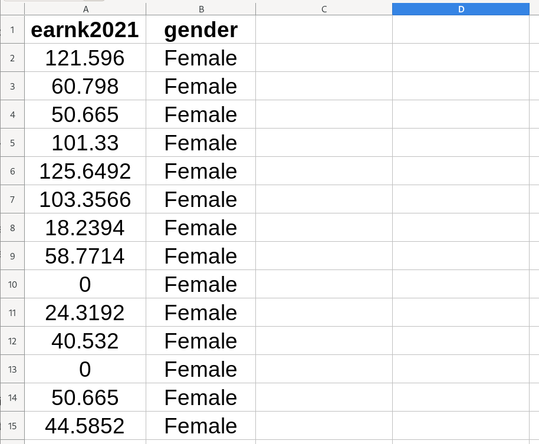
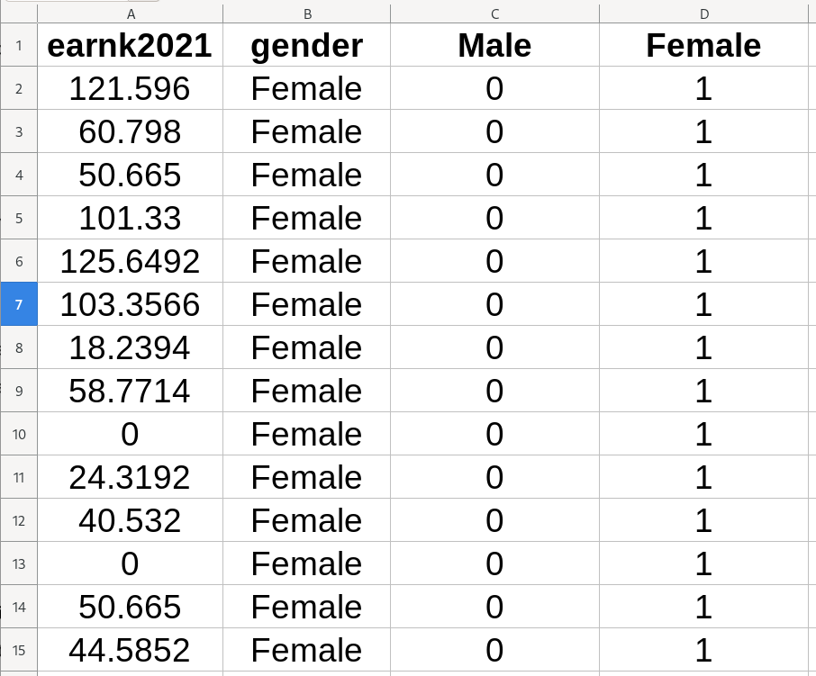
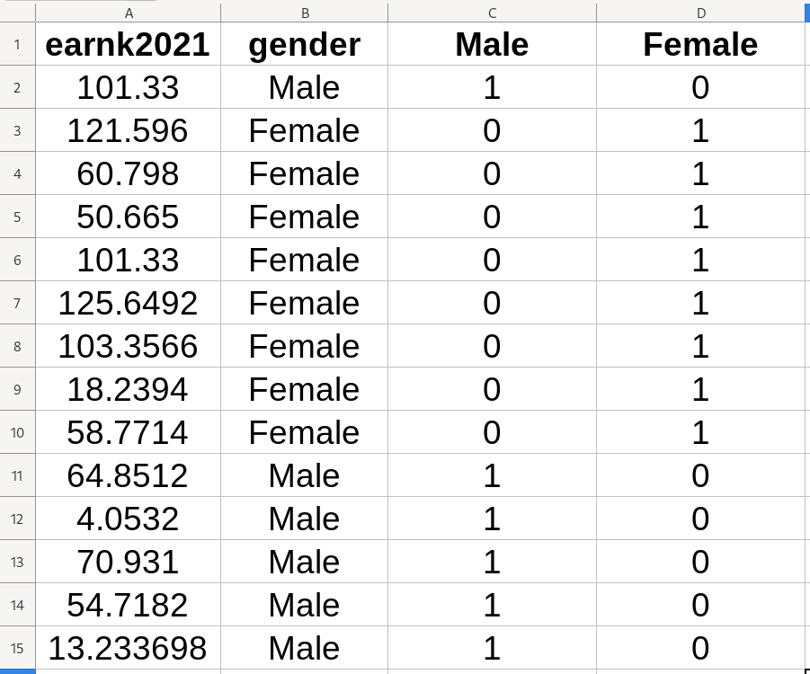

---
output:
  xaringan::moon_reader:
    css: ["default", "extra.css"]
    lib_dir: libs
    seal: false
    nature:
      highlightStyle: github
      highlightLines: true
      countIncrementalSlides: false
      ratio: '16:9'
---

```{r, echo = FALSE, warning = FALSE, message = FALSE}
##xaringan::inf_mr()
## For offline work: https://bookdown.org/yihui/rmarkdown/some-tips.html#working-offline
## Images not appearing? Put images folder inside the libs folder as that is the main data directory

library(tidyverse)
library(readxl)
library(stargazer)
library(modelr)
library(kableExtra)

knitr::opts_chunk$set(echo = FALSE,
                      eval = TRUE,
                      error = FALSE,
                      message = FALSE,
                      warning = FALSE,
                      comment = NA)

```

class: middle, slideblue

.size65[.content-box-white[**Today's Agenda**]]

.size45[
Multiple OLS Regression Modeling
1. Fitting the models
2. Interpreting the models
3. Evaluating the models
]

<br>

.center[.size40[
  Justin Leinaweaver (Summer 2023)
]]

???

## Prep for Class
1. Upload data and variable description document for today

<br>

Welcome back! 

- Let's review our material from Session 2 and make sure we're all ready to move forward.


---

class: middle, slideblue

.center[.size45[.content-box-white[**Session 2: Simple OLS Regression**]]]

<br>

.size40[
.center[Estimating a linear relationship between two variables]

1. Fitting in Excel

2. Interpreting the results

3. Evaluating the fit (4 steps)
4. Making point estimates
]

???

### Touching base, questions on what we've done so far? Clarifications needed?


---

class: middle, slideblue

.center[.size40[.content-box-white[**Do states that pay a higher minimum**]]]

.center[.size40[.content-box-white[**wage see more people finish college?**]]]

<br>

.size35[
1. Visualize the relationship (scatter plot)

2. Regress bachelors on min_wage

3. Evaluate the fit (four steps)

4. Make five predictions
    - Minimum wage at the minimum, 25th percentile, median, 75th percentile and the maximum
]

???

Use the data from Session 1 to practice all our skills so far!


---

class: slideblue

.pull-left[
```{r, fig.align='center', fig.retina=3, out.width='95%', fig.width=5, fig.asp=0.618, cache=TRUE}
d <- read_excel("../Data_for_Class/Session1/MBA_Session1-Data.xlsx", na = "NA") |>
  mutate(
    gdp_billions = gdp_millions / 1000,
    pop_millions = population / 1000,
    manufacture_millions = manufacturing / 1000,
  )

d |>
  ggplot(aes(x = min_wage, y = bachelors)) +
  geom_point() +
  theme_bw() + 
  labs(x = "Minimum Wage", y = "Bachelors (%)") +
  geom_smooth(method = "lm", se = FALSE)
```

```{r, fig.align='center', fig.retina=3, out.width='95%', fig.width=5, fig.asp=0.618, cache=TRUE}
res1 <- lm(data = d, bachelors ~ min_wage)

d |>
  add_residuals(res1) |>
  add_predictions(res1) |>
  ggplot(aes(x = pred, y = resid)) +
  geom_point() +
  theme_bw() + 
  labs(x = "Predicted Values", y = "Residuals") +
  geom_smooth(method = "lm", se = FALSE)
```
]

.pull-right[

<br>

.size24[
```{r, results='asis'}
stargazer(res1, type = "html", digits = 2, omit.stat = "rsq", dep.var.caption = "", dep.var.labels = "Bachelors (%)", covariate.labels = "Minimum Wage", notes = "*p<0.05", notes.append = FALSE, star.cutoffs = .05)
```
]]

???

### Everybody get these results?

<br>

### How does this regression answer our question: Do states that pay a higher minimum wage see more people finish college?

<br>

SLIDE: Making predictions


---

class: middle, center, slideblue

.size40[
```{r, results='asis'}
tibble(
  "Minimum Wage" = c("Minimum = 0", "25th percentile = 7.25", "Median = 8.25", "75th percentile = 9.96", "Maximum = 11.50"),
  "Predicted Bachelors" = round(as.numeric(predict(res1, newdata = data.frame(min_wage = c(0, 7.25, 8.25, 9.96, 11.5)))), 2)
) |>
  kbl(format = "html", digits = 2, align = c('l', 'c')) |>
  row_spec(row = 0, bold = TRUE, background = "lightgrey") |>
  column_spec(column = 1, width = "15em", background = "#ece9e8") |>
  column_spec(column = 2, width = "8em", background = "#ece9e8")
```
]

???

### Everybody get these results?

<br>

### How does this deepen our understanding of the results of the model? 
### - In what specific ways is this a useful addition to our regression table?

<br>

SLIDE: This table also represents a useful process for visualizing much more complicated models (e.g. the multiple regression models from today)


---

class: middle, slideblue

.center[.size55[**A Marginal Effects Plot**]]

<br>

.pull-left[

.size30[
```{r, results='asis'}
tibble(
  "Minimum Wage" = c(0, 7.25, 8.25, 9.96, 11.50),
  "Predicted Bachelors" = round(as.numeric(predict(res1, newdata = data.frame(min_wage = c(0, 7.25, 8.25, 9.96, 11.5)))), 2)
) |>
  kbl(format = "html", digits = 2, align = 'c') |>
  row_spec(row = 0, bold = TRUE, background = "lightgrey") |>
  column_spec(column = 1, width = "8em", background = "#ece9e8") |>
  column_spec(column = 2, width = "8em", background = "#ece9e8")
```
]]

.pull-right[
```{r, fig.align='center', fig.retina=3, out.width='95%', fig.width=5, fig.asp=0.8, cache=TRUE}
tibble(
  wage = c(0, 7.25, 8.25, 9.96, 11.50),
  pred = round(as.numeric(predict(res1, newdata = data.frame(min_wage = c(0, 7.25, 8.25, 9.96, 11.5)))), 2)
) |>
  ggplot(aes(x = wage, y = pred)) +
  geom_line() +
  geom_point() +
  theme_bw() +
  labs(x = "Minimum Wage", y = "Predicted Bachelor's Degrees (%)")
```
]

???

Everybody create two new columns on their spreadsheet and then use those new columns to insert a scatter plot with connecting lines.

<br>

This is a marginal effects plot

- e.g. It shows the estimated relationship between one of our predictors and the outcome controlling for all the other parts of the model.

<br>

As your models get more complicated, e.g. more variables and more complex transformations, this can become the only way to easily communicate to other people what you've found.

### Any questions on making or interpreting a marginal effects plot?

<br>

### Everybody clear on the value add of this exercise?


---

class: middle, center, slideblue

.size55[
Simple linear regression formula

.center[.content-box-white[Y = &#945; + &#946; X]]

Multiple linear regression formula
]

.size40[
.center[.content-box-white[Y = &#945; + &#946;<sub>1</sub> X<sub>1</sub> + &#946;<sub>2</sub> X<sub>2</sub> + ... + + &#946;<sub>k</sub> X<sub>k</sub>]]
]

???

Introducing multiple regression as a change in the formula for a line

<br>

In essence, multiple regression is exactly the same as what we did with simple regression. 

- An effort to draw a single line through the data that quantifies the relationship between a predictor and an outcome.

- However, now we want to include more than one predictor in our estimate of "the line"

<br>

Key 1: No matter how many variables we include, this is still just one line

Key 2: Once we produce estimates for all these coefficients (the Xs) we can't interpret any one of them without knowing something about all of them.

<br>

SLIDE: Let's build up to building a multiple regression using the Ross (1990) data
- Session 2 data


---

class: middle, center, slideblue

.size45[.content-box-white[**Is there a significant gender difference**]] 

.size45[.content-box-white[**in yearly earnings?**]]

???

Jump back to the Ross (1990) data from Session 2!

<br>

### Any ideas? How could we attack this?

--

<br>

<br>

.size40[.content-box-white[**Three Approaches**]

1) Group means,

2) Box plots, and

3) OLS regression

]

???

<br>

Let's examine three ways to answer this question with our data!

1. Group means,

2. Box plots, and

3. Our OLS regression


---

background-image: url('libs/Images/background-columns.png')
background-size: 100%
background-position: center

.left-column[
.size35[.center[.textblack[**Is there a significant gender difference in income?**]]]
]

.right-column[

<br>

.center[
.size40[
Calculate the mean earnk2021 for each gender:

Pivot table

OR 

Sort the data by gender and use AVERAGE()
]]]

???

Let's do the first one.

- Everybody calculate the group means.


---

background-image: url('libs/Images/background-columns.png')
background-size: 100%
background-position: center

.left-column[
.size35[.center[.textblack[**Is there a significant gender difference in income?**]]]
]

.right-column[

<br>

<br>

<br>

.size60[
```{r, results='asis'}
d <- read_excel("../Data_for_Class/Session2/MBA_Session2-Data.xlsx", na = c("NA"), guess_max = 10000) %>%
    mutate(
        earnk2021 = earnk*2.0266,
        male = if_else(gender == "Male", 1, 0),
        Black = if_else(ethnicity == "Black", 1, 0),
        Hispanic = if_else(ethnicity == "Hispanic", 1, 0),
        Other = if_else(ethnicity == "Other", 1, 0)
        )

d %>%
    group_by(gender) %>%
    summarize(
        Mean = mean(earnk2021)
    ) |>
  kbl(format = "html", digits = 2, align = 'c') |>
  row_spec(row = 0, bold = TRUE, background = "lightgrey") |>
  column_spec(column = 1:2, width = "5em", background = "#ece9e8")
```
]]

???

### Everybody get these?

<br>

### Is this a conclusive answer to our question? Why or why not?

- Seems a pretty stark difference, no?

- HOWEVER, the key here for our understanding is, how well does the average represent the full distirbution of the data?


---

background-image: url('libs/Images/background-columns.png')
background-size: 100%
background-position: center

.left-column[
.size35[.center[.textblack[**Is there a significant gender difference in income?**]]]
]

.right-column[

<br>

<br>

.center[
.size65[
Make a box plot of earnk2021 with separate boxes for each gender
]]]


---

background-image: url('libs/Images/background-columns.png')
background-size: 100%
background-position: center

.left-column[
.size35[.center[.textblack[**Is there a significant gender difference in income?**]]]
]

.right-column[
.size30[
```{r, results='asis'}
d %>%
    group_by(gender) %>%
    summarize(
        Mean = mean(earnk2021)
    ) |>
  kbl(format = "html", digits = 2, align = 'c') |>
  row_spec(row = 0, bold = TRUE, background = "lightgrey") |>
  column_spec(column = 1:2, width = "5em", background = "#ece9e8")
```
]

```{r, fig.align='center', fig.retina=3, out.width='85%', fig.width=6, fig.asp=0.618, cache=TRUE}
d %>%
    ggplot(aes(x = factor(male), y = earnk2021)) +
    geom_boxplot(fill = "lightblue") +
    theme_bw() +
    labs(x = "", y = "Yearly Earnings (2021 USD)") +
    scale_x_discrete(labels = c("Female", "Male"))
```
]

???

### Everybody get these?

<br>

### Is this a conclusive answer to our question? Why or why not?

<br>

SLIDE: Also worth zooming in on the IQR


---

background-image: url('libs/Images/background-columns.png')
background-size: 100%
background-position: center

.left-column[
.size35[.center[.textblack[**Is there a significant gender difference in income?**]]]
]

.right-column[
.size30[
```{r, results='asis'}
d %>%
    group_by(gender) %>%
    summarize(
        Mean = mean(earnk2021)
    ) |>
  kbl(format = "html", digits = 2, align = 'c') |>
  row_spec(row = 0, bold = TRUE, background = "lightgrey") |>
  column_spec(column = 1:2, width = "5em", background = "#ece9e8")
```
]

```{r, fig.align='center', fig.retina=3, out.width='85%', fig.width=6, fig.asp=0.618, cache=TRUE}
d %>%
    ggplot(aes(x = factor(male), y = earnk2021)) +
    geom_boxplot(fill = "lightblue") +
    theme_bw() +
    labs(x = "", y = "Yearly Earnings (2021 USD)") +
    scale_x_discrete(labels = c("Female", "Male")) +
  ylim(0, 100)
```
]

???

### So, do we now have a clear answer to the question? Why or why not?


---

background-image: url('libs/Images/background-columns.png')
background-size: 100%
background-position: center

.left-column[
.size35[.center[.textblack[**Is there a significant gender difference in income?**]]]
]

.right-column[

<br>

<br>

<br>

<br>

.center[
.size65[
Regress earnk2021 on gender using OLS
]]]

???

Thanks to regression we now have the basic tools to check the "statistical significance" of this difference. 

<br>

SLIDE: Unfortunately, Excel cannot fit an OLS to categorical variables...


---

class: middle, slideblue

.center[.size40[.content-box-white[**OLS Regressions with Categorical Variables**]]]

<br>

.size45[
.center[Excel cannot fit an OLS to categorical variables]

1. Create dummy variables for each level of the categorical variable, but

2. Omit one level as a baseline (the intercept).
]

???

Two steps


---

class: middle, center, slideblue

.center[.size40[.content-box-white[**Convert Categorical Vars to Dummies**]]]

<br>

```{r, out.width='60%'}
knitr::include_graphics('libs/Images/Session3-convert_vars1.png')
```

???

Copy the data you need for the regression to a new sheet


---

class: middle, center, slideblue

.center[.size40[.content-box-white[**Convert Categorical Vars to Dummies**]]]

<br>

```{r, out.width='60%'}

```

???

To make recoding easier sort the data by the categorical variable

- SUPER IMPORTANT: You MUST highlight ALL columns when you sort to keep the rows intact!


---

class: middle, center, slideblue

.center[.size40[.content-box-white[**Convert Categorical Vars to Dummies**]]]

<br>

```{r, out.width='60%'}

```

???

Create a new variable (column) for each level of the categorical variable.

- 'Male' gets a 1 for every respondent row that identifies as male and 0 for females.

- 'Female' variable is coded in the opposite way.

### Make sense?

Get to it!

<br>

### Any idea why we refer to these new variables as "dummies"?


---

class: middle, center, slideblue

.pull-left[
.center[.size35[.content-box-white[**Convert Categorical**]]]

.center[.size35[.content-box-white[**Vars to Dummies**]]]

<br>

```{r, out.width='100%'}

```
]

.pull-right[
```{r, out.width='75%'}
knitr::include_graphics('libs/Images/Session3-mannequin.jpeg')
```
]

???

Like a mannequin, these variables are meant to serve as stand-ins for actual variables.

- Reflecting only a certain characteristic of a given variable, rather than trying to capture all the variation in it.

### Make sense?


---

class: middle, center, slideblue

.center[.size40[.content-box-white[**Convert Categorical Vars to Dummies**]]]

<br>

.pull-left[
```{r, out.width='100%'}

```
]

.pull-right[

.size25[
```{r}
d |>
  select(earnk2021, male) |>
  slice(1:9) |>
  kbl(format = "html", digits = 2, align = 'c') |>
  row_spec(row = 0, background = "#ece9e8")
```
]]

???

Back to the process of preparing a categorical variable for running an OLS in Excel.

- Next step is to remove one dummy as a baseline.

<br>

To refresh, preparing a categorical variable for OLS regression in Excel requires

1. Create a dummy for each level of the cat var

2. Delete the cat and ONE of the dummies

<br>

Why do we delete one of the dummies? 

- Everybody now run a regression of earnings on the male dummy variable.

<br>

SLIDE: Results


---

class: middle, center, slideblue

.pull-left[
.size25[
```{r, results='asis'}
res1 <- lm(data = d, earnk2021 ~ male)

stargazer(res1, type = "html", omit.stat = c("rsq", "f"), star.cutoffs = .05, notes = "*p < 0.05", notes.append = FALSE, digits = 2, covariate.labels = c("Male", "Constant"), dep.var.labels = "Earnings (2021 USD)", dep.var.caption = "")
```
]]

.pull-right[
.size35[
```{r, results='asis'}
d %>%
    group_by(gender) %>%
    summarize(
        Mean = mean(earnk2021)
    ) |>
  kbl(format = "html", digits = 2, align = 'c') |>
  row_spec(row = 0, bold = TRUE, background = "lightgrey") |>
  column_spec(column = 1:2, width = "5em", background = "#ece9e8")
```
]

```{r, fig.align='center', fig.retina=3, out.width='95%', fig.width=4, fig.asp=0.618, cache=TRUE}
d %>%
    ggplot(aes(x = factor(male), y = earnk2021)) +
    geom_boxplot(fill = "lightblue") +
    theme_bw() +
    labs(x = "", y = "Yearly Earnings (2021 USD)") +
    scale_x_discrete(labels = c("Female", "Male")) +
  ylim(0, 100)
```
]

???

### Everybody get these?

<br>

### Can anybody tell us how these two things are linked? The regression results and the group means?

### - Where did our deleted dummy variable go?

<br>

SLIDE: Try writing the regression as the formula for a line...


---

class: middle, center, slideblue

.pull-left[
.size25[
```{r, results='asis'}
res1 <- lm(data = d, earnk2021 ~ male)

stargazer(res1, type = "html", omit.stat = c("rsq", "f"), star.cutoffs = .05, notes = "*p < 0.05", notes.append = FALSE, digits = 2, covariate.labels = c("Male", "Constant"), dep.var.labels = "Earnings (2021 USD)", dep.var.caption = "")
```
]]

.pull-right[
.size35[
```{r, results='asis'}
d %>%
    group_by(gender) %>%
    summarize(
        Mean = mean(earnk2021)
    ) |>
  kbl(format = "html", digits = 2, align = 'c') |>
  row_spec(row = 0, bold = TRUE, background = "lightgrey") |>
  column_spec(column = 1:2, width = "5em", background = "#ece9e8")
```
]

```{r, fig.align='center', fig.retina=3, out.width='95%', fig.width=4, fig.asp=0.618, cache=TRUE}
d %>%
    ggplot(aes(x = factor(male), y = earnk2021)) +
    geom_boxplot(fill = "lightblue") +
    theme_bw() +
    labs(x = "", y = "Yearly Earnings (2021 USD)") +
    scale_x_discrete(labels = c("Female", "Male")) +
  ylim(0, 100)
```
]

<br>

.center[.size35[**Earnings = 32.12 + 27.78 * Male**]]

???

### Does this help make the connection clearer?

<br>

### What is the model's predicted earnings for a female respondent?

### What about a male respondent?

- (SLIDE)


---

class: middle, center, slideblue

.pull-left[
.size20[
```{r, results='asis'}
res1 <- lm(data = d, earnk2021 ~ male)

stargazer(res1, type = "html", omit.stat = "rsq", star.cutoffs = .05, notes = "*p < 0.05", notes.append = FALSE, digits = 2, covariate.labels = c("Male", "Constant"), dep.var.labels = "Earnings (2021 USD)", dep.var.caption = "")
```
]]

.pull-right[
.size25[
```{r, results='asis'}
d %>%
    group_by(gender) %>%
    summarize(
        Mean = mean(earnk2021)
    ) |>
  kbl(format = "html", digits = 2, align = 'c') |>
  row_spec(row = 0, bold = TRUE, background = "lightgrey") |>
  column_spec(column = 1:2, width = "5em", background = "#ece9e8")
```
]

```{r, fig.align='center', fig.retina=3, out.width='95%', fig.width=4, fig.asp=0.618, cache=TRUE}
d %>%
    ggplot(aes(x = factor(male), y = earnk2021)) +
    geom_boxplot(fill = "lightblue") +
    theme_bw() +
    labs(x = "", y = "Yearly Earnings (2021 USD)") +
    scale_x_discrete(labels = c("Female", "Male")) +
  ylim(0, 100)
```
]

<br>

.center[.size30[
**Earnings** = 32.12 + 27.78 * 0 = 32.1

**Earnings** = 32.12 + 27.78 * 1 = 59.9
]]

???

### Everybody get these predictions?

<br>

### So, what happened to the deleted dummy variable?
- (Captured by the intercept of the model)

<br>

### So, what is our conclusive answer to the question? Is there a meaningful difference in earnings across the genders? Why or why not?

- The significance test is evidence that the data is more consistent with our alternative hypothesis than the null hypothesis
    - e.g. In other words, the underlying data is more consistent with a meaningful gender difference than with gender having no effect on earnings.
    
### Make sense?

<br>

SLIDE: Let's practice this exercise and move us towards multiple regression.
- e.g. regression on more than one predictor


---

class: middle, center, slideblue

.size45[.content-box-white[**Is there a significant difference**]] 

.size45[.content-box-white[**across reported ethnicities**]] 

.size45[.content-box-white[**in yearly earnings?**]]

<br>

.size50[
1) Group means,

2) Box plot, and

3) OLS regression

]

???

Everybody repeat our exercise but now using a categorical variable with more than two levels.

- Ethnicity has four levels.

<br>

Let's start with just approach 1 and 2.

- Everybody calculate the group means and the box plots.


---

class: middle, center, slideblue

.size40[**Is there a significant difference across reported ethnicities in yearly earnings?**]

.left-column[

<br>

<br>

.size25[.textblack[
```{r, results='asis'}
d |>
  group_by(ethnicity) |>
  summarize(
    Mean = mean(earnk2021)
  ) |>
  rename(Ethnicity = ethnicity) |>
  kbl(format = "html", align = c('l', 'c'), digits = 1) |>
  column_spec(column = 1:2, width = "8em") |>
  row_spec(row = 0, background = "#ece9e8")
```
]]]

.right-column[
```{r, fig.align='center', fig.retina=3, out.width='95%', fig.width=7, fig.asp=0.618, cache=TRUE}
d %>%
    ggplot(aes(x = factor(ethnicity), y = earnk2021)) +
    geom_boxplot(fill = "lightblue") +
    theme_minimal() +
    labs(x = "", y = "Yearly Earnings (2021 USD)")
```
]

???

### Everybody get these?

<br>

### What are your takeaways from these results?

<br>

SLIDE: Ok, now make your dummy variables and fit the regression.


---

background-image: url('libs/Images/Session3-convert_categories2.png')
background-size: 100%
background-position: center

???

Since "White" is the highest group mean, let's set it as the baseline and run the regression.

<br>

SLIDE: Results


---

class: middle, slideblue

.pull-left[

<br>

<br>

<br>

.size30[
```{r, results='asis'}
d |>
  group_by(ethnicity) |>
  summarize(
    Mean = mean(earnk2021)
  ) |>
  rename(Ethnicity = ethnicity) |>
  kbl(format = "html", align = c('l', 'c'), digits = 1) |>
  column_spec(column = 1:2, width = "8em") |>
  row_spec(row = 0, background = "#ece9e8")
```
]]

.pull-right[
.size23[
```{r, results='asis'}
res4 <- lm(data = d, earnk2021 ~ Black + Hispanic + Other)

stargazer(res4, type = "html", omit.stat = c("rsq", "ser", "f", "adj.rsq"), star.cutoffs = .05, notes = "*p < 0.05", notes.append = FALSE, digits = 2, dep.var.labels = "Earnings (2021 USD)", dep.var.caption = "")
```
]]

.center[.size30[
.content-box-white[Earnings = 44.08 - 9.34(Black) - 12.07(Hispanic) - 1.18(Other)]
]]

???

### Everybody get these results?
### - Are you still clear on how the group means connect to the regression results?

<br>

### So, how do these analyses answer our question?
- (On average, Black and hispanic respondents report significantly less yearly earnings)

- While the box plots show a great deal of overlap in the IQR, the regression accounts for the outliers too and shows that there is a substantial difference in the groups.

### Make sense?

<br>

### Any questions on fitting an OLS regression in Excel?

<br>

SLIDE: Connect this back to multiple regression


---

class: middle, center, slideblue

.size55[
Simple linear regression formula

.center[.content-box-white[Y = &#945; + &#946; X]]

Multiple linear regression formula
]

.size40[
.center[.content-box-white[Y = &#945; + &#946;<sub>1</sub> X<sub>1</sub> + &#946;<sub>2</sub> X<sub>2</sub> + ... + + &#946;<sub>k</sub> X<sub>k</sub>]]
]

???

So, let's tie this back to our aim today of fitting multiple regression models.

- Your ethnicity regression included three variables and that makes it a multiple regression!

<br>

One important takeaway is to remember that you can't interpret any of the coefficients in the model without making assumptions about the others.

- We can only interpret each coefficient if we assume the others do not apply (e.g. a respondent is either "White", "hispanic", "Black" or "Other").

### Make sense?


---

class: middle, slideblue

.pull-left[
.size20[
```{r, results='asis'}
res1 <- lm(data = d, earnk2021 ~ male)
res2 <- lm(data = d, earnk2021 ~ education)
res3 <- lm(data = d, earnk2021 ~ male + education)

stargazer(res1, res2, type = "html", omit.stat = "rsq", star.cutoffs = .05, notes = "*p < 0.05", notes.append = FALSE, digits = 2, dep.var.labels = "Earnings (2021 USD)", dep.var.caption = "", covariate.labels = c("Male", "Education"))
```
]]

.pull-right[
```{r, fig.align='center', fig.retina=3, out.width='95%', fig.width=5, fig.asp=0.618, cache=TRUE}
d %>%
    ggplot(aes(x = factor(male), y = earnk2021)) +
    geom_boxplot(fill = "lightblue") +
    theme_bw() +
    labs(x = "", y = "Yearly Earnings (2021 USD)") +
    scale_x_discrete(labels = c("Female", "Male"))
```

```{r, fig.align='center', fig.retina=3, out.width='95%', fig.width=5, fig.asp=0.618, cache=TRUE}
d %>%
    ggplot(aes(x = education, y = earnk2021)) +
    geom_point() +
  geom_smooth(method = "lm", se = FALSE) +
    theme_bw() +
    labs(x = "Education Level", y = "Yearly Earnings (2021 USD)")
```
]

???

Combined with our work in session 2, we now have data showing us that both gender and education explain yearly earnings. 
- Both models appear to explain some of the key outcome. 

- The question is how do we build a model to control for both?

<br>

### Any ideas how we could do this with a visualization? 
### - Perhaps a way to modify the scatterplot to account for the gender of the respondent?

- (SLIDE)


---

class: middle, slideblue

.center[.size35[.content-box-white[**What explains the variation in yearly earnings?**]]]

<br>

```{r, fig.align='center', fig.retina=3, out.width='80%', fig.width=8, fig.asp=0.618, cache=TRUE}
d |>
  ggplot(aes(x = education, y = earnk2021, color = gender, shape = gender)) +
  geom_point(size = 3) +
  theme_bw() +
  labs(x = "Education (Years)", y = "Yearly Earnings (2021 USDk)", color = "", shape = "") +
  scale_color_manual(values = c("red", "blue"))
```

???

We can add a third variable to our scatter plot, but let's be honest these are a pain to make and they aren't very easy to disentangle. 

<br>

*Demo if needed:* 
- Sort data by categorical var
- split into two tables
- highlight one table and insert scatter plot
- Add series; second table

<br>

SLIDE: Facet wrap...


---

class: middle, slideblue

.center[.size35[.content-box-white[**What explains the variation in yearly earnings?**]]]

<br>

```{r, fig.align='center', fig.retina=3, out.width='87%', fig.width=8, fig.asp=0.5, cache=TRUE}
d |>
  ggplot(aes(x = education, y = earnk2021, color = gender, shape = gender)) +
  geom_point(size = 3) +
  theme_bw() +
  labs(x = "Education (Years)", y = "Yearly Earnings (2021 USDk)", color = "", shape = "") +
  scale_color_manual(values = c("red", "blue")) +
  facet_wrap(~ gender)
```

???

Even if we separate the plots there is still far too much going on here for us to eyeball any difference in the relationship. 

- What we want to know is to what degree are yearly earnings influenced by gender and education simultaneously!

<br>

SLIDE: Practice...


---

background-image: url('libs/Images/background-columns.png')
background-size: 100%
background-position: center

.left-column[
.size35[.center[.textblack[**Multiple Linear Regression**]]]
]

.right-column[

<br>

.size40[
Regress earnk2021 on male AND education

- Make sure to remove missing data!

- Include both predictors (male and education) in the 'X' of the regression selection window
]]

???

Everybody now regress earnk2021 on male and education

- Note: Both 'X' columns must be side-by-side


---

class: middle

.size25[
```{r, results='asis', fig.align='center'}
stargazer(res1, res2, res3, type = "html", omit.stat = c("rsq", "ser", "f"), star.cutoffs = .05, notes = "*p < 0.05", notes.append = FALSE, digits = 2, dep.var.labels = "Earnings (2021 USD)", dep.var.caption = "", covariate.labels = c("Male", "Education"))
```
]

???

### Everybody get the results here from Model 3?

<br>

### What do we learn from our new model? 
- (Doubled the R2)
- (Coefficients stable)

<br>

SLIDE: Let's evaluate this using the five steps from the textbook


---

class: middle, slideblue

.pull-left[

<br>

.center[.size45[.content-box-white[**Evaluation Step 1**]]]

<br>

<br>

<br>

.center[.size45[.content-box-white[**Is it logical?**]]]

]

.pull-right[
.size20[
```{r, results='asis', fig.align='center'}
stargazer(res3, type = "html", omit.stat = "rsq", star.cutoffs = .05, notes = "*p < 0.05", notes.append = FALSE, digits = 2, dep.var.labels = "Earnings (2021 USD)", dep.var.caption = "", covariate.labels = c("Male", "Education"))
```
]]


---

class: middle, slideblue

.pull-left[

<br>

.center[.size45[.content-box-white[**Evaluation Step 2**]]]

<br>

<br>

<br>

.center[.size45[.content-box-white[**Is it significant?**]]]

]

.pull-right[
.size20[
```{r, results='asis', fig.align='center'}
stargazer(res3, type = "html", omit.stat = "rsq", star.cutoffs = .05, notes = "*p < 0.05", notes.append = FALSE, digits = 2, dep.var.labels = "Earnings (2021 USD)", dep.var.caption = "", covariate.labels = c("Male", "Education"))
```
]]


---

class: middle

.center[.size35[.content-box-blue[**Step 3: Coefficient of Determination (R<sup>2</sup>)**]]]

.size20[
```{r, results='asis', fig.align='center'}
stargazer(res1, res2, res3, type = "html", omit.stat = "rsq", star.cutoffs = .05, notes = "*p < 0.05", notes.append = FALSE, digits = 2, dep.var.labels = "Earnings (2021 USD)", dep.var.caption = "", covariate.labels = c("Male", "Education"))
```
]

???

Discuss

<br>

Everybody make a residuals plot for this model


---

class: middle, slideblue

```{r, fig.align='center', fig.retina=3, out.width='97%', fig.width=7, fig.asp=0.618, cache=TRUE}
d |>
  add_residuals(res3) |>
  add_predictions(res3) |>
  ggplot(aes(x = pred, y = resid)) +
  geom_hline(yintercept = 0, color = "red") +
  geom_point() +
  theme_bw() +
  labs(x = "Model Predictions", y = "Model Residuals",
       title = "Evaluation Step 4: Check the Residuals")
```

???

### Get this?

<br>

### Any concerns with this residual plot?

<br>

SLIDE: Evaluation step 5 is to check for multicollinearity.


---

class: middle, slideblue

.center[.size35[.content-box-white[**Step 5: Evidence of Multicollinearity?**]]]

<br>

<br>

.size45[
```{r, results='asis'}
d |>
  select(Education = education, Male = male) |>
  cor(use = "pairwise") |>
  kbl(format = "html", digits = 2, align = 'c') |>
  row_spec(row = 0, bold = TRUE, background = "lightgrey") |>
  column_spec(column = 1:3, width = "5em", background = "#ece9e8")


```
]

<br>

<br>

.center[.size35[
.content-box-white['Data' ribbon &#8594; 'Data Analysis' &#8594; 'Correlation']
]]

???

Everybody make a correlation table for our two predictors using the data analysis tools in Excel

<br>

### Based on your reading of the book, what is correlation?
- (SLIDE)


---

background-image: url('libs/Images/Session3-multicollinearity0.png')
background-size: 100%
background-position: center

???

<br>

SLIDE: more basics on correlation


---

background-image: url('libs/Images/Session3-multicollinearity1.png')
background-size: 100%
background-position: center

???

Size of correlation coefficients.

<br>

### Per the book, what happens if your predictors are HIGHLY correlated (> .7)? 
- OLS can't differentiate the variation and can't assign coefficients precisely.

<br>

SLIDE: Applied to our example...


---

class: slideblue, middle

.center[.size45[.content-box-white[**Step 5: Evidence of Multicollinearity?**]]]

<br>

```{r, fig.align='center', fig.retina=3, out.width='75%', fig.width=7, fig.asp=0.618, cache=TRUE}
d |>
  ggplot(aes(x = gender, y = education)) +
  geom_boxplot(fill = "lightblue") +
  theme_bw() +
  labs(x = "", y = "Education (Years)",
       title = "Correlation: 0.04")
```

???

Applied to our example (apologies for a correlation with a dummy variable). 

- They correlate at 0.04, a VERY small correlation

- Key here is observing that both distributions are VERY similar regardless of gender. 

- This means knowing the respondent's gender doesn't tell us anything about their level of education. 

So, keep both!

<br>

### Make sense?


---

class: slideblue

.size20[
```{r, results='asis', fig.align='center'}
stargazer(res3, type = "html", omit.stat = "rsq", star.cutoffs = .05, notes = "*p < 0.05", notes.append = FALSE, digits = 2, dep.var.labels = "Earnings (2021 USD)", dep.var.caption = "", covariate.labels = c("Male", "Education"))
```
]

.center[.size35[.content-box-white[Earnings = -38.28 + 5.35 (Education) + 26.53 (Male)]]]

???

Ok, we have a pretty good fit, but how do we interpret this model?

- We interpret a multiple regression very similarly to how we did it for the simple versions

- Think in terms of the formula for a line

<br>

The key here is the idea of ceteris paribus (with other conditions remaining the same). 

- We can't interpret any coefficient WITHOUT making an assumption about the others!

<br>

So, if I ask you what is the predicted earnings for a male on average based on this model? 

### What would you have to ask me first?
- (Depends on the level of education)

<br>

You'll remember from last session that we built a marginal effects plot to examine the predictions of a simple OLS model.

SLIDE: Let's do the same now for this multiple regression.


---

class: slideblue

.center[.size35[.content-box-white[Earnings = -38.28 + 5.35 (Education) + 26.53 (Male)]]]

<br>

.size55[
```{r, results='asis', fig.align='center'}
tibble(
  Education = c(1, 5, 9, 13, 17),
  Male = 1,
  Earnings = ""
) |>
  kbl(format = "html", align = 'c') |>
  row_spec(row = 0, bold = TRUE, background = "#f8deaa") |>
  column_spec(column = 1, background = "#f8deaa", width = "6em") |>
  column_spec(column = 2:3, width = "6em")
```
]

???

Everybody calculate point estimates for our model across these levels of education, only for the males.


---

class: slideblue

.center[.size35[.content-box-white[Earnings = -38.28 + 5.35 (Education) + 26.53 (Male)]]]

<br>

.size55[
```{r, results='asis', fig.align='center'}
preds_male <- predict.lm(res3, newdata = data.frame(education = c(1, 5, 9, 13, 17),
                                                    male = 1))

tibble(
  Education = c(1, 5, 9, 13, 17),
  Male = 1,
  Earnings = str_c(round(as.numeric(preds_male), 1), 'k')
) |>
  kbl(format = "html", align = 'c', digits = 1) |>
  row_spec(row = 0, bold = TRUE, background = "#f8deaa") |>
  column_spec(column = 1, background = "#f8deaa", width = "6em") |>
  column_spec(column = 2:3, width = "6em")
```
]

???

### Results?


---

class: slideblue

.center[.size35[.content-box-white[Earnings = -38.28 + 5.35 (Education) + 26.53 (Male)]]]

<br>

.size55[
```{r, results='asis', fig.align='center'}
tibble(
  Education = c(1, 5, 9, 13, 17),
  Male = 0,
  Earnings = ""
) |>
  kbl(format = "html", align = 'c') |>
  row_spec(row = 0, bold = TRUE, background = "#f8deaa") |>
  column_spec(column = 1, background = "#f8deaa", width = "6em") |>
  column_spec(column = 2:3, width = "6em")
```
]

???

Repeat for females


---

class: slideblue

.center[.size35[.content-box-white[Earnings = -38.28 + 5.35 (Education) + 26.53 (Male)]]]

<br>

.size55[
```{r, results='asis', fig.align='center'}
preds_female <- predict.lm(res3, newdata = data.frame(education = c(1, 5, 9, 13, 17),
                                                    male = 0))

tibble(
  Education = c(1, 5, 9, 13, 17),
  Male = 0,
  Earnings = str_c(round(as.numeric(preds_female), 1), 'k')
) |>
  kbl(format = "html", align = 'c', digits = 1) |>
  row_spec(row = 0, bold = TRUE, background = "#f8deaa") |>
  column_spec(column = 1, background = "#f8deaa", width = "6em") |>
  column_spec(column = 2:3, width = "6em")
```
]

???

### Results?


---

class: slideblue

.center[.size35[.content-box-white[Earnings = -38.28 + 5.35 (Education) + 26.53 (Male)]]]

<br>

.size55[
```{r, results='asis', fig.align='center'}
preds_female <- predict.lm(res3, newdata = data.frame(education = c(1, 5, 9, 13, 17),
                                                    male = 0))

tibble(
  Education = c(1, 5, 9, 13, 17),
  Male = str_c(round(as.numeric(preds_male), 1), 'k'),
  Female = str_c(round(as.numeric(preds_female), 1), 'k')
) |>
  kbl(format = "html", align = 'c', digits = 1) |>
  row_spec(row = 0, bold = TRUE, background = "#f8deaa") |>
  column_spec(column = 1, background = "#f8deaa", width = "6em") |>
  column_spec(column = 2:3, width = "6em")
```
]

???

Now make your marginal effects plot with these two lines.


---

class: middle, center, slideblue

```{r, fig.align='center', fig.retina=3, out.width='95%', fig.width=7.5, fig.asp=0.618, cache=TRUE}
new_male <- tibble(
  education = 1:18,
  male = rep(1, 18)
) |>
  add_predictions(res3, var = "earnk2021")

new_female <- tibble(
  education = 1:18,
  male = rep(0, 18)
) |>
  add_predictions(res3, var = "earnk2021")

d |>
  ggplot(aes(x = education, y = earnk2021)) +
  geom_jitter(width = .1, size = 1.4, alpha = .4, aes(color = gender, shape = gender)) +
  geom_line(data = new_male, color = "blue", size = 1.4) +
  geom_line(data = new_female, color = "red", size = 1.4) +
  theme_bw() +
  scale_color_manual(values = c("red", "blue")) +
  labs(x = "Education", y = "Earnings (2021 USDk)", color = "",
       title = "Marginal Effects Plot") +
  guides(shape = "none")
```

???

### Results?

<br>

### So, how does the marginal effects plot help us think about what a multiple regression produces?

- Remember, regression on a dummy variable calculates the group means

- Here we see that adding a dummy variable to a multiple regression shifts the intercept but NOT THE SLOPE of the line.

<br>

Now we need to see how adding numeric variables to a multiple regression shifts both the intercept AND the slope of the line.

<br>

SLIDE: Before we do that, let's talk strategy for designing a multiple regression model


---

class: middle, slideblue

.center[.size40[.content-box-white[**One approach to building a "best" multiple**]]]

.center[.size40[.content-box-white[**regression model**]]]

.size40[
1. Choose the "logical" predictors from your options

2. Evaluate a simple OLS regression for each

3. Fit a multiple regression with the "best" of those

4. Evaluate the model using our five steps

5. Consider tweaks to improve model fit
]

???

Process of building a "useful" multiple regression

- 5 steps to consider; everybody write these down.

<br>

### Any questions on these?


---

class: middle, slideblue

```{r, fig.align='center', fig.retina=3, out.width='65%', fig.width=6, fig.asp=0.618, cache=TRUE}
d |>
  ggplot(aes(x = earnk2021)) +
  geom_histogram(bins = 15, color = "white") +
  theme_bw() +
  labs(x = "Earnings (2021 USDk)", y = "")
```

.size40[
**Predictors to Consider**
- Height, age, education, exercise and male
]

???

Practice (small groups?): Let's now try all of this out.

- Here we see a histogram of earnings in 2021 dollars. 

- Your job is to build the "best" model of this outcome using the variables in Ross (1990).

- Predictors to Consider: Height, age, education, exercise and male

- Make sure your model can be defended using the textbook steps

<br>

SLIDE: Simple OLS results


---

class: middle, slideblue

.pull-left[
.size15[
```{r, results='asis'}
# Simple Regression Options
res1 <- d %>% lm(data = ., earnk2021 ~ height)
res2 <- d %>% lm(data = ., earnk2021 ~ age)
res3 <- d %>% lm(data = ., earnk2021 ~ education)
res4 <- d %>% lm(data = ., earnk2021 ~ exercise)
res5 <- d %>% lm(data = ., earnk2021 ~ male)

stargazer(res1, res2, res3, res4, res5, omit.stat = c("rsq", "f", "ser"), star.cutoffs = .05, notes = "*p < 0.05", notes.append = FALSE, digits = 2, dep.var.labels = "Earnings (Thousands 2021 USD)", dep.var.caption = "", type = "html")
```
]]

.pull-right[

<br>

<br>

<br>

```{r, fig.align='center', fig.retina=3, out.width='95%', fig.width=5, fig.asp=0.85, cache=TRUE}
d |>
  ggplot(aes(x = earnk2021)) +
  geom_histogram(bins = 15, color = "white") +
  theme_bw() +
  labs(x = "Earnings (2021 USDk)", y = "")
```
]

???

### Results?

<br>

*Present and discuss each*

### Which variables did you pick and why?

<br>

*Class selects a single "best" model and you recreate it too.*

### Walk me through the five evaluation steps.

<br>

Our textbook has given us five steps for evaluating a regression model but now that we have more practice I want to take a sec to unpack these criteria some more

- SLIDE: Mistakes to avoid


---

class: middle, slideblue

.center[.size40[.content-box-white[**Common Regression Mistakes**]]] 

.center[.size40[.content-box-white[**(Wheelan ch12)**]]]

<br>

.size40[
1. Linear regression on nonlinear relationships
2. Correlation does not equal causation
3. Reverse causality
4. Omitted variable bias (too few variables)
5. Highly correlated explanatory variables
6. Extrapolating beyond the data
7. Data mining (too many variables)
]

???

Here are seven common regression mistakes from a stats book by Wheelan. 

- Think of these like pieces of advice for building your model.

<br>

### Which of these do we cover with our five textbook evaluation steps? 
- (SLIDE)


---

class: middle, slideblue

.center[.size35[.content-box-white[**Common Regression Mistakes (Wheelan ch12)**]]] 
<br>

.size40[
1. .textred[Linear regression on nonlinear relationships]
2. .textblue[Correlation does not equal causation]
3. .textblue[Reverse causality]
4. .textblue[Omitted variable bias (too few variables)]
5. .textwhite[Highly correlated explanatory variables]
6. .textorange[Extrapolating beyond the data]
7. .textblue[Data mining (too many variables)]

.center[**Textbook Evaluation Steps: .textblue[1], .textorange[2], .textgreen[3], .textred[4], .textwhite[5]**
]]

???

Here's my stab at showing the overlap between Wheelan's advice and our textbook steps.

### What are our takeaway lessons about model building from this?
- What I want you to see here is how much of building a "best" model depends on you clearly making an argument that what you've built avoids these problems.

- Big idea here: Avoiding 4 out of the 7 mistakes depends on the quality of your argument NOT something you can "test" with data!

<br>

### Why doesn't the R^2 show up on Wheelan's list?
- R^2 is mostly relevant when trying to build a model that makes highly accurate predictions overall

- It's not very important at all when trying to calculate a precise estimate of any single coefficient in the model.

<br>

Let's now create a marginal effects plot for one of the predictors in our "best" model?

### Which variable should we focus on?

*Make the marginal effects plot*

### Takeaway lessons from the marginal effects plot?

<br>

### Questions on multiple regression?


---

class: middle, slideblue

.center[.size45[**For Next Class:** What is the "best" model of bachelor's degree completion in the  Session 1 data?]]

.size40[
- Outcome:
    - Bachelors' Degrees
]

.size40[
- Predictors to consider:
    - GDP (Rate), Homeownership, Minimum wage, State Tax Rate on Wages, Unemployment

]

???

### Questions on the assignment?

Let's get to it!


