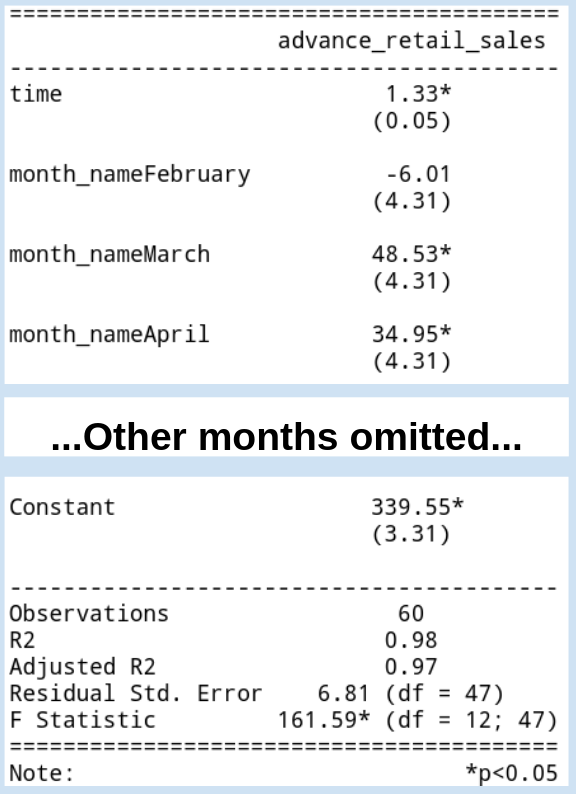

---
output:
  xaringan::moon_reader:
    css: ["default", "extra.css"]
    lib_dir: libs
    seal: false
    nature:
      highlightStyle: github
      highlightLines: true
      countIncrementalSlides: false
      ratio: '16:9'
---

```{r, echo = FALSE, warning = FALSE, message = FALSE}
##xaringan::inf_mr()
## For offline work: https://bookdown.org/yihui/rmarkdown/some-tips.html#working-offline
## Images not appearing? Put images folder inside the libs folder as that is the main data directory
library(tidyverse)
library(readxl)
library(stargazer)
library(modelr)
library(kableExtra)
library(lubridate)

knitr::opts_chunk$set(echo = FALSE,
                      eval = TRUE,
                      error = FALSE,
                      message = FALSE,
                      warning = FALSE,
                      comment = NA)

```


background-image: url('libs/Images/01-statistics-background_v1.png')
background-size: 100%
background-position: center
class: middle

.size65[.content-box-white[**Today's Agenda**]]

.size45[
Analyzing Time Series Data

1. Fitting the models
2. Interpreting the models
3. Evaluating the models
]

<br>

.center[.size40[
  Justin Leinaweaver (Summer 2023)
]]

???

## Prep for Class
1. Upload data and variable description document for today

<br>

Welcome back! 


---

class: middle, slideblue

.center[.size50[.content-box-white[**What is the "best" model of bachelor's degree**]]]

.center[.size50[.content-box-white[**completion in the  Session 1 data?**]]]

<br>

.size45[
- Outcome:
    - Bachelors' Degrees
]

.size45[
- Predictors to consider:
    - GDP (Rate), Homeownership, Minimum wage, State Tax Rate on Wages, Unemployment

]

???

We had an assignment for today.

### Everybody ready to go?


---

class: full

.size16[
```{r, results='asis'}
## Assignment for Today: Model bachelors degrees
d <- read_excel("../Data_for_Class/Session1/Financial_Data_US_States-2018.xlsx", na = "NA") |>
  mutate(
    gdp_billions = gdp_millions / 1000
  )

res1a <- d %>% lm(data = ., bachelors ~ gdp_rate)
res1b <- d %>% lm(data = ., bachelors ~ homeowner_rate)
res1c <- d %>% lm(data = ., bachelors ~ min_wage)
res1d <- d %>% lm(data = ., bachelors ~ state_rate_wages)
res1e <- d %>% lm(data = ., bachelors ~ unemployment)

stargazer(res1a, res1b, res1c, res1d, res1e, omit.stat = c("f", "rsq", "ser"), star.cutoffs = .05, notes = "*p<0.05", notes.append = FALSE, digits = 2, dep.var.caption = "", dep.var.labels = "Bachelors' Degrees (%)", covariate.labels = c("GDP Rate", "Homeownership", "Minimum Wage", "State Taxes", "Unemployment"), type = "html")
```
]

???

Simple OLS results. 

### Everybody get these?

<br>

### Walk me through each OLS model, what do we learn from this?

<br>

### What did you select from this list for your multiple regression? Why?

<br>

**SLIDE**: My choices based on logic, significance and R2


---

class: full

.size23[
```{r, results='asis'}
stargazer(res1b, res1c, res1e, omit.stat = c("f", "rsq", "ser"), star.cutoffs = .05, notes = "*p<0.05", notes.append = FALSE, digits = 2, dep.var.caption = "", dep.var.labels = "Bachelors' Degrees (%)", type = "html", covariate.labels = c("Homeownership", "Minimum Wage", "Unemployment"))
```
]

???

CLASS: Fit this multiple regression and evaluate using all five steps


---

```{r, results='asis'}
res1f <- d %>% lm(data = ., bachelors ~ homeowner_rate + min_wage + unemployment)

stargazer(res1b, res1c, res1e, res1f, type = "html", omit.stat = "rsq", star.cutoffs = .05, notes = "*p<0.05", notes.append = FALSE, digits = 2, dep.var.caption = "", dep.var.labels = "Bachelors' Degrees (%)", covariate.labels = c("Homeownership", "Minimum Wage", "Unemployment"))
```

???

Results compared to the simple models

### Everybody get this?

<br>

### Before we get to evaluating our new model, talk to me about what has changed between the simple and multiple results.

<br>

**SLIDE**: Ok, let's check our evaluation steps


---

.pull-left[
```{r, results='asis'}
stargazer(res1f, omit.stat = "rsq", star.cutoffs = .05, notes = "*p<0.05", notes.append = FALSE, digits = 2, dep.var.caption = "", dep.var.labels = "Bachelors' Degrees (%)", type = "html", covariate.labels = c("Homeownership", "Minimum Wage", "Unemployment"))
```
]

.pull-right[
```{r, fig.align='center', fig.retina=3, out.width='98%', fig.width=4, fig.asp=0.618, cache=TRUE}
## Residuals
d %>%
  add_residuals(res1f) %>%
  add_predictions(res1f) %>%
  ggplot(aes(x = pred, y = resid)) +
  geom_point() +
  theme_bw() +
  labs(x = "Model Predicted Values", y = "Residuals") +
  geom_smooth(method = "lm", se = FALSE)
```

<br>

```{r, results='asis'}
## Correlations
d |>
  select(Home = homeowner_rate, Wage = min_wage, Unempl = unemployment) |>
  cor() |>
  kbl(format = "html", digits = 2, align = 'c') |>
  row_spec(row = 0, bold = TRUE, background = "lightgrey") |>
  column_spec(column = 1:4, width = "5em", background = "#ece9e8")
```
]

???

### Did everybody get these same results?

<br>

### Bottom line, how well does our multiple regression fit the data? Is this a "better" model than the three simple ones?

<br>

### Remind me, how do we communicate the results from a multiple regression model using a visualization?

(**SLIDE**: Marginal effects plots!)


---

class: middle, center

.pull-left[
```{r, results='asis'}
stargazer(res1f, omit.stat = c("rsq", "ser"), star.cutoffs = .05, notes = "*p<0.05", notes.append = FALSE, digits = 2, dep.var.caption = "", dep.var.labels = "Bachelors' Degrees (%)", type = "html", covariate.labels = c("Homeownership", "Minimum Wage", "Unemployment"))
```
]

.pull-right[

<br>

.size50[
Make a marginal effects plot of homeownership using our multiple regression results
]]

???

### Refresh my memory, how do we build a marginal effects plot?
- Make a new table of two columns, one for the levels of a single selected predictor and the other the fitted value for the model using each value of the predictor.
- Highlight the two columns and insert a scatterplot with points connected by a line.

<br>

### What values should we use for homeownership?
- Use the range of the actual data
    - 51:75

### And what values do we set minimum wage and unemployment to in our model predictions?
- (General Rule of Thumb: Use the sample mean for numeric variables and the mode for categorical variables)
    - Min wage: $7.71
    - Unemployment: 3.776

<br>

### Questions on this?

Get to it!


---

```{r, fig.align='center', fig.retina=3, out.width='90%', fig.width=6, fig.asp=0.618, cache=TRUE}
tibble(
  homeowner_rate = 50:75,
  min_wage = mean(d$min_wage),
  unemployment = mean(d$unemployment)
) |>
  #add_predictions(res1b, var = "Simple OLS") |>
  add_predictions(res1f, var = "Multiple OLS") |>
  pivot_longer(cols = c("Multiple OLS"), names_to = "Model", values_to = "Values") |>
  ggplot(aes(x = homeowner_rate, y = Values, color = Model)) +
  geom_line(size = 1.4) +
  theme_bw() +
  labs(x = "Homeownership Rate (%)", y = "Predicted Bachelors Degrees (%)", color = "") +
  coord_cartesian(ylim = c(25, 40)) +
  scale_color_manual(values = c("blue", "pink")) +
  guides(color = "none")
```

???

### Did everybody produce a plot like this?

<br>

### In a professional setting, when might you prefer to present regression results like this instead of as a properly formatted regression table?

<br>

### Stepping back into what we've actually found here. What do we think is driving this negative effect of homeownership on college graduations?

<br>

**SLIDE**: Now, remember, we have actually estimated this relationship twice. Once using a simple and once using a multiple regression.


---

class: middle, center

.pull-left[
```{r, results='asis'}
stargazer(res1b, res1f, omit.stat = c("rsq", "ser"), star.cutoffs = .05, notes = "*p<0.05", notes.append = FALSE, digits = 2, dep.var.caption = "", dep.var.labels = "Bachelors' Degrees (%)", type = "html") #, covariate.labels = c("Homeownership", "Minimum Wage", "Unemployment"))
```
]

.pull-right[

<br>

<br>

```{r, fig.align='center', fig.retina=3, out.width='95%', fig.width=4, fig.asp=0.85, cache=FALSE}
tibble(
  homeowner_rate = 50:75,
  min_wage = mean(d$min_wage),
  unemployment = mean(d$unemployment)
) |>
  add_predictions(res1b, var = "Simple OLS") |>
  add_predictions(res1f, var = "Multiple OLS") |>
  pivot_longer(cols = c("Multiple OLS", "Simple OLS"), names_to = "Model", values_to = "Values") |>
  ggplot(aes(x = homeowner_rate, y = Values, color = Model)) +
  geom_line(size = 1.4) +
  theme_bw() +
  labs(x = "Homeownership Rate (%)", y = "Predicted Bachelors Degrees (%)", color = "") +
  coord_cartesian(ylim = c(15, 40)) +
  scale_color_manual(values = c("blue", "pink")) +
  theme(legend.position = c(.8, .3))
```
]

???

Here is a visualization of both the simple OLS results as compared to the multiple OLS results. 

### What do we learn from this?

### What happened to the estimated effect when controlling for the other two predictors?
- The effect of homeownership is reduced when controlling for the minimum wage and unemployment.

### Any idea why this might be happening?
- Remember that homeownership and the minimum wage correlate at -.37. Possible that minimum wage is now capturing some of that effect.

<br>

### As an aside, can we see here why this kind of visualization, a marginal effects plot, can be used to compare multiple models in a much more intuitive way?


---

```{r, results='asis'}
res1f <- d %>% lm(data = ., bachelors ~ homeowner_rate + min_wage + unemployment)

stargazer(res1b, res1c, res1e, res1f, type = "html", omit.stat = c("rsq", "ser"), star.cutoffs = .05, notes = "*p<0.05", notes.append = FALSE, digits = 2, dep.var.caption = "", dep.var.labels = "Bachelors' Degrees (%)", covariate.labels = c("Homeownership", "Minimum Wage", "Unemployment"))
```

???

Ultimately, multiple regression extends the OLS model in at least two ways that help us as data analysts.

1. If your goal is prediction, e.g. what does the future hold, adding relevant predictors boosts the R^2 and makes your model fit better.
    - HOWEVER, just because your model fits the past well DOES NOT mean it predicts the future.
    
2. If your goal is causal explanation, e.g. what is the effect of raising the minimum wage by $1, then adding confounder variables is necessary for making that argument.
    - The concept of causality and confounders is material for another class, but that's where the science happens!
    
<br>

### Questions on any of this?


---

class: middle, slideblue

.center[.size60[.content-box-white[**Reviewing Sessions 1, 2 & 3**]]]

<br>

.size50[
1. Descriptive statistics & visualizations

2. Simple OLS Regression

3. Multiple OLS Regression
]

???

Sessions 1, 2 and 3 Review

As we wrap up our week of work today let's make sure you don't have any questions

### Questions on session 1 material?

<br>

### Session 2 material?

<br>

### Session 3 material?


---

background-image: url('libs/Images/Session4-components_time_series.png')
background-size: 100%
background-position: center

???

Today we move to exploring and analyzing time series data.

Time series data means variables with observations across time

- Any period is possible: Years, months, weeks, days, minutes, etc.

- Three components of a time series: Trend, seasons and random variations

<br>

Random variation: Random changes from period to period
- Can be measurement error or unmodeled variation

<br>

Seasonal variation: Changes related to some reoccuring changes in time (e.g.ice cream sales peak in the summer, every summer)

<br>

Trend: Increases or decreases in value across time
- The kinds of linear trends we've been modeling with OLS

<br>

These components can be mixed and combined in any set of these three pieces. 

- This means a big part of modeling time series data depends on identifying the variation you are interested in and matching your tool to that variation.

- Questions on this?


---

class: middle, slideblue

.center[.size45[.content-box-white[**Session 4 Data: Missouri Across Time**]]]

<br>

.size25[
```{r, results='asis'}
## Missouri data 1998-2018
## Exploring GDP Rate of change in Missouri
d <- read_excel("../Data_for_Class/Session4/SU23-MBA_Session4-Data.xlsx", sheet = "MO", na = "NA")

d |>
  #select(state:unemployment) |>
  slice_tail(n=9) |>
  kbl(format = "html", digits = 2, align = 'c') |>
  row_spec(row = 0, bold = TRUE, background = "lightgrey")
```
]

???

Introduce new data: Dataset 1 for MO only, 2006-2022

### CLASS: Explore the data: Any interesting observations?

<br>

### CLASS: Make a line plot of the homeownership rate in MO


---

class: full

```{r, fig.align='center', fig.retina=3, out.width='100%', fig.width=6, fig.asp=0.58, cache=TRUE}
d %>%
  ggplot(aes(x = year, y = homeowner)) +
  geom_line(linewidth = 1.5) +
  theme_bw() +
  labs(x = "", y = "(%)", title = "Homeownership in Missouri") +
  scale_x_continuous(breaks = seq(2006, 2022, 2))
```

???

*DEMO if needed*
- Highlight only homeowner, insert line plot, select data, add horizontal labels by highlighting years (without label in row 1)

<br>

### CLASS: Describe the line plot for me. How would you describe the change in homeownership in MO since 2006?

<br>

### CLASS: Which of the three variation types do you see here? (Random variation)


---

class: middle, slideblue

.pull-left[
.size45[.content-box-white[**Random Variation**]

.content-box-white[**Forecasting Tools**]

1. Naive Forecasts

2. Moving Averages (MA)

3. Weighted Moving Averages (WMA)
]]

.pull-right[

<br>

<br>

```{r, fig.align='center', fig.retina=3, out.width='100%', fig.width=5, fig.asp=0.75, cache=TRUE}
d %>%
  ggplot(aes(x = year, y = homeowner)) +
  geom_line(linewidth = 1.5) +
  theme_bw() +
  labs(x = "", y = "(%)", title = "Homeownership in Missouri") +
  scale_x_continuous(breaks = seq(2006, 2022, 2))
```
]

???

Let's now practice these three most common random variation forecasting tools: 
- Naive Forecasts, 

- Moving Averages (MA), 

- Weighted Moving Averages (WMA)


---

class: middle, center, slideblue

.size65[.content-box-white[**Forecast 1: Naïve Forecast**]]

<br>

.size55[
Set forecast to the last observation

Forecast <sub>*t*</sub> = Actual <sub>*t-1*</sub>
]

???

Naive forecasts
- Super basic concept and, surprisingly, an effective prediction tool! 
    - At least, just one period into the future.
- The best prediction for tomorrow is typically the value for today

<br>

- **SLIDE**: Here's how you do it.


---

background-image: url('libs/Images/Session4-Naive_Sheet.png')
background-size: 100%
background-position: center

???

CLASS: Everybody do this, predict 2019 and plot your naive forecast on top of the current line plot


---

class: full


```{r, fig.align='center', fig.retina=3, out.width='95%', fig.width=7.5, fig.asp=0.6, cache=TRUE}
d2 <- d %>%
  add_row(state = "MO", year = 2023, homeowner = NA) %>% 
  mutate(
    Naive = lag(homeowner, n = 1),
    error = (homeowner - Naive),
    error2 = error^2
  ) 

d2 %>%
  pivot_longer(cols = c(homeowner, Naive), names_to = "Variables", values_to = "Values") %>%
  ggplot(aes(x = year, y = Values, color = Variables)) +
  geom_line(size = 1.3) +
  theme_bw() +
  labs(x = "", y = "", title = "Homeownership Rates (Missouri)", color = "") +
  scale_x_continuous(breaks = seq(2006, 2024, 2)) +
  scale_color_manual(values = c("black", "orange")) +
  theme(legend.position = c(0.2, 0.25)) +
  annotate("text", x = 2024.5, y = d2$Naive[d2$year==2023], label = str_c(d2$Naive[d2$year==2023], "%"), size = 5, color = "orange")
```

???

### Everybody get these?

<br>

**SLIDE**: Now we need a method for measuring the "accuracy" of a forecast


---

background-image: url('libs/Images/Session4-Mean_Squared_Error.png')
background-size: 100%
background-position: center

???

*Step through the MSE approach*

<br>

Class: Apply this to the naive forecast

- **SLIDE**: How to do it


---

background-image: url('libs/Images/Session4-Mean_Squared_Error2.png')
background-size: 100%
background-position: center

???

CLASS: Apply to the naive forecast. 

### What is the MSE?

(**SLIDE**)


---

```{r, fig.align='center', fig.retina=3, out.width='100%', fig.width=7.5, fig.asp=0.6, cache=TRUE}
d2 %>%
  pivot_longer(cols = c(homeowner, Naive), names_to = "Variables", values_to = "Values") %>%
  ggplot(aes(x = year, y = Values, color = Variables)) +
  geom_line(size = 1.3) +
  theme_bw() +
  labs(x = "", y = "",
       title = "Homeownership Rates (Missouri)",
       subtitle = str_c("MSE =  ", round(mean(d2$error2, na.rm = T), 4)), 
       color = "") +
  scale_x_continuous(breaks = seq(2006, 2024, 2)) +
  scale_color_manual(values = c("black", "orange")) +
  theme(legend.position = c(0.2, 0.25)) +
  annotate("text", x = 2024.5, y = d2$Naive[d2$year==2023], label = str_c(d2$Naive[d2$year==2023], "%"), size = 5, color = "orange")
```

???

### Everybody get this?

<br>

### Talk to me about this forecast. 
### - In what ways is the naive a good forecasting approach and in what ways is it problematic?

<br>

**SLIDE**: Let's move to our second random variation tool, moving average


---

background-image: url('libs/Images/Session4-MA_textbook.png')
background-size: 100%
background-position: center

???

Moving Average Forecast

Discuss the intuition here.

<br>

**SLIDE**: How to do it...


---

background-image: url('libs/Images/Session4-MA3.png')
background-size: 100%
background-position: center

???

Here's how you do it.

<br>

Everybody apply this to our trend, calculate the MSE, extend one year and visualize.


---

```{r, fig.align='center', fig.retina=3, out.width='100%', fig.width=7.5, fig.asp=0.6, cache=TRUE}
## Calculate MA3 forecast and mse
d3 <- d %>%
  add_row(state = "Missouri", year = 2023, homeowner = NA) %>% 
  mutate(
    MA3 = (lag(homeowner, n = 1) + lag(homeowner, n = 2) + lag(homeowner, n = 3)) / 3,
    error = (homeowner - MA3),
    error2 = error^2
  ) 

d3 %>%
  pivot_longer(cols = c(homeowner, MA3), names_to = "Variables", values_to = "Values") %>%
  ggplot(aes(x = year, y = Values, color = Variables)) +
  geom_line(size = 1.3) +
  theme_bw() +
  labs(x = "", y = "",
       title = "Homeownership Rates (Missouri)",
       subtitle = str_c("MSE =  ", round(mean(d3$error2, na.rm = T), 4)), 
       color = "") +
  scale_x_continuous(breaks = seq(2006, 2024, 2)) +
  scale_color_manual(values = c("black", "red")) +
  theme(legend.position = c(0.2, 0.25)) +
  annotate("text", x = 2024.5, y = d3$MA3[d3$year==2023], label = str_c(d3$MA3[d3$year==2023], "%"), size = 5, color = "red")
```

???

### Everybody get this?

<br>

### Talk to me about this forecast. 
### - In what ways is the MA-3 a good forecasting approach and in what ways is it problematic?

<br>

Usefully, the moving average approach is fairly dynamic.

- You can choose any number of periods as your smoothing function.

<br>

Everybody now redo the forecast but with 5 periods instead of 3.


---

```{r, fig.align='center', fig.retina=3, out.width='100%', fig.width=7.5, fig.asp=0.6, cache=TRUE}
## Calculate MA5 forecast and mse
d4 <- d %>%
  add_row(state = "Missouri", year = 2023, homeowner = NA) %>% 
  mutate(
    MA5 = (lag(homeowner, n = 1) + lag(homeowner, n = 2) + lag(homeowner, n = 3) + lag(homeowner, n = 4) + lag(homeowner, n = 5)) / 5,
    error = (homeowner - MA5),
    error2 = error^2
  ) 

d4 %>%
  pivot_longer(cols = c(homeowner, MA5), names_to = "Variables", values_to = "Values") %>%
  ggplot(aes(x = year, y = Values, color = Variables)) +
  geom_line(size = 1.3) +
  theme_bw() +
  labs(x = "", y = "",
       title = "Homeownership Rates (Missouri)",
       subtitle = str_c("MSE =  ", round(mean(d4$error2, na.rm = T), 4)), 
       color = "") +
  scale_x_continuous(breaks = seq(2006, 2024, 2)) +
  scale_color_manual(values = c("black", "red")) +
  theme(legend.position = c(0.2, 0.25)) +
  annotate("text", x = 2024.5, y = d4$MA5[d3$year==2023], label = str_c(round(d4$MA5[d4$year==2023], 2), "%"), size = 5, color = "red")
```

???

### Everybody get this?

<br>

### Talk to me about this forecast. 
### - How do we think about choosing the "right" number of periods in a moving average?


---

background-image: url('libs/Images/Session4-WMA_1.png')
background-size: 100%
background-position: center

???

Weighted Moving Average Forecast

- *Discuss the intuition here*

<br>

- **SLIDE**: Examples


---

background-image: url('libs/Images/Session4-WMA_2.png')
background-size: 100%
background-position: top
class: bottom, slideblue

.size35[
$$Forecast_{t} = \frac{(Actual_{t-1} * 2 + Actual_{t-2} * 2 + Actual_{t-3} * 1)}{5}$$
]

<br>

<br>

???

<br>

Here's an example of an MA-3 with weights.

### Can anybody tell me how each forecast uses the previous three periods differently than a regular MA-3?

- (Double weight on last period AND the period before plus a smaller weight on three periods ago)

<br>

### Why are we dividing the results by 5?
- Sum of the weights!

### Make sense?

<br>

- **SLIDE**: A more standard example


---

background-image: url('libs/Images/Session4-WMA_2.png')
background-size: 100%
background-position: top
class: bottom, slideblue

.size35[
$$Forecast_{t} = \frac{(Actual_{t-1} * 3 + Actual_{t-2} * 2 + Actual_{t-3} * 1)}{6}$$
]

<br>

<br>

???

### How are we weighting the three periods in this example?
- (Heavily emphasizing last period, some inclusion of two periods ago and a small amount on three periods ago)

- This is a fairly standard set up

<br>

Key is to remember you can set the weights to anything you want.

- Just make sure to divide by the sum of the weights

<br>

### Questions on the logic?


---

background-image: url('libs/Images/Session4-WMA_3.png')
background-size: 100%
background-position: center

???

Here's how you do it.

<br>

Everybody apply this to our trend, calculate the MSE, extend one year and visualize.


---

```{r, fig.align='center', fig.retina=3, out.width='100%', fig.width=7.5, fig.asp=0.6, cache=TRUE}
# Calculate Weighted MA3 forecast and mse
d5 <- d %>%
  add_row(state = "Missouri", year = 2023, homeowner = NA) %>% 
  mutate(
    Weighted_MA3 = (lag(homeowner, n = 1) * 3 + lag(homeowner, n = 2) * 2 + lag(homeowner, n = 3)) / 6,
    error = (homeowner - Weighted_MA3),
    error2 = error^2
  ) 

d5 %>%
  pivot_longer(cols = c(homeowner, Weighted_MA3), names_to = "Variables", values_to = "Values") %>%
  ggplot(aes(x = year, y = Values, color = Variables)) +
  geom_line(size = 1.3) +
  theme_bw() +
  labs(x = "", y = "",
       title = "Homeownership Rates (Missouri)",
       subtitle = str_c("MSE =  ", round(mean(d5$error2, na.rm = T), 4)), 
       color = "") +
  scale_x_continuous(breaks = seq(2006, 2024, 2)) +
  scale_color_manual(values = c("black", "darkgreen")) +
  theme(legend.position = c(0.2, 0.25)) +
  annotate("text", x = 2024.5, y = d5$Weighted_MA3[d3$year==2023], label = str_c(round(d5$Weighted_MA3[d5$year==2023], 2), "%"), size = 5, color = "darkgreen")
```

???

### Everybody get this?

<br>

### Talk to me about this forecast. 
### - In what ways is the weighted MA a good forecasting approach and in what ways is it problematic?


---

class: middle, center, slideblue

.size55[.content-box-white[**Comparing our Forecasts**]]

<br>

.size45[
```{r, results='asis'}
# Consolidate forecasts
d10 <- d %>%
  add_row(state = "Missouri", year = 2023, homeowner = NA) %>% 
  mutate(
    Naive = lag(homeowner, n = 1),
    MA3 = (lag(homeowner, n = 1) + lag(homeowner, n = 2) + lag(homeowner, n = 3)) / 3,
    MA5 = (lag(homeowner, n = 1) + lag(homeowner, n = 2) + lag(homeowner, n = 3) + lag(homeowner, n = 4) + lag(homeowner, n = 5)) / 5,
    Weighted_MA3 = (lag(homeowner, n = 1) * 3 + lag(homeowner, n = 2) * 2 + lag(homeowner, n = 3)) / 6
  )

# Re-calculate MSE on rows in common across forecast
error_calc <- function(forecast) {
  
  d10 %>%
    filter(complete.cases(.)) %>%
    mutate(
      error = (homeowner - {{forecast}}),
      error2 = error^2
    ) %>%
    summarize(
      mean(error2, na.rm = T)
    )
}

# Output table of Tool, MSE and prediction
d100 <- tibble(
  Method = c("Naive", "MA-3", "MA-5", "Weighted-MA3"),
  MSE = c(as.numeric(error_calc(forecast = Naive)),
          as.numeric(error_calc(forecast = MA3)),
          as.numeric(error_calc(forecast = MA5)),
          as.numeric(error_calc(forecast = Weighted_MA3))),
         Prediction = c(
           str_c(round(tail(d10$Naive, n=1),1), '%'),
           str_c(round(tail(d10$MA3, n=1),1), '%'),
           str_c(round(tail(d10$MA5, n=1),1), '%'),
           str_c(round(tail(d10$Weighted_MA3, n=1),1), '%')))

d100 |>
  arrange(MSE) |>
  kbl(format = "html", digits = 2, align = c('l', 'c', 'c')) |>
  row_spec(row = 0, background = "lightgrey") |>
  column_spec(column = 1:3, width = "10em")
```
]

???

### In terms of MSE, which is the most "accurate" forecast?
- (Naive)

<br>

### So, does that make the Naive the winner? Why or why not?
- (**SLIDE**: Visualize)


---

```{r, fig.align='center', fig.retina=3, out.width='80%', fig.width=7.5, fig.asp=0.6, cache=TRUE}
d10 %>%
  pivot_longer(cols = Naive:Weighted_MA3, names_to = "Variables", values_to = "Values") %>%
  ggplot(aes(x = year)) +
  geom_line(aes(y = homeowner)) +
  geom_line(aes(y = Values, color = Variables), size = 1.3) +
  theme_bw() +
  facet_wrap(~ Variables) +
  #scale_y_continuous(labels = scales::percent_format(), limits = c(0,.07)) +
  labs(x = "", y = "Homeownership Rates (MO)") +
  guides(color = "none")
```

.size25[
```{r, results='asis'}
d100 |>
  select(Method, MSE) |>
  mutate(
    MSE = round(MSE, 3)
  ) |>
  arrange(MSE) |>
  t() |>
  kbl(format = "html", align = 'c', digits = 2) |>
  row_spec(row = 1, bold = TRUE) |>
  column_spec(column = 2:5, width = "10em")
```
]

???

Now, here's the deal, for the purposes of projecting into the future the MSE is not the only thing to consider. 

<br>

Overfitting: A forecast model can have a tiny error in the past and still make terrible predictions of the future.

<br>

### CLASS: So, which of these models best combines a low MSE with a line that logically tracks the underlying data?

### - If this was your money on the line, which prediction guides your behavior? Why?


---

class: middle, slideblue

.center[.size40[.content-box-white[**Practice Using the Tools**]]]

.pull-left[

<br>

```{r, fig.align='center', fig.retina=3, out.width='100%', fig.width=5, fig.asp=0.6, cache=TRUE}
# Test on GDP rate
d_gdp <- d |>
  select(state, year, gdp_rate) |>
  mutate(
    time = 1:17,
    time2 = time^2,
    time3 = time^3
  )

## Visualize current data
d_gdp %>%
  ggplot(aes(x = year, y = gdp_rate)) +
  geom_line(linewidth = 1.5) +
  theme_bw() +
  labs(x = "", y = "GDP Rate (%)") 
```
]

.pull-right[
.size35[
.center[What is the best forecast model of GDP  rates in MO?]

- Naïve
- MA (3), or
- Weighted MA (3)

.center[Predict the next year and calculate the MSE]
]]

???

Class Practice


---

```{r, fig.align='center', fig.retina=3, out.width='100%', fig.width=8, fig.asp=0.6, cache=TRUE}
# Calculate forecasts
d10 <- d_gdp %>%
  add_row(state = "Missouri", year = 2023, gdp_rate = NA) %>% 
  mutate(
    Naive = lag(gdp_rate, n = 1),
    MA3 = (lag(gdp_rate, n = 1) + lag(gdp_rate, n = 2) + lag(gdp_rate, n = 3)) / 3,
    MA5 = (lag(gdp_rate, n = 1) + lag(gdp_rate, n = 2) + lag(gdp_rate, n = 3) + lag(gdp_rate, n = 4) + lag(gdp_rate, n = 5)) / 5,
    Weighted_MA3 = (lag(gdp_rate, n = 1) * 3 + lag(gdp_rate, n = 2) * 2 + lag(gdp_rate, n = 3)) / 6,
    Weighted_MA5 = (lag(gdp_rate, n = 1) * 5 + lag(gdp_rate, n = 2) * 4 + lag(gdp_rate, n = 3) * 3 + lag(gdp_rate, n = 4) * 2 + lag(gdp_rate, n = 5)) / 15,
  )

# Calculate MSE
error_calc <- function(forecast) {
  
  d10 %>%
    filter(complete.cases(.)) %>%
    mutate(
      error = (gdp_rate - {{forecast}}),
      error2 = error^2
    ) %>%
    summarize(
      mean(error2, na.rm = T)
    )
}

# error_calc(forecast = Naive)
# error_calc(forecast = MA3)
# error_calc(forecast = MA5)
# error_calc(forecast = Weighted_MA3)
# error_calc(forecast = Weighted_MA5)

# Output table of Tool, MSE and prediction
d1000 <- tibble(
  Method = c("Naive", "MA-3", "Weighted-MA3"),
  MSE = c(as.numeric(error_calc(forecast = Naive)),
          as.numeric(error_calc(forecast = MA3)), 
          as.numeric(error_calc(forecast = Weighted_MA3))), 
  Prediction = c(tail(d10$Naive, n=1), tail(d10$MA3, n=1), tail(d10$Weighted_MA3, n=1))
) |>
  arrange(MSE)

# Visualize
d10 %>%
    pivot_longer(cols = c(Naive, MA3, Weighted_MA3), names_to = "Variables", values_to = "Values") %>%
    mutate(
        Variables = case_when(
                        Variables == "Naive" ~ str_c("Naive (MSE: ", round(as.numeric(error_calc(forecast = Naive)), 2), ", Predict: ", round(tail(d10$Naive, n=1), 2), "%)"),
                        Variables == "MA3" ~ str_c("2. MA-3 (MSE: ", round(as.numeric(error_calc(forecast = MA3)), 2), ", Predict: ", round(tail(d10$MA3, n=1), 2), "%)"),
                        Variables == "Weighted_MA3" ~ str_c("3. WMA-3 (MSE: ", round(as.numeric(error_calc(forecast = Weighted_MA3)), 2), ", Predict: ", round(tail(d10$Weighted_MA3, n=1),2), "%)"))
    ) %>%
    ggplot(aes(x = year)) +
    geom_line(aes(y = gdp_rate)) +
    geom_line(aes(y = Values, color = Variables), size = 1.3) +
    theme_bw() +
    facet_wrap(~ Variables, ncol = 2) +
    labs(x = "", y = "Unemployment Rate (%)") +
    guides(color = "none")
```

???

### Everybody get these?

- Remember, MSE on common forecasts only

<br>

### So, the best model is?

- Depends on combination of history AND your own expertise!

<br>

### Questions on the random variation tools?

<br>

**SLIDE**: Let's add some new tools!


---

class: full, middle

```{r, fig.align='center', fig.retina=3, out.width='93%', fig.width=8, fig.asp=0.45, cache=FALSE}
d <- read_excel("../Data_for_Class/Session4/SU23-MBA_Session4-Data.xlsx", sheet = "Retail_Sales") %>%
  mutate(
    date = ymd(date),
    Time = 1:101,
    year = year(date),
    month = month(date)
  )

## Plot both facets
d %>%
    pivot_longer(cols = advance_retail_sales_adj:advance_retail_sales_raw, names_to = "Predictor", values_to = "Values") %>%
    mutate(
        Predictor = if_else(Predictor == "advance_retail_sales_raw", "1. Advanced Retail Sales (raw)", "2. Adjusted by the Fed")
        ) %>%
    ggplot(aes(x = date, y = Values)) +
    geom_line() +
    theme_bw() +
    facet_wrap(~ Predictor) +
    labs(x = "", y = "Billions USD") +
    scale_x_date(date_breaks = "1 year", date_labels = "%Y")
```

???

Retail sales measure the total receipts at stores that sell durable and nondurable goods. 

- Consumer spending accounts for two-thirds of GDP and is therefore a key element in economic growth.

<br>

Monthly retail sales from the Federal Reserve in two versions. 

- On the left is the actual data in billions of USD

- On the right is a second version the Federal Reserve provides that they call "adjusted"

- Federal reserve releases both versions and each is useful for different things

Let's explore the actual data, not the adjusted, to see how and why they "adjust" the data.

<br>

**SLIDE**: Hopefully everyone can see that the actual data here has more going on than just random variation.


---

background-image: url('libs/Images/Session4-Decompose_Data.png')
background-size: 100%
background-position: center

???

Three types of variation possible in time series data.

- Not all time series have all three.

<br>

This is a decomposition of the unadjusted retail sales.

- Here we see that time series includes all three elements: seasonality, trend and random variation.

<br>

*Optional:*

Everybody fit our three random variation models to the unadjusted data

- Naive, MA-3 and a weighted MA-3


---

```{r, fig.align='center', fig.retina=3, out.width='100%', fig.width=10, fig.asp=0.6, cache=TRUE}
# Calculate forecasts
d20 <- d %>%
  #add_row(state = "Missouri", year = 2023, homeowner = NA) %>% 
  mutate(
    Naive = lag(advance_retail_sales_raw, n = 1),
    MA3 = (lag(advance_retail_sales_raw, n = 1) + lag(advance_retail_sales_raw, n = 2) + lag(advance_retail_sales_raw, n = 3)) / 3,
    Weighted_MA3 = (lag(advance_retail_sales_raw, n = 1) * 3 + lag(advance_retail_sales_raw, n = 2) * 2 + lag(advance_retail_sales_raw, n = 3)) / 6
  )

# Calculate MSE
error_calc <- function(forecast) {
  
  d20 %>%
    filter(complete.cases(.)) %>%
    mutate(
      error = (advance_retail_sales_raw - {{forecast}}),
      error2 = error^2
    ) %>%
    summarize(
      mean(error2, na.rm = T)
    )
}

# Output table of Tool, MSE and prediction
d2000 <- tibble(
  Method = c("Naive", "MA-3", "Weighted-MA3"),
  MSE = c(as.numeric(error_calc(forecast = Naive)),
          as.numeric(error_calc(forecast = MA3)), 
          as.numeric(error_calc(forecast = Weighted_MA3))), 
  Prediction = c(tail(d10$Naive, n=1), tail(d10$MA3, n=1), tail(d10$Weighted_MA3, n=1))
) |>
  arrange(MSE)

# Visualize
d20 %>%
    pivot_longer(cols = Naive:Weighted_MA3, names_to = "Variables", values_to = "Values") %>%
    mutate(
        Variables = case_when(
                        Variables == "Naive" ~ str_c("Naive (MSE: ", round(as.numeric(error_calc(forecast = Naive)), 2), ", Predict: ", round(tail(d20$Naive, n=1),1), ")"),
                        Variables == "MA3" ~ str_c("2. MA-3 (MSE: ", round(as.numeric(error_calc(forecast = MA3)), 2), ", Predict: ", round(tail(d20$MA3, n=1),1), ")"),
                        Variables == "Weighted_MA3" ~ str_c("3. WMA-3 (MSE: ", round(as.numeric(error_calc(forecast = Weighted_MA3)), 2), ", Predict: ", round(tail(d20$Weighted_MA3, n=1),1), ")"))
    ) %>%
    ggplot(aes(x = date)) +
    geom_line(aes(y = advance_retail_sales_raw)) +
    geom_line(aes(y = Values, color = Variables), size = 1.3) +
    theme_bw() +
    facet_wrap(~ Variables, ncol = 2) +
    labs(x = "", y = "Advanced Retail Sales") +
    guides(color = "none")
```

???

### Everybody get these results?

<br>

### Which model fits the best? Why?

- (Not a great fit but that's because we're ignoring two of the three types of variation in this trend)

<br>

**SLIDE**: Let's see if we can do a better job of forecasting this data using OLS regressions


---

class: middle, center, slideblue

.size40[.content-box-white[**Linear Model 1 of Advanced Retail Sales**]]

<br>

.size25[
```{r, results='asis'}
d |>
  select(date, "Retail Sales" = advance_retail_sales_raw, Time) |>
  slice(1:8) |>
  kbl(format = "html", digits = 2, align = 'c')
```
]

.size45[
Create a "time" variable and regress advanced retail sales on it
]

???

Create the time variable (1-101), then

Fit a regression of unadjusted sales on time.


---

class: middle, center, slideblue

.size40[.content-box-white[**Linear Model 1 of Advanced Retail Sales**]]

<br>

.size25[
```{r, results='asis', eval=TRUE}
res1 <- d %>% lm(data = ., advance_retail_sales_raw ~ Time)

stargazer(res1, type = "html", digits = 2, dep.var.caption = "", star.cutoffs = .05, notes.append = FALSE, notes = "*p<0.05", omit.stat = "rsq", dep.var.labels = "Retail Sales", covariate.labels = c("Time"))
```
]

???

### Everybody get these results?


---

class: middle, center, slideblue

.size25[
```{r, results='asis', eval=TRUE}
res1 <- d %>% lm(data = ., advance_retail_sales_raw ~ Time)

stargazer(res1, type = "html", digits = 2, dep.var.caption = "", star.cutoffs = .05, notes.append = FALSE, notes = "*p<0.05", omit.stat = "rsq", dep.var.labels = "Retail Sales", covariate.labels = c("Time"))

coef1 <- as.numeric(round(coef(res1), 2))
```
]

<br>

.size40[.content-box-white[**Retail Sales = `r coef1[1]` + `r coef1[2]` * (Time)**]]

???

Remember, the OLS results can be translated into a straight line

Everybody now to visualize these results on top of the actual data

- Line plot with the actual data AND the model line


---

class: middle, center, slideblue

.pull-left[
.size22[
```{r, results='asis', eval=TRUE}
stargazer(res1, type = "html", digits = 2, dep.var.caption = "", star.cutoffs = .05, notes.append = FALSE, notes = "*p<0.05", omit.stat = "rsq", dep.var.labels = "Retail Sales", covariate.labels = c("Time"))
```
]]

.pull-right[
```{r, fig.align='center', fig.retina=3, out.width='100%', fig.width=5, fig.asp=0.9, cache=TRUE, eval=TRUE}
d |>
  add_predictions(res1) |>
  ggplot(aes(x = date)) +
  geom_line(aes(y = advance_retail_sales_raw), size = 1) +
  geom_line(aes(y = pred), size = 1.5, color = "blue") +
  theme_bw() +
  labs(x = "", y = "Billions USD",
  title = "Advance Retail Sales (raw)") +
  scale_x_date(date_breaks = "1 year", labels = lubridate::year)
```
]

<br>

???

### Everybody get this?

<br>

### What is the MSE for this model?
### - How do we calculate it?

- (**SLIDE**)


---

background-image: url('libs/Images/Session4-OLS_MSE1.png')
background-size: 90%
background-position: center

???

The errors in your model are the residuals you output in your regression window

- Forgive me as these aren't the matching residuals for the updated regression

- I pulled updated data for us to work on in class

<br>

### If these are the "errors", what do we need to do with them to get the MSE?

- (**SLIDE**)


---

background-image: url('libs/Images/Session4-OLS_MSE2.png')
background-size: 92%
background-position: center

???

Next step, square the residuals!


---

background-image: url('libs/Images/Session4-OLS_MSE3.png')
background-size: 92%
background-position: top
class: slideblue, bottom

.center[.size55[**Summer 2023 MSE = `r round(mean((res1$residuals)^2), 2)`**]]

???

Finally, take the average.

<br>

### Questions on calculating the MSE on an OLS?

<br>

**SLIDE**: Comparing MSEs across tools


---

class: middle, slideblue

.pull-left[

<br>

.size40[
```{r, results='asis', eval=TRUE}
d2000 |>
  select(-Prediction) |>
  add_row(Method = "Linear OLS", MSE = mean((res1$residuals)^2)) |>
  arrange(desc(MSE)) |>
  kbl(format = "html", digits = 1, align = 'c')
```
]]

.pull-right[
```{r, fig.align='center', fig.retina=3, out.width='100%', fig.width=5, fig.asp=0.8, cache=TRUE, eval=TRUE}
d |>
  add_predictions(res1) |>
  ggplot(aes(x = date)) +
  geom_line(aes(y = advance_retail_sales_raw), size = 1) +
  geom_line(aes(y = pred), size = 1.5, color = "blue") +
  theme_bw() +
  labs(x = "", y = "Billions USD",
  title = "Advance Retail Sales") +
  scale_x_date(date_breaks = "1 year", date_labels = "%Y")
```
]

???

### What's happening here? Why is this MSE so much better?

- (This time series tries to include all three types of variation: trend, season and random!)


---

class: middle, center, slideblue

.size25[
```{r, results='asis'}
res1 <- d %>% lm(data = ., advance_retail_sales_raw ~ Time)

stargazer(res1, type = "html", digits = 2, dep.var.caption = "", star.cutoffs = .05, notes.append = FALSE, notes = "*p<0.05", omit.stat = "rsq", dep.var.labels = "Retail Sales", covariate.labels = c("Time"))
```
]

<br>

.size40[.content-box-white[**Retail Sales = `r coef1[1]` + `r coef1[2]` * (Time)**]]

???

Next step, making predictions!

- Unlike the random variation tools which can only project out one period (e.g. next year), this approach can produce any number of predictions you want.

<br>

Everybody use this formula to predict the next 12 months.

- (**SLIDE**)


---

class: middle, slideblue

```{r, fig.align='center', fig.retina=3, out.width='70%', fig.width=5, fig.asp=0.618, cache=TRUE}
new100 <- tibble(
  Time = 102:113,
  date = seq.Date(from = ymd("2023-06-01"), by = "month", length.out = 12)
) |>
  add_predictions(res1, var = "Predictions")

d |>
  add_predictions(res1) |>
  ggplot(aes(x = date)) +
  geom_line(aes(y = advance_retail_sales_raw), size = 1) +
  geom_line(aes(y = pred), size = 1.5, color = "blue") +
  geom_line(data = new100, aes(y = Predictions), size = 1.5, color = "springgreen") +
  theme_bw() +
  labs(x = "", y = "Billions USD",
  title = "Advance Retail Sales") +
  scale_x_date(date_breaks = "1 year", date_labels = "%Y")
```


.size30[
```{r, results='asis'}
 new100 |>
  select(-date) |>
  t() |>
  kbl(format = "html", digits = 0) |>
  row_spec(row = 1, bold = TRUE, background = "lightgrey")
```
]

???

### Everybody get these?

<br>

### Questions on using our linear prediction model to forecast data?

<br>

**SLIDE**: Back to the decomposition


---

background-image: url('libs/Images/Session4-Decompose_Data.png')
background-size: 100%
background-position: center

???

Everybody can see how the time period created a model of the trend, right?

- In acuality this model is mostly trend and some of the random variation too!

<br>

Now lets talk about seasonality.


---

.center[.size25[
"Seasonality is a characteristic of a time series in which the data experiences regular and predictable changes that recur every calendar year" (Investopedia 2020).
]]

```{r, fig.align='center', fig.retina=3, out.width='80%', fig.width=7, fig.asp=0.618, cache=FALSE}
## highlight seasons

ymin1 <- 340
ymax1 <- 650

d %>%
  ggplot(aes(x = date, y = advance_retail_sales_raw)) +
  geom_line() +
  annotate("rect", xmin = ymd("2015-01-01"), xmax = ymd("2015-12-31"), ymin = ymin1, ymax = ymax1, alpha = .1, fill = "#CCCC00") +
  annotate("rect", xmin = ymd("2016-01-01"), xmax = ymd("2016-12-31"), ymin = ymin1, ymax = ymax1, alpha = .1, fill = "#006633") +
  annotate("rect", xmin = ymd("2017-01-01"), xmax = ymd("2017-12-31"), ymin = ymin1, ymax = ymax1, alpha = .1, fill = "#CCCC00") +
  annotate("rect", xmin = ymd("2018-01-01"), xmax = ymd("2018-12-31"), ymin = ymin1, ymax = ymax1, alpha = .1, fill = "#006633") +
  annotate("rect", xmin = ymd("2019-01-01"), xmax = ymd("2019-12-15"), ymin = ymin1, ymax = ymax1, alpha = .1, fill = "#CCCC00") +
  annotate("rect", xmin = ymd("2020-01-01"), xmax = ymd("2020-12-15"), ymin = ymin1, ymax = ymax1, alpha = .1, fill = "#006633") +
  annotate("rect", xmin = ymd("2021-01-01"), xmax = ymd("2021-12-15"), ymin = ymin1, ymax = ymax1, alpha = .1, fill = "#CCCC00") +
  annotate("rect", xmin = ymd("2022-01-01"), xmax = ymd("2022-12-15"), ymin = ymin1, ymax = ymax1, alpha = .1, fill = "#006633") +
  annotate("rect", xmin = ymd("2023-01-01"), xmax = ymd("2023-12-15"), ymin = ymin1, ymax = ymax1, alpha = .1, fill = "#CCCC00") +
  theme_bw() +
  labs(x = "", y = "Billions USD", title = "Advance Retail Sales",
       caption = "Source: U.S. Census Bureau")
```


---

.center[.size25[
"Seasonality is a characteristic of a time series in which the data experiences regular and predictable changes that recur every calendar year" (Investopedia 2020).
]]

```{r, fig.align='center', fig.retina=3, out.width='80%', fig.width=7, fig.asp=0.618, cache=FALSE}
## highlight seasons
d %>%
  ggplot(aes(x = date, y = advance_retail_sales_raw)) +
  geom_line() +
  theme_bw() +
  labs(x = "", y = "Billions USD") +
  facet_wrap(~ year, scale = "free_x") +
  theme(axis.text.x = element_blank())
```


---

.center[.size25[
"Seasonality is a characteristic of a time series in which the data experiences regular and predictable changes that recur every calendar year" (Investopedia 2020).
]]

```{r, fig.align='center', fig.retina=3, out.width='80%', fig.width=7, fig.asp=0.618, cache=FALSE}
## Overlap the seasonality
x1 <- ts(data = d$advance_retail_sales_raw, frequency = 12, start = c(2015, 1))

forecast::ggseasonplot(x1, year.labels = TRUE) +
  theme_bw() +
  labs(x = "", y = "Billions USD", title = "Advance Retail Sales",
       caption = "Source: U.S. Census Bureau")
```

???

**SLIDE**: Ok, let's now add seasonality to our model!


---

class: middle, slideblue

.center[.size40[.content-box-white[**Model 2: Linear with Seasonal Dummies**]]]

.size40[
1. Fit the model
    - Time period = 1:101
    - Spring = '1' if Apr, May, Jun
    - Summer = '1' if Jul, Aug, Sep
    - Fall = '1' if Oct, Nov, Dec

2. Visualize the model (line plot)

3. Predict the next 12 months
]

???

**SLIDE**: Ok, to do this you'll need to create dummy variables for the seasons.


---

background-image: url('libs/Images/Session4-Season_Dummies1.png')
background-size: 100%
background-position: center

???

### Why am I omitting the Winter dummy?


---

background-image: url('libs/Images/Session4-Season_Dummies2.png')
background-size: 100%
background-position: center


---

background-image: url('libs/Images/Session4-Season_Dummies3.png')
background-size: 100%
background-position: center


---

background-image: url('libs/Images/Session4-Season_Dummies4.png')
background-size: 100%
background-position: center

???

### Does the logic of this make sense?


---

class: middle, slideblue

.center[.size40[.content-box-white[**Model 2: Linear with Seasonal Dummies**]]]

.size40[
1. Fit the model
    - Time period = 1:101
    - Spring = '1' if Apr, May, Jun
    - Summer = '1' if Jul, Aug, Sep
    - Fall = '1' if Oct, Nov, Dec

2. Visualize the model (line plot)

3. Predict the next 12 months
]

???

Ok, get to it!


---

class: middle, center, slideblue

.pull-left[
.size17[
```{r, results='asis'}
d2 <- d |>
     mutate(
     time = Time,
     time2 = time^2,
     time3 = time^3,
     Spring = if_else(month %in% 4:6, 1, 0),
     Summer = if_else(month %in% 7:9, 1, 0),
     Fall = if_else(month %in% 10:12, 1, 0)
   )

res2 <- d2 %>% lm(data = ., advance_retail_sales_raw ~ time + Spring + Summer + Fall)

stargazer(res2, type = "html", digits = 2, dep.var.caption = "", star.cutoffs = .05, notes.append = FALSE, notes = "*p<0.05", omit.stat = c("rsq", "f", "ser"), dep.var.labels = "Retail Sales") #, covariate.labels = c("Time")
```
]]

.pull-right[
```{r, fig.align='center', fig.retina=3, out.width='100%', fig.width=5, fig.asp=0.8, cache=FALSE}
d2 |>
  add_predictions(res2) |>
  ggplot(aes(x = date)) +
  geom_line(aes(y = advance_retail_sales_raw), size = 1) +
  geom_line(aes(y = pred), size = 1.5, color = "blue") +
  theme_bw() +
  labs(x = "", y = "Billions USD",
  title = "Advance Retail Sales") +
  scale_x_date(date_breaks = "1 year", date_labels = "%Y")
```

.size20[
```{r, results='asis'}
x1 <- tibble(
  time = 102:113,
  month = c(6:12, 1:5),
  Spring = if_else(month %in% 4:6, 1, 0),
  Summer = if_else(month %in% 7:9, 1, 0),
  Fall = if_else(month %in% 10:12, 1, 0)
) |>
  add_predictions(res2, var = "Predictions") |>
  select(Time = time, Predictions)

x1[1:6,] |>
  t() |>
  kbl(format = "html", digits = 0) |>
  row_spec(row = 1, bold = TRUE, background = "lightgrey")

x1[7:12,] |>
  t() |>
  kbl(format = "html", digits = 0) |>
  row_spec(row = 1, bold = TRUE, background = "lightgrey")
```
]
]

???

### Everybody get these results?

<br>

### Help me understand these results. How does a single OLS table give us a line that changes across time?

- Season dummies shift the intercept, not the slope!

<br>

Now calculate the MSE for our new linear model.


---

class: middle, slideblue

.pull-left[

<br>

.size40[
```{r, results='asis'}
d2000 |>
  select(-Prediction) |>
  add_row(Method = "Linear OLS", MSE = mean((res1$residuals)^2)) |>
  add_row(Method = "Seasonal OLS", MSE = mean((res2$residuals)^2)) |>
  arrange(desc(MSE)) |>
  kbl(format = "html", digits = 1, align = 'c')
```
]]

.pull-right[
```{r, fig.align='center', fig.retina=3, out.width='100%', fig.width=5, fig.asp=0.8, cache=FALSE}
d2 |>
  add_predictions(res2) |>
  ggplot(aes(x = date)) +
  geom_line(aes(y = advance_retail_sales_raw), size = 1) +
  geom_line(aes(y = pred), size = 1.5, color = "blue") +
  theme_bw() +
  labs(x = "", y = "Billions USD",
  title = "Advance Retail Sales") +
  scale_x_date(date_breaks = "1 year", date_labels = "%Y")
```
]

???

### Everybody get this?

<br>

Pretty cool, right?


---

class: middle, slideblue

.center[.size40[.content-box-white[**Model 3: Linear with Monthly Dummies**]]]

.size40[
1. Fit the model
    - Time period = 1:101
    - Month dummies (x 11)

2. Visualize the model (line plot)

3. Predict the next 12 months
]

???

**SLIDE**: Last extension of our model, forget seasons, let's do months!

*Optional if you ask them to do this...*


---

background-image: url('libs/Images/Session4-Monthly_Dummies.png')
background-size: 100%
background-position: center

???

### Why omit January?


---

class: middle, center, slideblue

.pull-left[
```{r, out.width='75%'}
res3 <- d2 %>% lm(data = ., advance_retail_sales_raw ~ time + factor(month))

#stargazer(res3, type = "html", digits = 2, dep.var.caption = "", star.cutoffs = .05, notes.append = FALSE, notes = "*p<0.05", omit.stat = c("rsq", "f", "ser"), dep.var.labels = "Retail Sales") #, covariate.labels = c("Time")


```
]

.pull-right[
```{r, fig.align='center', fig.retina=3, out.width='100%', fig.width=5, fig.asp=0.8, cache=FALSE}
d2 |>
  add_predictions(res3) |>
  ggplot(aes(x = date)) +
  geom_line(aes(y = advance_retail_sales_raw), size = 1) +
  geom_line(aes(y = pred), size = 1.5, color = "blue") +
  theme_bw() +
  labs(x = "", y = "Billions USD",
  title = "Advance Retail Sales") +
  scale_x_date(date_breaks = "1 year", date_labels = "%Y")
```

.size20[
```{r, results='asis'}
x10 <- tibble(
  time = 102:113,
  month = c(6:12, 1:5),
  Spring = if_else(month %in% 4:6, 1, 0),
  Summer = if_else(month %in% 7:9, 1, 0),
  Fall = if_else(month %in% 10:12, 1, 0)
) |>
  add_predictions(res3, var = "Predictions") |>
  select(Time = time, Predictions)

x10[1:6,] |>
  t() |>
  kbl(format = "html", digits = 0) |>
  row_spec(row = 1, bold = TRUE, background = "lightgrey")

x10[7:12,] |>
  t() |>
  kbl(format = "html", digits = 0) |>
  row_spec(row = 1, bold = TRUE, background = "lightgrey")
```
]
]

???

### Everybody get this?

<br>

How awesome is this!?!

<br>

Now calculate the MSE for our new linear model.


---

class: middle, slideblue

.pull-left[
.size40[
```{r, results='asis'}
d2000 |>
  select(-Prediction) |>
  add_row(Method = "Linear OLS", MSE = mean((res1$residuals)^2)) |>
  add_row(Method = "Seasonal OLS", MSE = mean((res2$residuals)^2)) |>
  add_row(Method = "Monthly OLS", MSE = mean((res3$residuals)^2)) |>
  arrange(desc(MSE)) |>
  kbl(format = "html", digits = 1, align = 'c')
```
]]

.pull-right[
```{r, fig.align='center', fig.retina=3, out.width='100%', fig.width=5, fig.asp=0.8, cache=FALSE}
d2 |>
  add_predictions(res3) |>
  ggplot(aes(x = date)) +
  geom_line(aes(y = advance_retail_sales_raw), size = 1) +
  geom_line(aes(y = pred), size = 1.5, color = "blue") +
  theme_bw() +
  labs(x = "", y = "Billions USD",
  title = "Advance Retail Sales") +
  scale_x_date(date_breaks = "1 year", date_labels = "%Y")
```
]

???

Not a surprise given how close the model line is to the actual data.


---

background-image: url('libs/Images/Session4-Decompose_Data.png')
background-size: 100%
background-position: center

???

Key takeaway?

- Choosing the right tool depends on the variation you are trying to model! 

<br>

### Questions on our tools today?


---

background-image: url('libs/Images/Session4-Home_Sales_Practice.png')
background-size: 100%
background-position: center

???

Let's wrap-up today, and this week, by practicing these linear models.

<br>

Last new dataset: New Home Sales

- Focus on the raw data!


---

class: middle, center, slideblue

.pull-left[
.size25[
```{r, results='asis'}
d <- read_excel("../Data_for_Class/Session4/SU23-MBA_Session4-Data.xlsx", sheet = "Home_Sales") |>
  mutate(
    date = ymd(date),
    time = 1:101,
    month = month(date),
    Spring = if_else(month %in% 4:6, 1, 0),
    Summer = if_else(month %in% 7:9, 1, 0),
    Fall = if_else(month %in% 10:12, 1, 0)
  )

res1 <- d %>% lm(data = ., home_sales_raw ~ time) 

stargazer(res1, type = "html", digits = 2, dep.var.caption = "", star.cutoffs = .05, notes.append = FALSE, notes = "*p<0.05", omit.stat = c("rsq", "f", "ser"), dep.var.labels = "New Home Sales")
```
]]

.pull-right[
```{r, fig.align='center', fig.retina=3, out.width='100%', fig.width=5, fig.asp=0.8, cache=FALSE}
d |>
  add_predictions(res1) |>
  ggplot(aes(x = date)) +
  geom_line(aes(y = home_sales_raw), size = 1) +
  geom_line(aes(y = pred), size = 1.5, color = "blue") +
  theme_bw() +
  labs(x = "", y = "Thousands of Units",
  title = "New Home Sales") +
  scale_x_date(date_breaks = "1 year", date_labels = "%Y")
```

.size30[
```{r, results='asis'}
tibble(
  Method = "Linear OLS",
  MSE = mean((res1$residuals)^2)
) |>
  arrange(desc(MSE)) |>
  kbl(format = "html", digits = 1, align = 'c')
```
]]

???


---

class: middle, center, slideblue

.pull-left[
.size22[
```{r, results='asis'}
d <- read_excel("../Data_for_Class/Session4/SU23-MBA_Session4-Data.xlsx", sheet = "Home_Sales") |>
  mutate(
    date = ymd(date),
    time = 1:101,
    month = month(date),
    Spring = if_else(month %in% 4:6, 1, 0),
    Summer = if_else(month %in% 7:9, 1, 0),
    Fall = if_else(month %in% 10:12, 1, 0)
  )

res2 <- d %>% lm(data = ., home_sales_raw ~ time + Spring + Summer + Fall)

stargazer(res2, type = "html", digits = 2, dep.var.caption = "", star.cutoffs = .05, notes.append = FALSE, notes = "*p<0.05", omit.stat = c("rsq", "f", "ser"), dep.var.labels = "New Home Sales")
```
]]

.pull-right[
```{r, fig.align='center', fig.retina=3, out.width='100%', fig.width=5, fig.asp=0.8, cache=FALSE}
d |>
  add_predictions(res2) |>
  ggplot(aes(x = date)) +
  geom_line(aes(y = home_sales_raw), size = 1) +
  geom_line(aes(y = pred), size = 1.5, color = "blue") +
  theme_bw() +
  labs(x = "", y = "Thousands of Units",
  title = "New Home Sales") +
  scale_x_date(date_breaks = "1 year", date_labels = "%Y")
```

.size25[
```{r, results='asis'}
tibble(
  Method = "Linear OLS",
  MSE = mean((res1$residuals)^2)
) |>
  add_row(Method = "Seasonal OLS", MSE = mean((res2$residuals)^2)) |>
  arrange(desc(MSE)) |>
  kbl(format = "html", digits = 1, align = 'c')

```
]]

???


**SLIDE**: Predict the rest of the year


---

class: middle, center, slideblue

```{r, fig.align='center', fig.retina=3, out.width='80%', fig.width=7, fig.asp=0.6, cache=FALSE}
d500 <- tibble(
  time = 102:113,
  month = c(6:12, 1:5),
  Spring = if_else(month %in% 4:6, 1, 0),
  Summer = if_else(month %in% 7:9, 1, 0),
  Fall = if_else(month %in% 10:12, 1, 0)
) |>
  add_predictions(res2)

d |>
  add_predictions(res2) |>
  ggplot(aes(x = time)) +
  geom_line(aes(y = home_sales_raw), size = 1) +
  geom_line(aes(y = pred), size = 1.5, color = "blue") +
  geom_line(data = d500, aes(x = time, y = pred), color = "darkorange", size = 1.5) +
  theme_bw() +
  labs(x = "", y = "Thousands of Units",
  title = "New Home Sales") +
  scale_x_continuous(breaks = seq(1, 131, 12), labels = 2011:2021)
```

.size25[
```{r, results='asis'}
x100 <- tibble(
  time = 102:113,
  month = c(6:12, 1:5),
  Spring = if_else(month %in% 4:6, 1, 0),
  Summer = if_else(month %in% 7:9, 1, 0),
  Fall = if_else(month %in% 10:12, 1, 0)
) |>
  add_predictions(res2, var = "Predictions") |>
  select(Time = time, Predictions)

x100[1:12,] |>
  t() |>
  kbl(format = "html", digits = 1) |>
  row_spec(row = 1, bold = TRUE, background = "lightgrey")
```
]


---

class: middle, center, slideblue

.size70[.content-box-white[**Wrapping Up**]]

<br>

.size55[
This intensive course is designed to help students learn essential aspects of applied data analysis (e.g. visualization, descriptive statistics and modeling) using Excel. 
]


